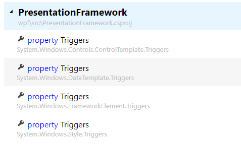
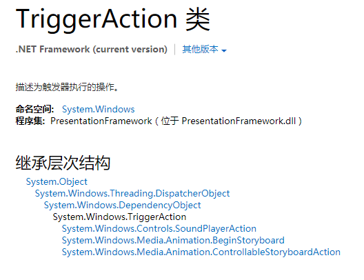
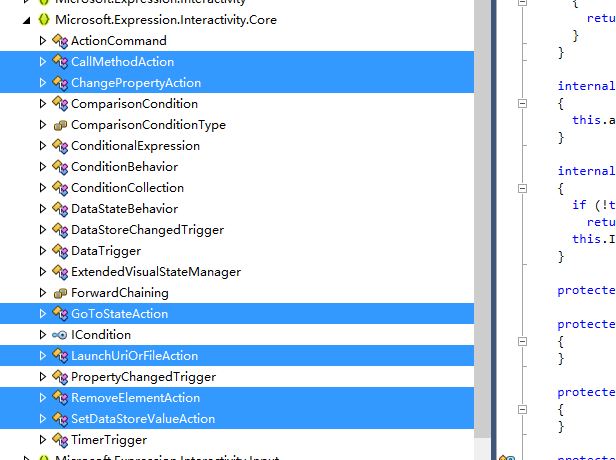

EventTrigger相信大家都会写，就和下面的东西一样样的。

```xml
<EventTrigger RoutedEvent="Mouse.MouseEnter">          
  <EventTrigger.Actions>            
    <BeginStoryboard>              
      <Storyboard>                
        <DoubleAnimation Duration="0:0:0.2" Storyboard.TargetProperty="MaxHeight" To="90"/>            </Storyboard>            
    </BeginStoryboard>          
  </EventTrigger.Actions>        
</EventTrigger>
```

这个例子很简单，检测到MouseEnter事件后，触发一段动画。

那么EventTrigger是怎么实现这一功能的呢？

首先我们知道EventTrigger被存储在一个叫做Triggers的集合里面

那么我们打开referencesource，搜索一下Triggers，发现居然有4种！！



这里我们仅研究FrameworkElement的Triggers。

```csharp
 public TriggerCollection Triggers
        {
            get
            {
                TriggerCollection triggerCollection = EventTrigger.TriggerCollectionField.GetValue(this);
                if (triggerCollection == null)
                {
                    // Give the TriggerCollectiona back-link so that it can update
                    // 'this' on Add/Remove.
                    triggerCollection = new TriggerCollection(this);
 
                    EventTrigger.TriggerCollectionField.SetValue(this, triggerCollection);
                }
 
                return triggerCollection;
            }
        }
```

第一眼我们发现它实际上只是一个放了` TriggerCollection`，但是第二眼我们发现这个`TriggerCollection`居然来自`EventTrigger.TriggerCollectionField`。所以我们从实现上了解到了`FrameworkElement`的`Triggers`仅支持`EventTrigger`

`FrameworkElement`在初始化的时候会调用`EventTrigger`的`ProcessTriggerCollection( FrameworkElement triggersHost )`方法，针对集合中的每一个事件，为`FrameworkElement`添加监听器，而在事件触发时，引发监听器的`Handler`，使`EventTrigger`中`Actions`集合的每一个`TriggerAction`得到执行


## EventTrigger进化史

文章在之前本应该结束的，但是`EventTrigger`这个家伙的故事貌似并没有这么简单

执行`Actions`的实际上是调用它的`Invoke`方法。这是一个抽象方法，可以通过继承实现自己的逻辑。

比如说在	`SoundPlayerAction`中就实现了如下工作

```csharp
internal sealed override void Invoke(FrameworkElement el)
       {
           PlayWhenLoaded();
       }
```

多么美妙的设计啊，这么棒的东西微软一定为我们实现了很多用法吧！

于是我们打开MSDN。。。



什么鬼！只能做动画！根本不够用好吗?于是有这么一段对话（纯属虚构）

B:我要发命令！MS:请用Code Behind

B:我有后台不写代码强迫症！MS:您不能走极端，我们的方案是很合理的实现

B:我叫Blend。 MS:做做做，立刻做，马上做！


于是Blend自己实现了一套新的`EventTrigger`系统，在`System.WIndows.Interactivity.dll`中

原理都很类似，重点是两个

1. 提供了`InvokeCommandAction`类，可以通过`EventTrigger`触发`Command`的`CanExecute`和`Execute`
2. 他的`TriggerAction`传入触发事件的`EventArgs`作为参数

A：哇，从此可以通过`EventTrigger`发命令啦！另外有了`EventArgs`可以做事件，还可以给命令传参，可以。。。

Blend：哦！除了第一个以外，剩下的我都没做。你自己实现咯

P：

Blend：骗你的，在`Microsoft.Expression.Interaction.dll`中实现了好多哦



P：我要在`Command`中传`EventArgs`

Blend：少年郎，这种东西很奇怪咯。你要不试试`CallMethodAction`，可好用了呢

P：不管我就要（*PS：MSDN的原话是[Sometimes you need to pass a parameter to the command that comes from the parent trigger](https://msdn.microsoft.com/en-us/library/gg405494(v=pandp.40).aspx)*，我也不知道具体场景）

Blend：我不做

P(Prism)：我自己做

于是Prism在`Microsoft.Practice.Prism.Interactivity.dll`中提供了默认`CommandParamater` 为触发事件 `EventArgs`的`InvokeCommandAction`类。

源码反编译失败了，这里贴一段MVVMLight的`EventToCommand`的实现，原理基本是一样的

```csharp
 protected override void Invoke(object parameter)
        {
            if (AssociatedElementIsDisabled() 
                && !AlwaysInvokeCommand)
            {
                return;
            }

            var command = GetCommand();
            var commandParameter = CommandParameterValue;

            if (commandParameter == null
                && PassEventArgsToCommand)
            {
                commandParameter = EventArgsConverter == null
                    ? parameter
                    : EventArgsConverter.Convert(parameter, EventArgsConverterParameter);
            }

            if (command != null
                && command.CanExecute(commandParameter))
            {
                command.Execute(commandParameter);
            }
        }
```

## 链接

[MVVM实现](https://msdn.microsoft.com/en-us/library/gg405484(v=pandp.40).aspx)

[MVVM进阶](https://msdn.microsoft.com/en-us/library/gg405494(v=pandp.40).aspx)

[MVVMLight源码EventToCommand](http://mvvmlight.codeplex.com/SourceControl/latest#GalaSoft.MvvmLight/GalaSoft.MvvmLight.Platform (NET45)/Command/EventToCommand.cs)

