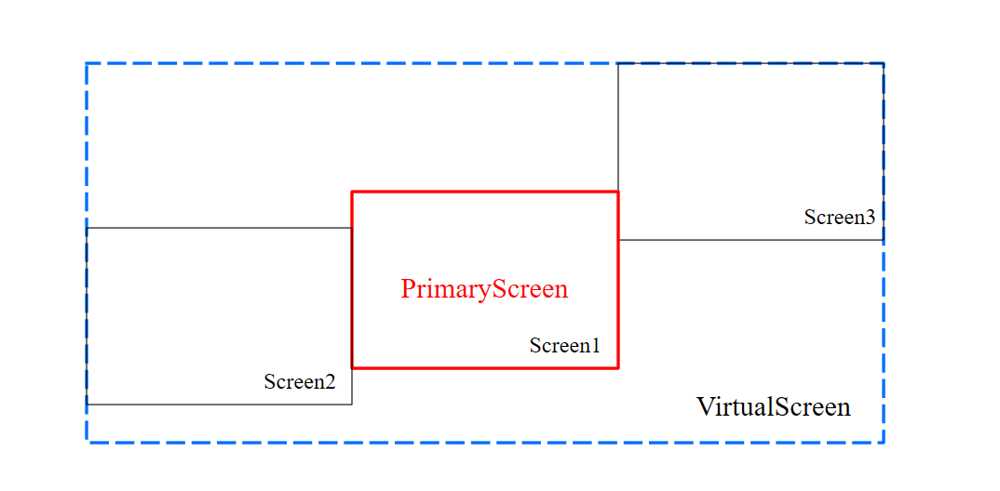
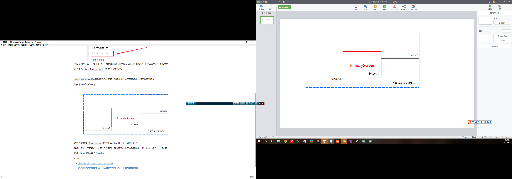

桌面应用常常会遇到多显示器适配问题，比如我们会期望让小人从最左边的屏幕跑到最右边，或者将一个窗口藏在所有显示器的显示区域之外。

-----

在wpf中，我们我们有一个类叫做`SystemParameters`, 他提供了一些列系统相关的参数属性。

我们在这里需要注意的是两个系列

- `PrimaryScreen`系列：包括`PrimaryScreenHeight`，`PrimaryScreenWidth`

- `VirtualScreen`系列：包括`VirtualScreenHeight`，`VirtualScreenTop`,`VirtualScreenLeft`，`VirtualScreenTop`

`PrimaryScreen`指的是系统的主屏幕。就是我们在显示设置中，确定的主显示器所显示的屏幕。

主屏幕的左上角点一定是(0,0)，所有的其他显示器的显示屏幕坐标都是相对于主屏幕的坐标来确定的。

这也是为什么`PrimaryScreen`只提供了宽高的数据。

`VirtualScreen`指的是系统的虚拟屏幕。他是将所有的屏幕用最小的矩形包裹的区域。

如图中的蓝色虚线区域。

值得注意的是`VirtualScreen`的左上角点很可能处于不可显示区域。

这是处于各个显示器的分辨率，DPI不同，且多显示器也可能采用横排，竖排和九宫格方式进行布置。

不能简单的进行水平方向的对齐。

事实上，如果你使用截图软件对多屏幕进行截图，就可以发现`VirtualScreen`所存在的那些非显示区域

参考链接：

- [The Virtual Screen | Microsoft Docs](https://docs.microsoft.com/en-us/windows/desktop/gdi/the-virtual-screen)
- [SystemParameters Class (System.Windows) | Microsoft Docs](https://docs.microsoft.com/zh-cn/dotnet/api/system.windows.systemparameters?redirectedfrom=MSDN&view=netframework-4.7.2)

