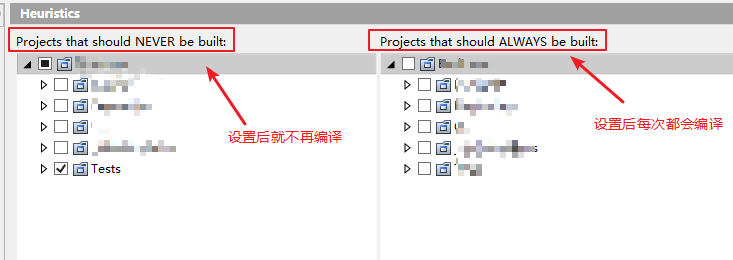
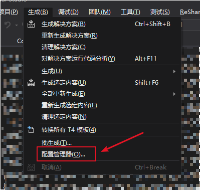
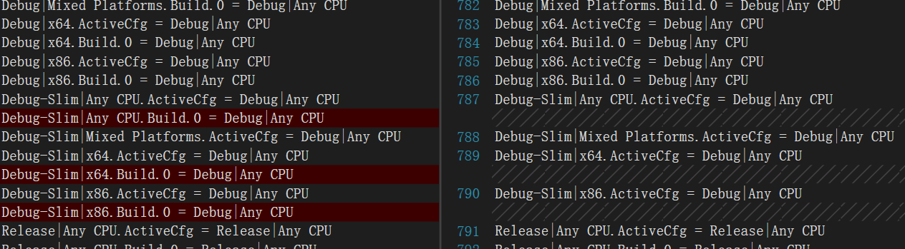

你有一个大的解决方案，里面毛毛多的项目。

一次编译要好久，怎么办？

-----

##1、你是一个单进程的项目，项目里面都是你的依赖。

没关系，全宇宙最好的IDE，visual studio会帮你，点击运行，会自动编译你的启动项目以及其依赖的项目。

就是说所有的项目都是最新的。

你说时间久，没关系全宇宙最好的IDE，visual studio会帮你。它有一个叫增量编译功能，检查编译的项目，只要是未修改的，就不会再次编译。

## 2、你是一个多进程项目，或者你的项目里带有单元测试工程

- 没关系，全宇宙最好的IDE，visual studio会帮你，采用第一种方法时会gg。没关系，我们还有全宇宙最好的IDE的插件Resharper。在Resharper的`Options`-`Tools`-`Heuristics`将你的项目禁止

于是你再使用Resharper Builder就不再生成单元测试项目了

不过这个方法的坏处就是当你希望编译时必须手动点开启用

- 没关系，还有全宇宙最好的IDE，visual studio的自带功能，生成一个项目配置，比如说如下的debug-slim。

然后呢在这个活动解决方案的配置下，将单元测试（test）项目的生成checkbox取消勾选。

**注意是每个解决方案平台都要勾一遍哦**

然后我们可以看到`sln`文件中对应项目在`Debug-Slim`配置下的`Build.0`的配置信息被删除了

在`Debug-Slim`配置下，再次生成就发现那些单元测试项目不再生成了。

debug目录下面什么都没有

##### 我们再试试Resharper会怎样

项目的确没有再次生成，可是项目依赖的dll还是被输出至debug目录。（┓( ´∀` )┏还是差一点点）