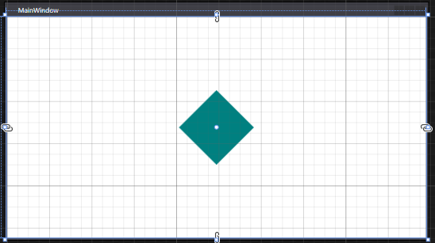
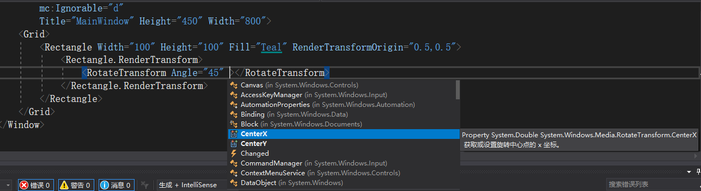
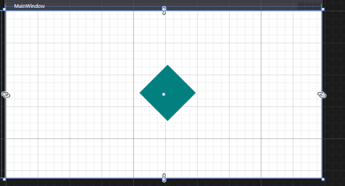
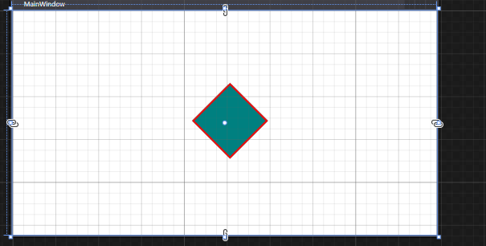

我们都知道RotateTransform会受到旋转中心RenderTransformOrigin的影响

-----

因此我们如果期望在中点旋转，我们可以选择设置RenderTransformOrigin=0.5,0.5

```xaml
        <Rectangle Width="100" Height="100" Fill="Teal" RenderTransformOrigin="0.5,0.5">
            <Rectangle.RenderTransform>
                <RotateTransform Angle="45"></RotateTransform>
            </Rectangle.RenderTransform>
        </Rectangle>
```



和期望相符合。

但是智能提示告诉我们，在旋转的时候还能够设置一些其他东西。比如`CenterX`和`CenterY`。



我们看到`CenterX`的智能提示是“获取或者设置旋转中心点的X坐标”。

这个功能类似于`RotateAt`能够使我们绕非`RenderTransformOrigin`进行旋转

OK，我们现在尝试将旋转中心改到10,10点，代码如下（注意，`CenterX`和`CenterY`是绝对坐标，`RenderTransformOrigin`是相对坐标）

```xaml
        <Rectangle Width="100" Height="100" Fill="Teal" RenderTransformOrigin="0.5,0.5">
            <Rectangle.RenderTransform>
                <RotateTransform Angle="45" CenterX="10" CenterY="10"></RotateTransform>
            </Rectangle.RenderTransform>
        </Rectangle>
```



咦，期望不一致。我们期望矩形绕着窗口的（10,10）点旋转45°，但是最终的呈现却几乎没有变动

实际上，`CenterX`和`CenterY`以及`RotateAt`和`ScaleAt`都是**相对于`RenderTransformOrigin`**的偏移

我们做一个实现，,添加一个`RenderTransformOrigin`为0,0，`CenterX`和`CenterY`为60的矩形框

那么两边的旋转中心都是0.5*100+10=0\*100+60=60

```xaml
        <Rectangle Width="100" Height="100" Fill="Teal" RenderTransformOrigin="0.5,0.5">
            <Rectangle.RenderTransform>
                <RotateTransform Angle="45" CenterX="10" CenterY="10" />
            </Rectangle.RenderTransform>
        </Rectangle>
        <Rectangle Width="100" Height="100" Stroke="Red" StrokeThickness="3" RenderTransformOrigin="0,0">
            <Rectangle.RenderTransform>
                <RotateTransform Angle="45" CenterX="60" CenterY="60" />
            </Rectangle.RenderTransform>
        </Rectangle>
```



可以看到图片重合咯