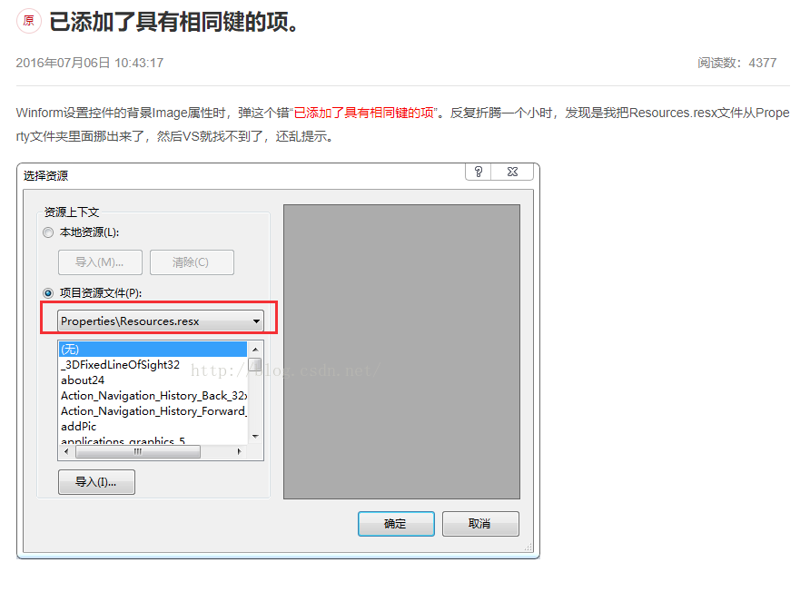

代码出bug会让你发狂，那么编译时出了bug呢？

-----


你看到这个错误会怎么办，没错去google“Error RG1000 未知的生成错误 已添加了具有相同键的项”


不错嘛很多人遇到了，肯定有解决方案。然而。。。





OK，换一个思路，我们在编译时出错了，肯定是有错误提示，只是vs把这个提示的细节忽略了。

那么我们是不是可以试试命令行呢。


试了一下。可以哟，编译过程的内容在cmd中有输出，还发现了红字。（项目原因，不上图了）

但是这里的信息似乎有些太多啦，很难在cmd窗口中发现问题代码。


OK，那我们是否可以寻找一种将msbuild日志输出的方法呢？

当然有，方法就是

```bash
MSBuild.exe MyProj.csproj ^ /filelogger /fileLoggerParameters:Verbosity=diag
```

这样就是在你对应的项目下生成编译日志，然后通过日志查找就很容易定位到问题了


参考链接：MSBuild: a simple way to find out all properties and their values while building a csproj file: https://techblog.dorogin.com/msbuild-a-simple-way-to-find-out-all-properties-and-their-values-while-building-a-csproj-file-d14bcbe8fadc

