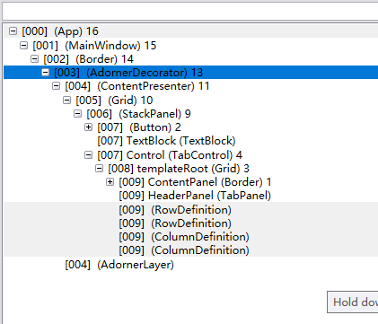
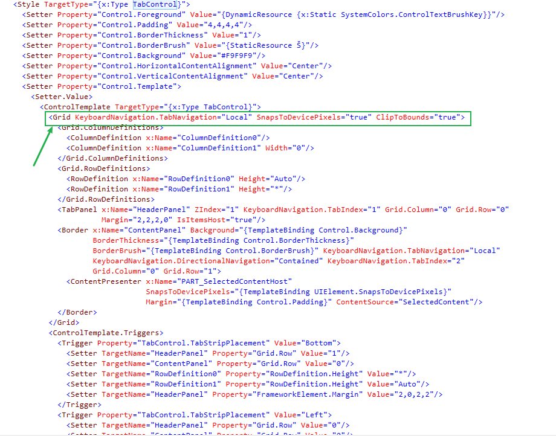
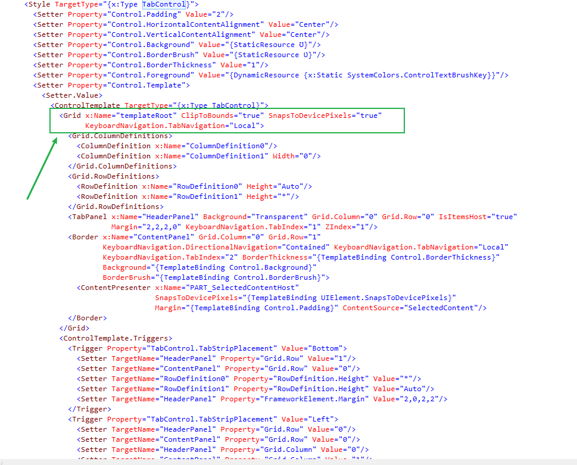

今天有同事跑过来说遇到了一个奇怪的bug，同样的程序在win7和win10上界面相差了2个像素

-----

一开始我们以为是半像素或者是分辨率的问题。

结果调试了很久都没有结果。

不过意外的我们发现了另一个奇妙的东西。

下面两个图分别是在win7和win10情况下soonp获得的可视化树（已用demo替换）




有么有发现`TabControl`的子元素`Grid`多出了一个名字`templateRoot`。

在代码里面查找，发现并没有这个名字的`Grid`，所以可以确定这个是来自`TabControl`的默认`Style`

所以我们找到win7和win10 下的默认主题 `Aero`和`Aero2`

查找方法可以参见博客[默认的WPF样式在哪里](2018-7-25-默认的WPF样式在哪里.md)

我们分别放在DotPeek中反编译下，获取theme中对应的样式baml





有没有发现这个名字呀。

当然对于这样子的问题的确不是很好定位，因此我们有两种可行的解决方案

1、尽量在关键界面使用自定义样式，对元素的呈现细节进行控制

2、在App.xaml中指定主题样式。代码如下

```xaml
<Application.Resources>
        <ResourceDictionary>
            <ResourceDictionary.MergedDictionaries>
                <ResourceDictionary Source="/PresentationFramework.Luna, Version=3.0.0.0,
 Culture=neutral, PublicKeyToken=31bf3856ad364e35,
 ProcessorArchitecture=MSIL;component/themes/luna.normalcolor.xaml" />
            </ResourceDictionary.MergedDictionaries>
    </ResourceDictionary>
  </Application.Resources>
```


参考链接：https://social.msdn.microsoft.com/Forums/en-US/f4b9fdfe-5cd5-4c52-9e38-725d766a77c8/xaml-theme-file-name-for-windows-10?forum=wpf