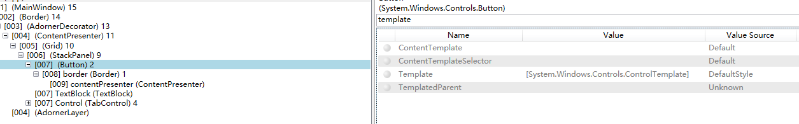

我们使用WPF的控件时，.NET framework会为我们提供一些默认的样式

-----

一开始我们会认为这个是依赖属性的默认值。但是实际上并非如此

我们可以通过以下方法看下默认`Button`的`Template`属性

```csharp
Control.TemplateProperty.GetMetadata(typeof(Button)).DefaultValue
```

我们神奇的发现，返回值是`null`

那么不是依赖属性的默认值就是来自于`Style`咯

我们试试

```csharp
FrameworkElement.StyleProperty.GetMetadata(typeof(Button)).DefaultValue
```

返回值也是`null`

但是我们通过snoop发现他的确是有值的，而且值来自于`DefaultStyle`



通过以下代码也可以得到类似结果

```csharp
DependencyPropertyHelper.GetValueSource(myButton, Button.TemplateProperty).BaseValueSource
```

关于什么是`DefaultStyle`，参见[theme主题的原理](2018-7-25-theme主题的原理.md)

实际上WPF控件在应用程序中找不到相应的样式时，会从系统中获取样式。

首先查找指定类型所在的程序集（例如Button所在的PresentationFramework）,如果程序集定义了`ThemeInfo`

特性，那么他就会查看`ThemeInfoDictionaryLocation`的属性值，如果是

- `None`  ：则说明没有特定主题资源
- `SourceAssembly ` : 则说明特定主题资源在这个程序集内部
- `ExternalAssembly ` :则说明特定主题资源在外部同名，不同后缀的程序集中（例如resentationFramework.Aero）而这个选择由系统主题决定

而最后，如果这些主题都没有找到，那么程序会在自身的`themes/generic.xaml`中获取默认的样式。


参考链接：https://www.interact-sw.co.uk/iangblog/2007/02/14/wpfdefaulttemplate

