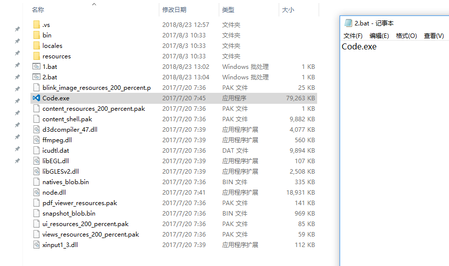
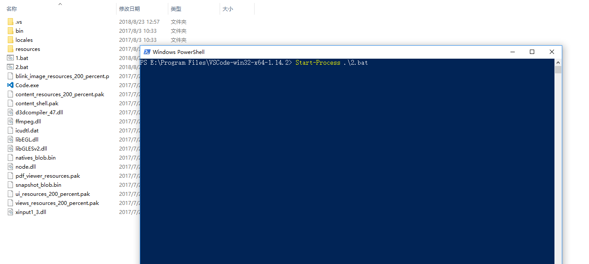
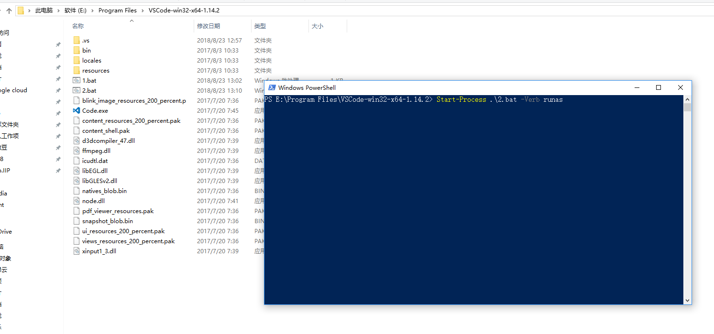
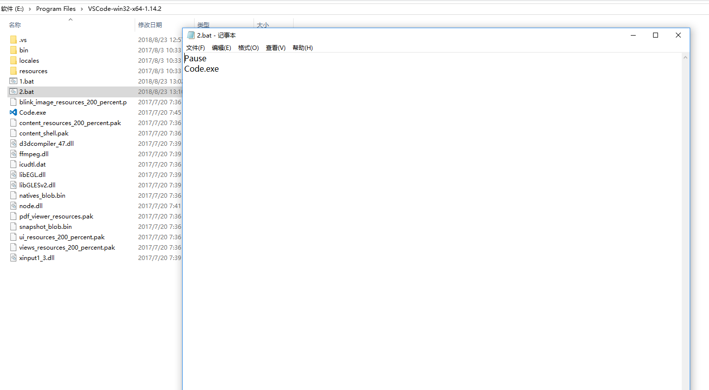
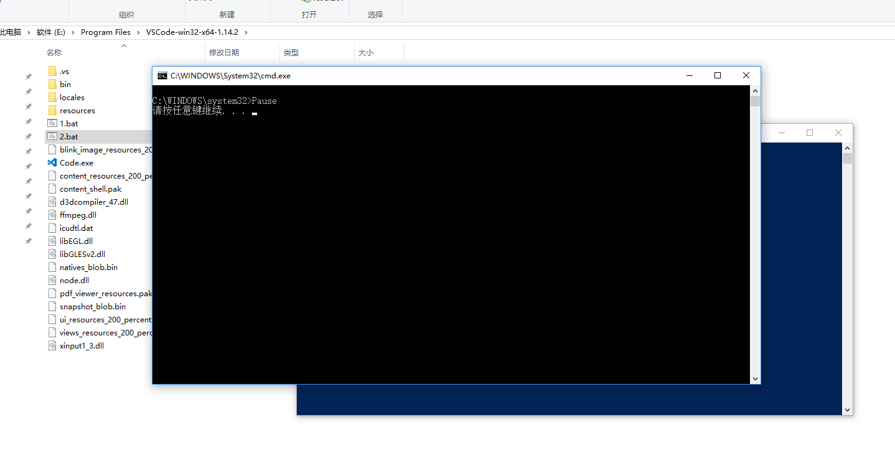
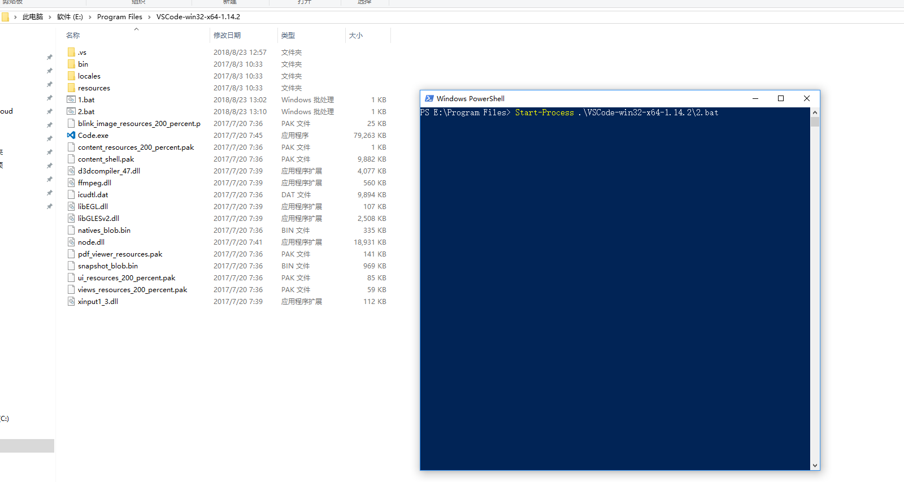
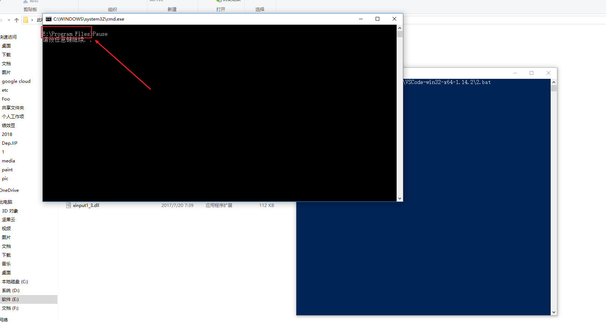
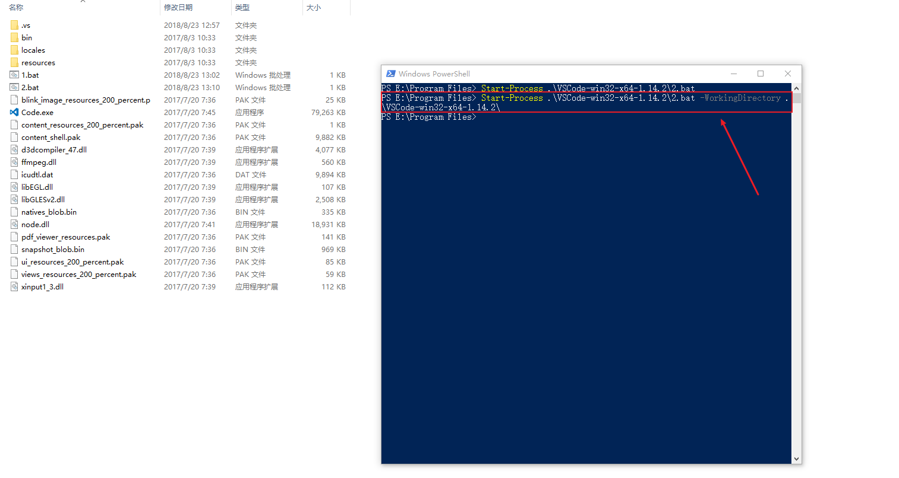
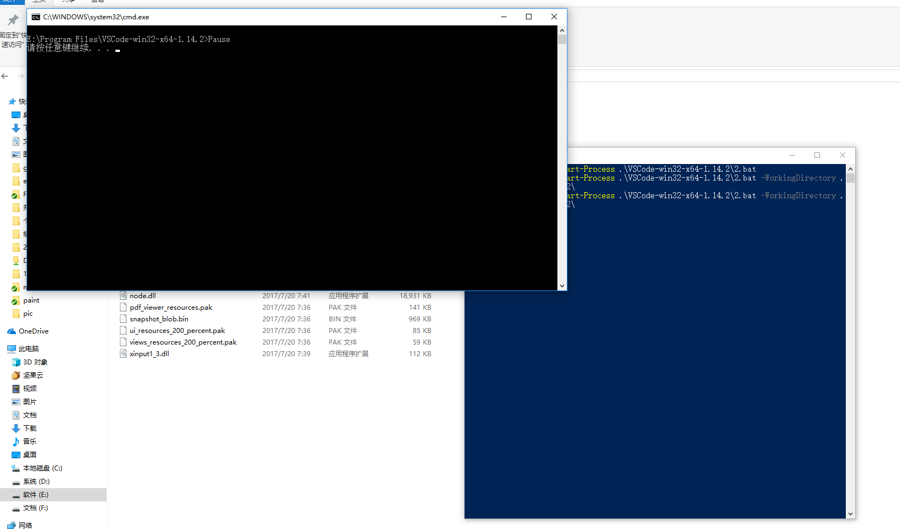

我们可以通过`Process`开启一个进程，但是如果通过这个进程再开启另一个进程时，就容易发生错误。

-----

##上Demo

1、我们在vscode的目录下，建立一个名为`2.bat`的脚本，里面输入命令`Code.exe`打开vscode

2、然后，我们在同一个目录下打开`PowerShell` ，输入`Start-Process .\2.bat`通过`Process`的方式运行这个脚本。

我们发现运行一切正常

## 那么如果添加`RunAs`

3、我们现在使用`Start-Process .\2.bat -Verb runas` 使用管理员方式运行脚本。

我们发现运行不了了。

4、为了确认发现了什么事情，我们在脚本中添加`Pause`

重新以`RunAs`方式执行后发现，运行路径竟然是`C:WINDOWS\System32`

那么自然找不到`Code.exe`咯

所以这是一个相对路径的问题。

## 其他的坑

发现是路径问题后，我们会想那么在打开非当前所在路径的进程时会不会有同样问题呢？

5、我们将`PowerShell`的当前路径移动到上级目录，然后运行`2.bat`

可以看到`2.bat`执行路径仍为`PowerShell`的当前路径。

同样无法开启`Code.exe`

# 结论

##原因

- `Process`以`RunAs`方式启动进程，执行目录在系统目录，一般为 `C:WINDOWS\System32`。
- `Process`以普通方式启动进程，执行目录在当前运行目录，而不在目标进程所在目录。

## 解决方式

既然知道了问题所在，那么解决方案就很简单了。

- 将启动的工作目录调整到目标进程的工作目录，以非`RunAs`方式启动

  这种方式可以解决`PowerShell`的问题，但是如果是在C#中使用，或者必须要求目标进程以管理员权限启动时就很尴尬了。

- 不要使用**相对路径**

  正解，没问题，杠杠的

- 设置`WorkingDirectory`

  如果你使用的是第三方软件，而第三方软件已经使用了相对路径。这个几乎就是唯一方案了

  

  

  这样讲执行目录强制设置为目标进程所在目录，就不会出现相对路径找不到的问题了