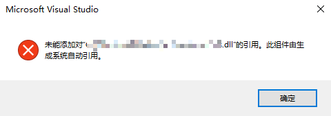
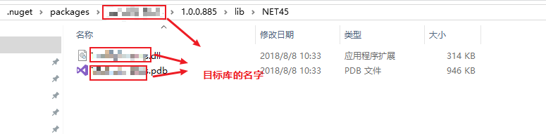
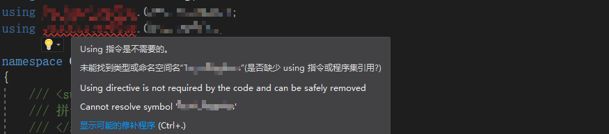
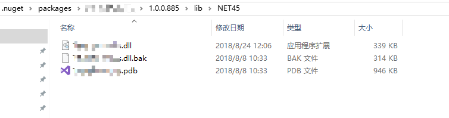
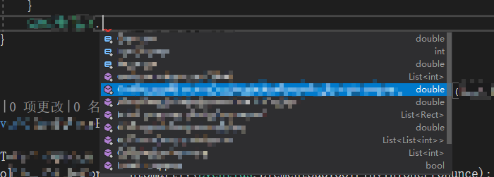
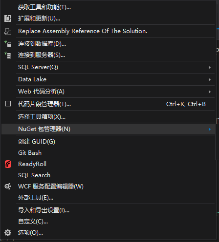
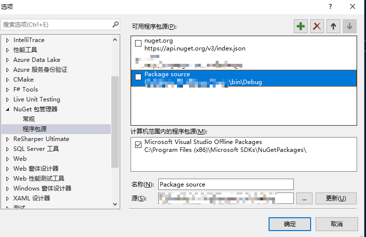
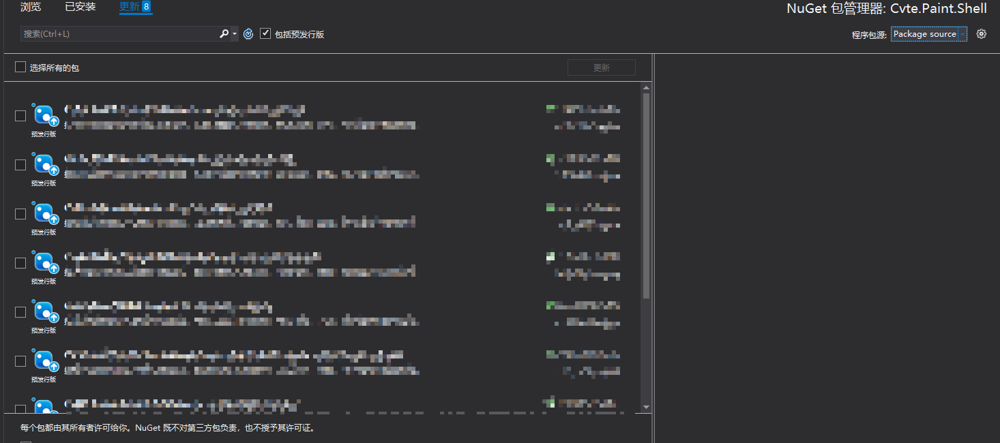

开发C#项目时通过Nuget引用添加依赖很方便，但是调试的时候就不一样了。

-----

## 情景再现

我们有一个超级基础的库`A`，我们的多个公共组件`B`,`C`,`D`,和最终产品`E`都依赖于库`A`。

现在我们在开发`A`的新功能时，期望能在最终产品`E`中得到测试验证。

### 不可行方法

- 通过添加引用的方式添加本地包

  

  由于最终产品`E`的依赖项，依赖于nuget上的库`A`，nuget发现有同名dll就会出现冲突

### 可行方法

- 最简单的方法是，我们打出一个alpha包，发送到nuget服务器中，然后在最终产品`E`中升级

  缺点是成本较高，每次测试都打一个包上传，版本号上升搜搜的。前提还是每个开发小伙伴都能够上传nuget

- 另一个较为方便的方法是，我们使用国内著名WPF大师猫神（[晒太阳的猫](https://jasongrass.gitee.io/)），开发的DLL源码调试工具[DLL Reference Path Change Auto - Visual Studio Marketplace](https://marketplace.visualstudio.com/items?itemName=Jasongrass.DLLReferencePathChangeAuto)

  这个工具非常棒，有着全5星好评，大家快去下载

## 懒人方法

### 替换nuget缓存

我们知道在vs中的nuget包，从nuget服务器中下载之后会添加到本地nuget缓存目录。之后每次编译时只需要从nuget缓存中获取现有的dll进行编译。那么我们就可以通过替换nuget缓存目录中的文件实现使用本地dll调试。

#### 实操

- 我们找到目标nuget库所在的缓存目录，注意版本号要相同哦

  

- 将原有的dll改为bak，此时我们发现vs对项目中所有有关于这个库的引用都飘红了，提示需要还原nuget

  

- 然后我们将本地的dll放进去，发现一家可以成功使用本地包的方法啦~~

  

  

这个方法存在的缺点是，nuget缓存会影响所有项目，如果忘记调试后改回来，容易让其他项目出错

### 高级懒人方法

#### 搭建本地nuget源

- 找到vs中工具-nuget管理器

  

- 添加一个本地程序包源

  

- 然后你可以在vs中的指定项目右键-打包（需要新格式才能支持），生成一个本地nuget包，放到刚刚的文件夹中

- 然后在产品项目里指定本地的程序包源，就可以看到你本地的nuget包了

  

