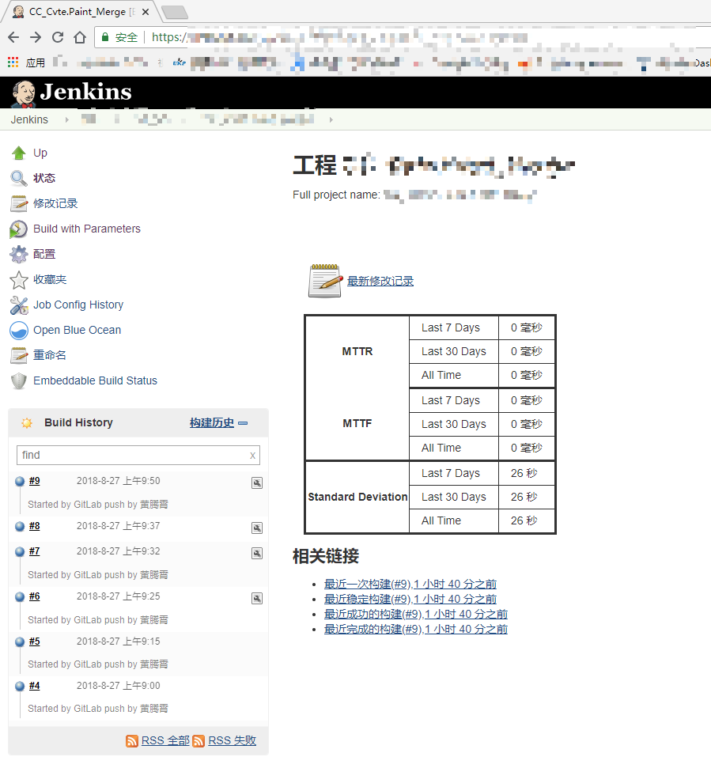
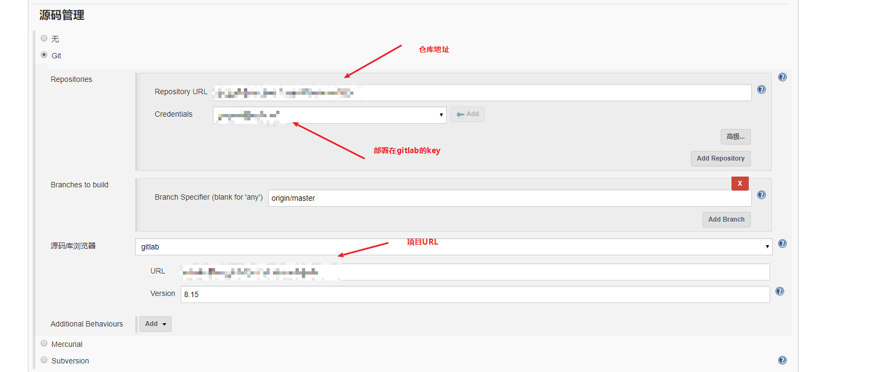
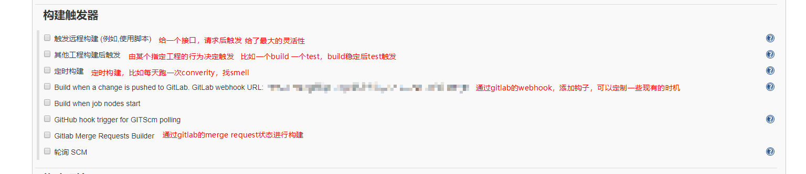
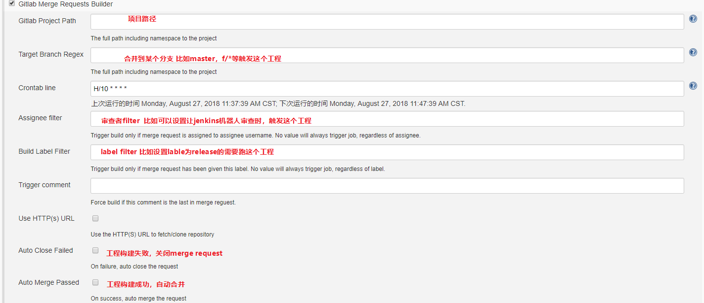
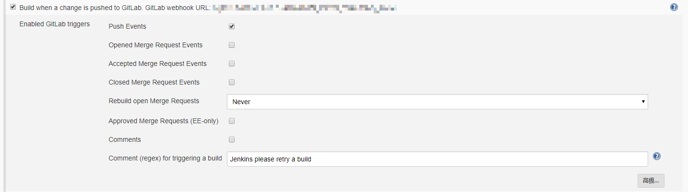
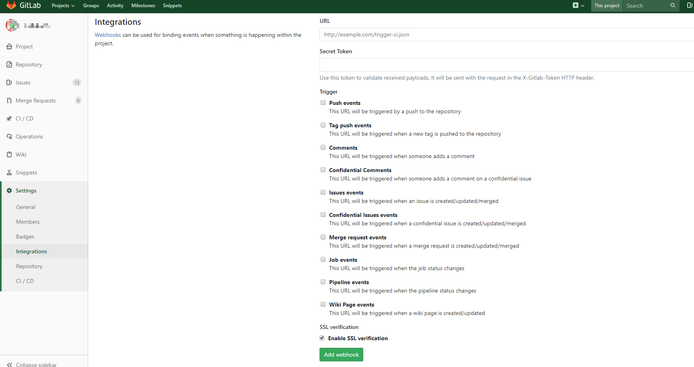
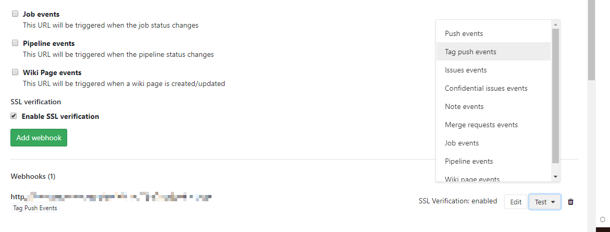
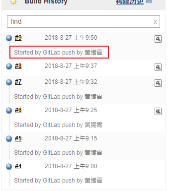

我们大部分程序员都是只想安安静静的写代码，但是总是绕不过去的一个问题就是打包和发布。

---

我们团队的流程是这样子的

- vs编写代码
- gitlab merge request
- 审核合并
- jenkins打包发布

然而我们还是会常常遇到一些问题，比如打包不过呀，低级bug呀等等各种问题

然后revert，hotfix

那么问题来了，我们程序员有限的生命这么宝贵，为什么要浪费在这些问题上。

## CI

ci持续集成，参加[持续集成 - 维基百科，自由的百科全书](https://zh.wikipedia.org/wiki/%E6%8C%81%E7%BA%8C%E6%95%B4%E5%90%88)

其实我们这边有做持续集成，比如定期build，定期converity

但是我们可以做的更多一些

## Jenkins+Gitlab

实操一下jenkins+gitlab做ci

1. 我们在jenkins上建立一个工程，这个工程可以做build或者test或者publish

   

2. 添加源码管理，对我们项目来说是gitlab

   

3. 设置触发器，这个是最有用的地方，可以决定我们在什么时机去运行这个jenkins工程

   

   - merge request触发

     

   - webhook触发

     这个是一个比较简单的方式，可以实现对gitlab本身触发器的集成。

     这里我们选择push events

     

     回到gitlab项目，在settings-intergrations

     将刚刚jenkins中的webhook的URL粘贴过来，然后选择触发事件。例如我期望每次添加一个tag的时候跑一边发布，那么就勾选`Tag push events`

     

     创建的webhook会在下面列出了，我们可以点击右侧的test发送一个测试的`Tag push events`

     

     我们可以看到jenkins跑了一次构建，里面还显示了相应的信息

     

## What can we do

- merge request自动跑单元测试
- 合并后跑build
- 添加tag后发布
- ……

限制的只是想象力

