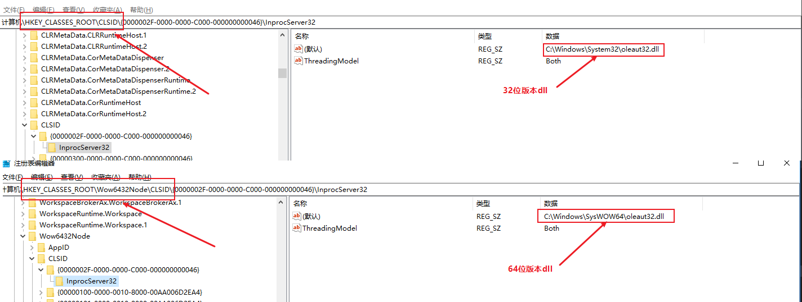

我们都知道对于windows应用来说，注册表是很重要的部分。所有的com组件和部分应用程序的运行都会依赖于注册表。

-----

那么问题来了。我们的软件进程有x86和x64两个互不兼容的版本。而软件的注册表位置（比如com组件的clsid）是固定的。那么对于这种情况该怎么确保找到对应版本的软件或dll路径呢？

## 不同版本的注册表处理

对于这种情况，windows提供了在64位系统提供了对32位软件的注册表项目支持。

在`HKEY_CLASSES_ROOT`,`HKEY_LOCAL_MACHINE\SOFTWARE`,`HKEY_CURRENT_USER\Software`目录下面提供了`Wow6432Node`节点。里面涵盖了同名软件的32位版本的相同注册表路径。只是区别在于对应的dll或者exe的`物理路径`换成了32位版本的路径。

### 多版本软件注册表注意点

- 确认软件或者dll版本是否是64位和32位不兼容的
- 安装的电脑是否是64位电脑
- 在64位电脑下需要同时写64位（不带`Wow6432Node`节点）和32位版本(带`Wow6432Node`节点)的注册表信息

