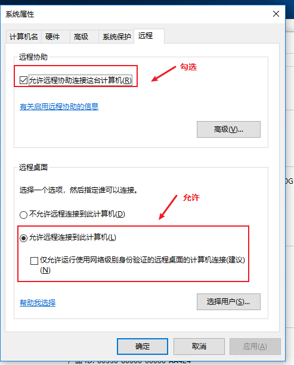
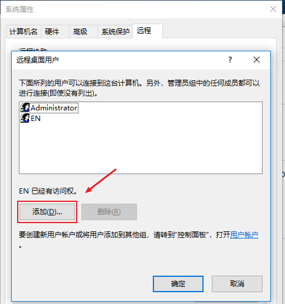
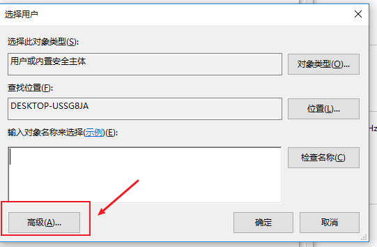
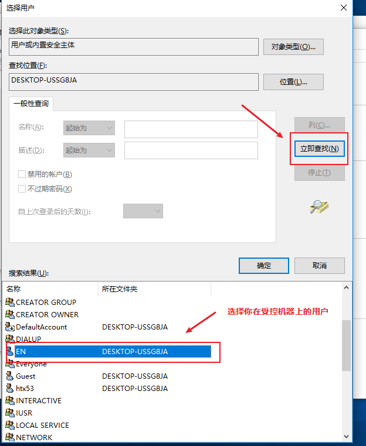
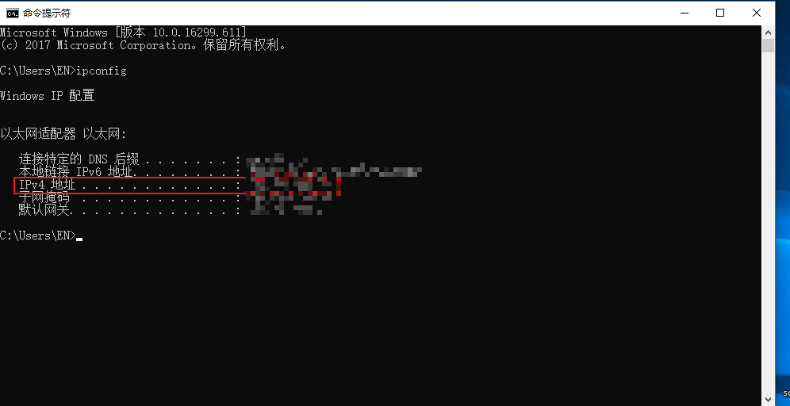
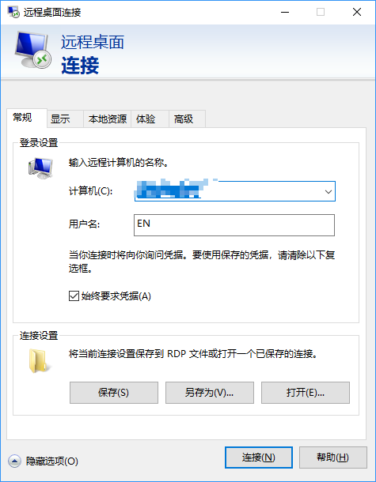

亲，你的服务器可用了~

-----

公司的服务器离我好远，每次去跑项目都很辛苦。所以就研究了下windows远程桌面协助。

## 被控端电脑配置

- 首先打开系统属性—远程

  

- 点击选择用户，添加

  

- 点击高级

  

- 点击立即查找—选择指定用户（确保你拥有这个用户的密码）

  

- 查询到被控制电脑的ip，可以使用cmd的ipconfig

  

  ## 连接远端电脑进行控制

  - 打开远程桌面，输入被控制电脑的ip地址和需要登入的用户名，并在弹出窗口里面输入密码就成功连接上了

    

