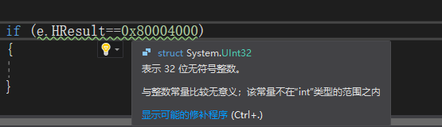

在c#代码中处理一些系统出现的异常的时候，常常需要对异常的`HResult`属性进行处理。

-----

于是我们就会写出以下代码

```c#
if(e.HResult==0x80030005)
{
    ...
}
```

然而有时候会惊奇的发现结果并没有如预期的进入if分支

so why

事实上如果你安装了Resharper，就会在这句代码里面得到提示



因为我们的`HResult`的值是`uint`，而`Exception.HResult`是`int`所以比较结果必然是false

那么怎么办呢？

- 都转成`uint`

  ```c#
  if((uint)e.HResult==0x80030005)
  {
      ...
  }
  ```

- 都转成`int`

  ```c#
  if(e.HResult==uncheck((int)0x80030005)
  {
      ...
  }
  ```


参考文档：

[Exception.HResult Property (System) | Microsoft Docs](https://docs.microsoft.com/en-us/dotnet/api/system.exception.hresult?view=netframework-4.7.2)

[c# - Checking the return value from a method for an HRESULT of S_OK - Stack Overflow](https://stackoverflow.com/questions/13145585/checking-the-return-value-from-a-method-for-an-hresult-of-s-ok)


