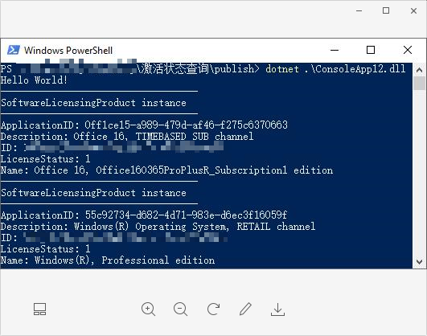

这篇文章我们聊一下如何查看windows软件激活状态

-----

## WMI

在[2018-9-17-windows和office激活异同.md](windows和office激活异同.md)这边文章里我们发现了windows和office的激活都依赖于一个叫WMI的东西。那么什么是WMI呢？、

官方定义是`Windows Management Instrumentation (WMI) is the infrastructure for management data and operations on Windows-based operating systems. `简单的说就是windows系统上数据和操作的管理器。

一般来说都会微软倾向于使用脚本语言对WMI进行查询，（如slmgr.vb）。但是在桌面应用程序层面脚本语言的使用会缺少灵活性。不过好在C#在[System.Management](https://docs.microsoft.com/en-us/dotnet/api/system.management?view=netframework-4.7.2)中提供了，一个叫`ManagementObjectSearcher`的类。可以通过特定的sql语句，对WMI中的对象进行查询。范围可以包括软件，硬件，网络等等系统信息。

## License Status

查询License状态，首先是构造一个`Scope`是`root\\CIMV2`,的搜索对象，然后在`SoftwareLicensingProduct`这张表中查询。如下面的代码所示，其中`LicenseStatus=1`表示软件处于激活状态。（当然你可以选择SELECT * ，如果 不担心时间问题）

```c#
ManagementObjectSearcher searcher =
                new ManagementObjectSearcher("root\\CIMV2",
                    "SELECT ApplicationID, Description, ID, LicenseStatus, Name FROM SoftwareLicensingProduct WHERE LicenseStatus=1");
```

```c#
foreach (var queryObj in searcher.Get())
            {
                Console.WriteLine("-----------------------------------");
                Console.WriteLine("SoftwareLicensingProduct instance");
                Console.WriteLine("-----------------------------------");
                Console.WriteLine("ApplicationID: {0}", queryObj["ApplicationID"]);
                Console.WriteLine("Description: {0}", queryObj["Description"]);
                Console.WriteLine("ID: {0}", queryObj["ID"]);
                Console.WriteLine("LicenseStatus: {0}", queryObj["LicenseStatus"]);
                Console.WriteLine("Name: {0}", queryObj["Name"]);
            }
```

接着调用`ManagementObjectSearcher.Get()`方法就可以执行查询，获得一个查询对象。可以通过索引的方式获得对象的各种属性值。



结果如上


是不是跃跃欲试了呢？可以看下github上的源码：[xinyuehtx/LicenseStatus: 检查license](https://github.com/xinyuehtx/LicenseStatus)


参考链接：

[Windows Management Instrumentation | Microsoft Docs](https://docs.microsoft.com/zh-cn/windows/desktop/wmisdk/wmi-start-page)

[ManagementObjectSearcher Class (System.Management) | Microsoft Docs](https://docs.microsoft.com/en-us/dotnet/api/system.management.managementobjectsearcher?view=netframework-4.7.2)

