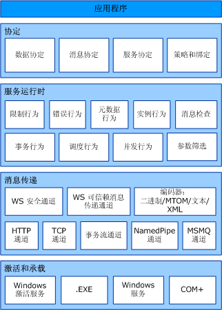
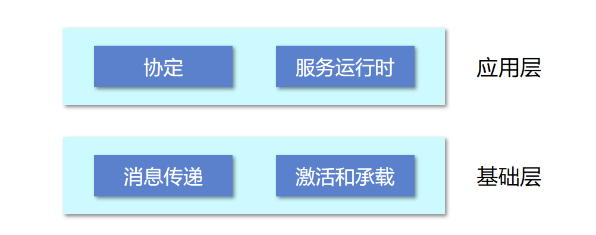
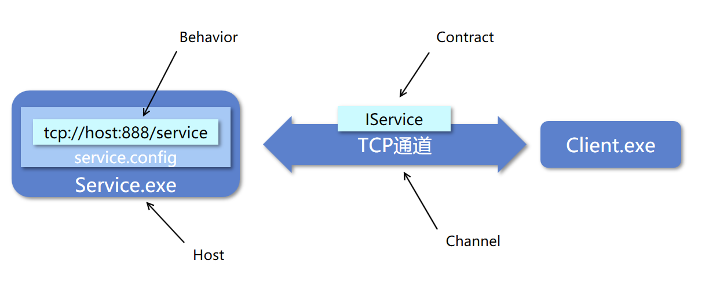

今天开一个新坑WCF的入门教程

-----

# 什么是WCF

wcf - Windows Communication Foundation，是微软设计的一个构建SOA的一个应用程序框架。其主要用于解决应用程序之间的通信问题。

在我看来WCF更适合被看做一个统一的通信编程模型。在WCF之前，微软推出过Web Service，.NET Remoting以及基础的Winsock等通信框架。各个通信方式的编程模型各不相同，这就为开发者学习、维护和切换通信模式产生了障碍。

而WCF几乎涵盖了所有.NET Framework 中的通信方法，为其提供了统一的API接口，以及灵活的配置方案。这就解决了上述的种种问题，开发者只要学会使用WCF就够了。

这也是为什么许多人将WCF称为微软分布式应用开发的集大成者。

# WCF的体系结构

WCF的结构体系如图所示，分为协定、服务运行时、消息传递、承载程序四个部分

## 协定（Contract）

协定指定了应用程序之间通信的API规范，比如数据协定就规定了.NET 对象的序列化和反序列化的方式，而服务协定就规定了服务的API调用方法签名。

## 服务运行时 （Service Runtime）

虽然是叫运行时，其实这个只是WCF服务运行期间的行为配置。例如我们实现了具有某个服务协定的接口，但是我们在运行服务时往往还需要关心这个服务所需要运行的实例个数，是否支持并发，会话等等。而这些设置都是出于服务运行时定义的

## 消息传递 （Message）

消息传递层是有一些列的通道channel组成。这里就涵盖了上述所说的.NET Framework中所有的通信方式。而WCF对其做了统一封装，以便于上层业务的调用。例如HTTP通道就是对Http协议实现的WCF封装，TCP通道就是对TCP协议的实现封装。

## 承载 （Host）

承载或者称之为宿主方式，决定了WCF服务的运行方式。比如服务可以部署在IIS，或者可以使用exe执行

# WCF 体系结构关系

个人理解，WCF体系中可以将协定和服务运行时（行为）归到应用层，消息传递（通道）和激活承载（host）归到基础层。

基础层是服务与应用层的，是从现有成熟技术中“拿”过来的。而应用层控制着对这些技术的使用方式。各层内部的内容相互平等，只是作用方向不同。

## 示例

如图所示，Service.exe 启动了一个service 服务，通过TCP和Client.exe 进行通信。其中IService就是两者的通信协定，而服务的运行时行为由service.config确定（这属于服务运行时）。TCP通道是消息传递层，用于底层通信技术。而Service.exe则是承载了这个服务的宿主程序

参考链接：

- [[Windows通信基础 - 维基百科，自由的百科全书](https://zh.wikipedia.org/wiki/Windows%E9%80%9A%E8%A8%8A%E5%9F%BA%E7%A4%8E)](https://docs.microsoft.com/en-us/dotnet/api/system.aggregateexception.flatten?view=netframework-4.7.2)
- [什么是 Windows Communication Foundation | Microsoft Docs](https://docs.microsoft.com/zh-cn/dotnet/framework/wcf/whats-wcf)
- [Windows Communication Foundation 体系结构 | Microsoft Docs](https://docs.microsoft.com/zh-cn/dotnet/framework/wcf/architecture)

