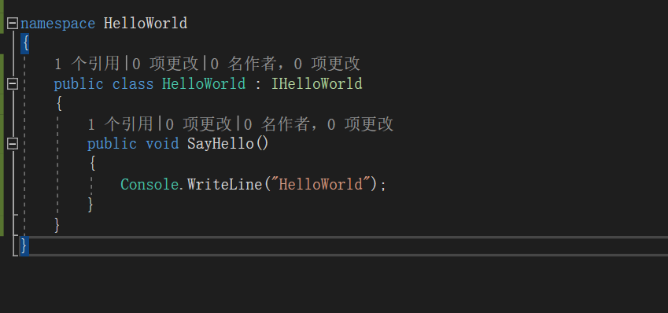

宇宙起源于helloworld

-----

# HelloWorld

开启宇宙第一IDE——visual studio。创建一个工程

我们看到vs已经为我们提供了许多wpf的默认模板。

但是作为入门教程，建议大家创建一个.NET Framework 的控制台应用，然后一步步进行开发。

#### **来自灵魂的拷问** ——为什么不用 .NET Core？

因为WCF一开始设计是专用于windows平台的，而.NET Core是跨平台的。

在写这篇博客时，WCF在github有一个.NET Core相关的社区[开源项目](https://github.com/dotnet/wcf)，正在实现.NET版本的WCF。

但是遗憾的是目前这个版本功能还远不及.NET Framework 版本的WCF强大。所以在这个系列的博客中都会采用.NET Framework 版本的WCF（以后不再对此做区分）

回归正题，首先我们需要建立一个**协定**

我们建立一个接口`IHelloWorld` 然后添加`ServiceContract`特性

然而vs给出了错误提示，说明我们需要添加一个额外的库`System.ServiceModel`

我们添加了对应的库后和using之后，就可以正常编译了。

不过光有服务不行，还需要服务对应的方法，比如这里使用`OperationContract`标记SayHello方法

接下来就是对服务的实现

接着我们就可以使用`ServiceHost`启动这个服务。这里我们使用localhost的8888端口注册一个HelloWorld服务

接着是客户端，我们同样使用控制台作为承载程序。

这个客户端继承了`ClientBase<T>`的抽象类，并且实现`IHelloWorld`接口，实际上是搭建了服务的一个代理。

而在使用时在调用`IHelloWorld`接口方法即调用服务的实现。

当然除此之外我们还需要指定通信方式和服务地址，所以我们需要创建一个构造函数，对这些配置进行传入。（当然，也可以通过配置文件等方式进行设置）

好，现在我们可以启动这个客户端了，这里需要指定下绑定方式为TCP，服务地址端口要正确。

最后我们看下效果

我们看到启动服务和客户端，客户端调用`SayHello`方法，服务端成功响应。

参考链接：

- [GitHub - dotnet/wcf: This repo contains the client-oriented WCF libraries that enable applications built on .NET Core to communicate with WCF services.](https://github.com/dotnet/wcf)
- [The Argument for WCF Hosting in .NET Core](https://www.infoq.com/articles/WCF-Net-Core-Debate)

