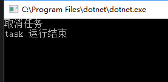
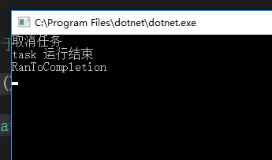
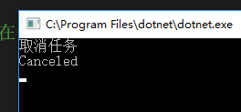
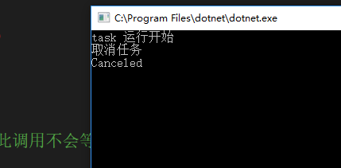
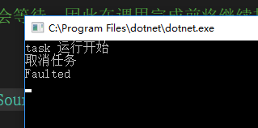

我们都知道`Task.Run`方法可以传入一个`CancellationToken`，用于取消。可是有多少人真的去了解过当调用`CancellationSource.Cancel`方法时，`Task`是否真的被取消了

-----

我们做个实验

```C#
        public static async void Foo()
        {
            var source = new CancellationTokenSource();

            Task.Run(() =>
            {
                Thread.Sleep(TimeSpan.FromSeconds(5));
                Console.WriteLine("task 运行结束");
            }, source.Token);
            await Task.Delay(TimeSpan.FromSeconds(3));
            source.Cancel();
            Console.WriteLine("取消任务");
        }
```

创建上述程序，让一个Task运行5秒后输出"task运行结束"，而在3秒后就进行取消。



令人惊讶的是任务竟然顺利执行完成。

为了进一步确认结果，我们添加一个后续任务，查看下之前任务的结束状态

```C#
        public static async void Foo()
        {
            var source = new CancellationTokenSource();

            Task.Run(() =>
            {
                Thread.Sleep(TimeSpan.FromSeconds(5));
                Console.WriteLine("task 运行结束");
            }, source.Token).ContinueWith(task => Console.WriteLine(task.Status));
            await Task.Delay(TimeSpan.FromSeconds(3));
            source.Cancel();
            Console.WriteLine("取消任务");
        }
```



结果是`RanToCompletion`而不是`Canceled`，这说明任务根本没有被取消

我们如果不在取消前等待3秒，并且添加任务运行开始日志

```C#
        public static async void Foo()
        {
            var source = new CancellationTokenSource();

            Task.Run(() =>
            {
                Console.WriteLine("task 运行开始");
                Thread.Sleep(TimeSpan.FromSeconds(5));
                Console.WriteLine("task 运行结束");
            }, source.Token).ContinueWith(task => Console.WriteLine(task.Status));
            source.Cancel();
            Console.WriteLine("取消任务");
        }
```



任务有被正常取消了

## 原因

实际上，当`Task.Run`的任务真正开始执行后，调用`CancellationSource.Cancel`方法并不能取消任务，或者结束调用线程。调用的方法仍然会顺利执行。

那么带有`CancellationToken`的方法重载有什么用呢？

1、如第三个例子所示，在任务运行开始之前，调用`Cancel`可以直接取消任务，避免额外消耗一个线程

2、当对应的token，在执行体中抛出`OperationCanceledException`，（即调用`CancellationToken.ThrowIfCancellationRequested（）`）可以将其捕获，并且将任务状态置为`Canceled`

```C#
        public static async void Foo()
        {
            var source = new CancellationTokenSource();

            Task.Run(() =>
            {
                Console.WriteLine("task 运行开始");
                Thread.Sleep(TimeSpan.FromSeconds(5));
                source.Token.ThrowIfCancellationRequested();
                Console.WriteLine("task 运行结束");
            },source.Token).ContinueWith(task => Console.WriteLine(task.Status));
            await Task.Delay(TimeSpan.FromSeconds(3));
            source.Cancel();
            Console.WriteLine("取消任务");
        }
```



而如果没有使用这个重载，任务会因未捕获异常而终止，并非取消

```C#
        public static async void Foo()
        {
            var source = new CancellationTokenSource();

            Task.Run(() =>
            {
                Console.WriteLine("task 运行开始");
                Thread.Sleep(TimeSpan.FromSeconds(5));
                source.Token.ThrowIfCancellationRequested();
                Console.WriteLine("task 运行结束");
            }).ContinueWith(task => Console.WriteLine(task.Status));
            await Task.Delay(TimeSpan.FromSeconds(3));
            source.Cancel();
            Console.WriteLine("取消任务");
        }
```



所以我们为`Task.Run`添加了`CancellationToken`后仍需要，在方法执行时手动判断token是否取消


参考链接：

- [c# - How to cancel a running task? - Stack Overflow](https://stackoverflow.com/questions/50232129/how-to-cancel-a-running-task)
- [Task cancellation in C# and things you should know about it](https://binary-studio.com/2015/10/23/task-cancellation-in-c-and-things-you-should-know-about-it/)
- [c# - Stop Task when task run - Stack Overflow](https://stackoverflow.com/questions/36911609/stop-task-when-task-run)
- [Task.Run Method (System.Threading.Tasks) - Microsoft Docs](https://docs.microsoft.com/en-us/dotnet/api/system.threading.tasks.task.run?redirectedfrom=MSDN&view=netframework-4.7.2#System_Threading_Tasks_Task_Run_System_Action_System_Threading_CancellationToken_)
- [Task Cancellation - Microsoft Docs](https://docs.microsoft.com/en-us/dotnet/standard/parallel-programming/task-cancellation?view=netframework-4.7.2)
- [How to: Cancel a Task and Its Children - Microsoft Docs](https://docs.microsoft.com/en-us/dotnet/standard/parallel-programming/how-to-cancel-a-task-and-its-children)
- [How to: Use Parallel.Invoke to Execute Parallel Operations - Microsoft Docs](https://docs.microsoft.com/en-us/dotnet/standard/parallel-programming/how-to-use-parallel-invoke-to-execute-parallel-operations)

  


