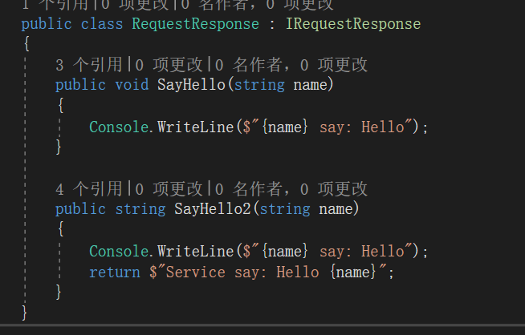

**本文demo已上传至github：[xinyuehtx/WCFdemo](https://github.com/xinyuehtx/WCFdemo)**

这个博客会介绍如何设置服务操作的调用模式

-----

WCF的服务调用有3种模式：请求答复模式（Request-Repley），单向模式（One-Way），双工模式（Duplex）

## 请求答复模式

请求答复模式的服务调用方式如如所示，这也是服务的默认行为。

如图所示我们创建了服务协定`IRequestResponse`，并且定义了方法`SayHello`和，他们使用`OperationContractAttribute`的默认构造指定，表明这个方法是请求答复模式。

接着我们完成其余部分。

这个例子和上一篇的HelloWorld并无差别。

但是细心的同学已经发现，请求答复模式的答复去哪儿了？

因为我们的方法是`void`方法，没有返回值。

现在我们添加另一个方法`SayHello2`并且返回一个字符串

我们现在尝试将返回值进行输出

结果如图所示

这个时候又有一些细心的小伙伴发现问题了，我们在客户端调用服务的方式是一个同步方法。

那么**服务端的计算和通信延迟势必会造成客户端卡顿**

默认的WCF通信超时是1min，我们尝试在服务实现中添加延时

好糟心~~那么上面的`void`方法总没事了吧。我们继续做实验

这次在`SayHello`这个`void`方法中添加延时

失败++

### 小结

我们研究了WCF服务的请求答复模式，其特点有

- 简单
- 可以获得返回值
- 是同步方法，有超时风险

### 问题解决方案

那么对于那些耗时服务，出现的超时问题该怎么解决呢？

1. 采用尽量简短的服务计算功能，大量计算任务建议移动至客户端
2. 对于没有同步执行要求的`void`方法，可以尝试`单向模式`
3. 对于没有同步执行要求的非`void`方法，可以尝试`异步服务`

而`单向模式`和`异步服务`可以在之后的博客中进行介绍

参考链接：

- [请求-答复服务 | Microsoft Docs](https://docs.microsoft.com/zh-cn/dotnet/framework/wcf/feature-details/request-reply-services)

