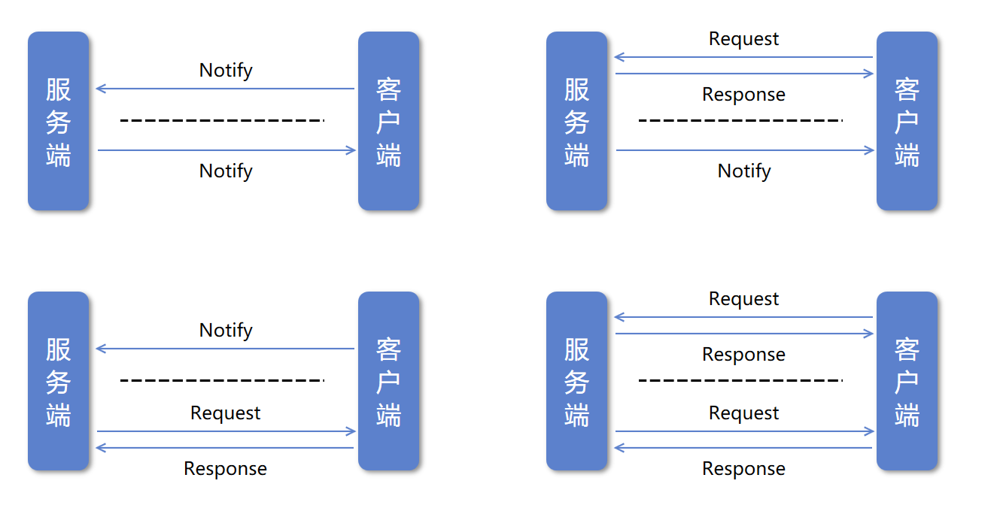
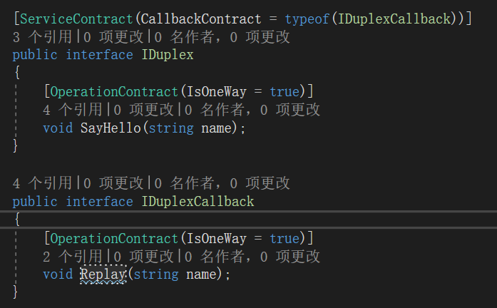
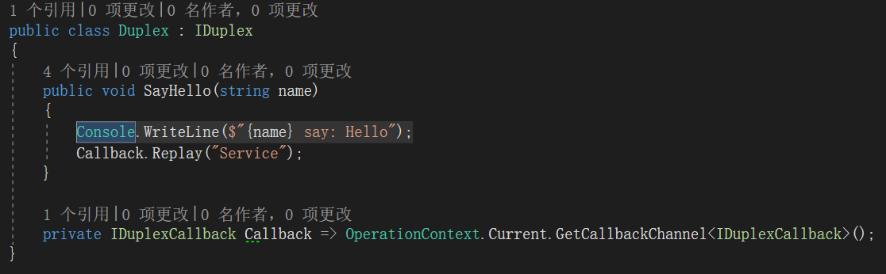
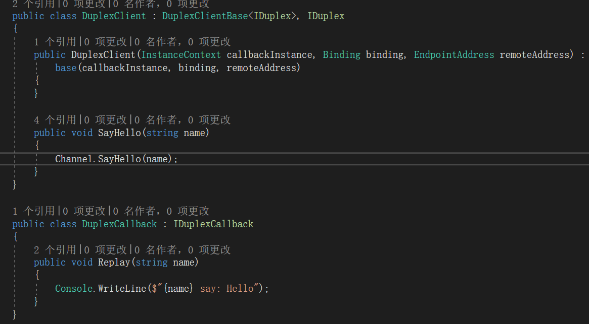
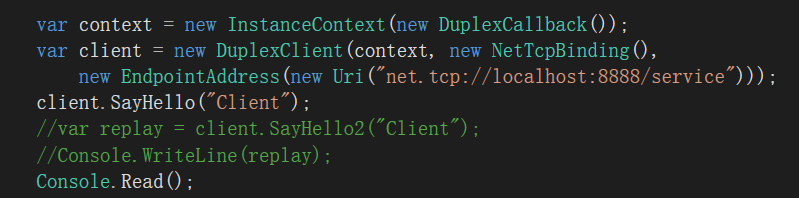
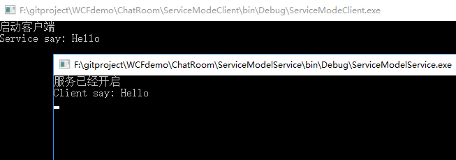

**本文demo已上传至github：[xinyuehtx/WCFdemo](https://github.com/xinyuehtx/WCFdemo)**

这个博客会介绍如何设置服务操作调用模式的第三种双工模式（Duplex）

-----

## 双工模式

双工模式意味这个客户端可以向服务端发送消息，同时服务端也可以向客户端发送消息

双工模式实际上是由`客户端->服务端`的服务协议和`服务端->客户端`的回调协议组成。

而每个协议中的方法都可以选择是单向模式，或者是请求答复模式。

因此双工模式实际上是之前两种模式的组合。

如图所示在创建双工模式的协定时，我们需要定义两个接口`IDuplex`用于客户端向服务端发送消息（或者称之为调用服务端方法），`IDuplexCallback`用于服务端向客户端发送消息（或者称之为调用客户端方法）

注意我们通过设置	`ServiceContract`的`CallbackContract`指定服务的回调接口

在服务端实现上我们额外通过`OperationContext`获取定义为`IDuplexCallback`接口的通道。

通过这个通道（客户端的透明代理），在服务端就可以调用客户端的方法

在客户端实现上也有变动，我们需要继承`DuplexClientBase<T>`，同时我们的构造函数也需要额外传入一个`InstanceContext`

在客户端的使用时，我们需要将回调接口的实现注入到`InstanceContext`中，并且传入客户端的构造函数

运行程序，我们发现，客户端向服务端发送了消息，服务端也向客户端发送了消息。实现了双向的通信

### 小结

我们研究了WCF服务的双工模式，其特点有

- 可以实现双向通信
- 协定的每个方法都可以通过`OperationContract`指定为单向或者请求答复模式
- 双工协定要求Binding支持双工模式(如`NetTcpBinding`)
- 双工模式在底层实现利用了会话机制，但是在指定服务协定时可以不要求会话。

参考链接：

- [请求-答复服务 | Microsoft Docs](https://docs.microsoft.com/zh-cn/dotnet/framework/wcf/feature-details/request-reply-services)
- [单向服务 | Microsoft Docs](https://docs.microsoft.com/zh-cn/dotnet/framework/wcf/feature-details/one-way-services)
- [双工服务 | Microsoft Docs](https://docs.microsoft.com/zh-cn/dotnet/framework/wcf/feature-details/duplex-services)

