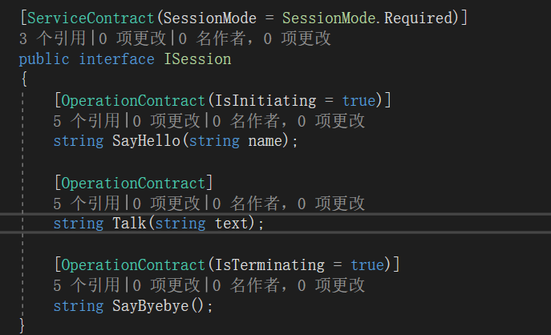
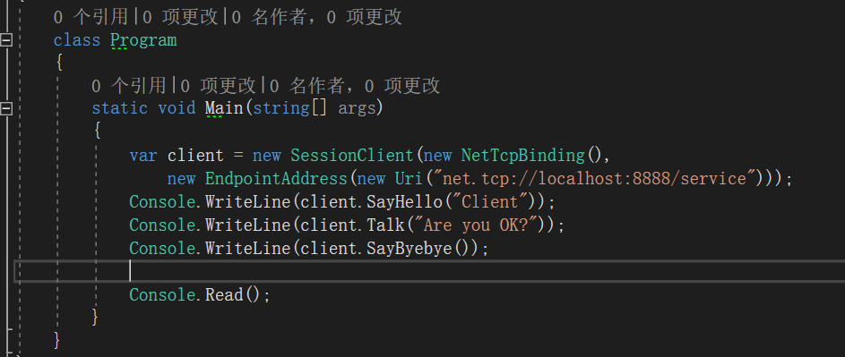
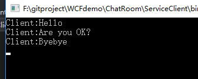
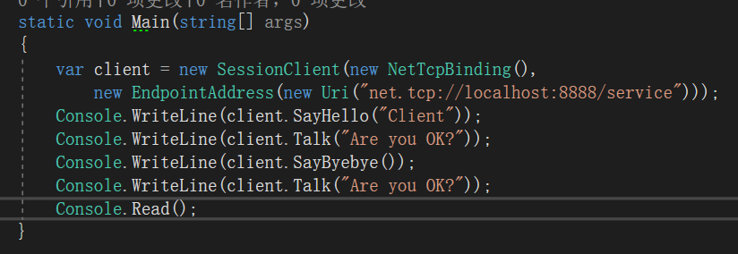
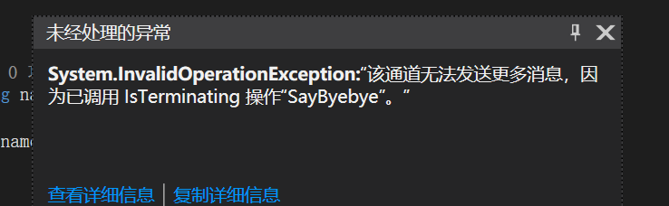
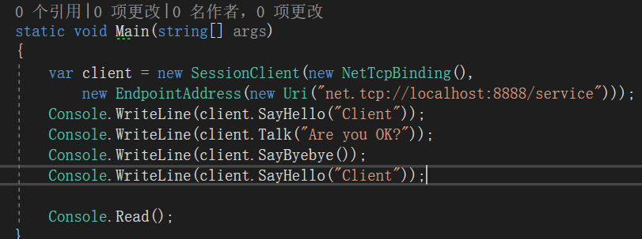
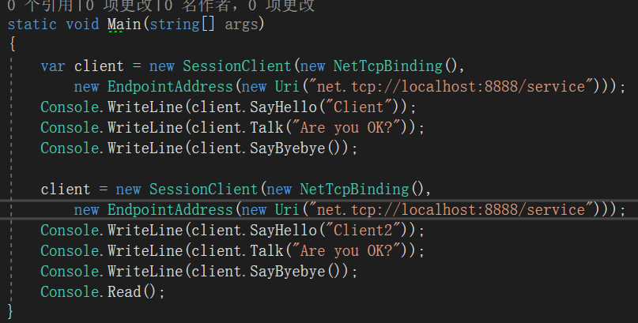
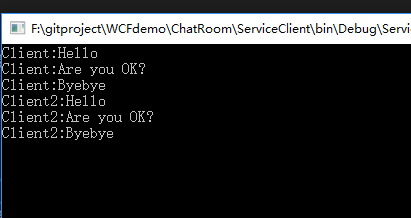

**本文demo已上传至github：[xinyuehtx/WCFdemo](https://github.com/xinyuehtx/WCFdemo)**

这个博客会介绍如何设置服务的会话

-----

## 会话(Session)

还记得[2019-1-25-wcf入门（5） - huangtengxiao](https://xinyuehtx.github.io/post/wcf%E5%85%A5%E9%97%A8-5.html)中提到的双工模式么？

大家有没有疑问为什么服务端能够知道该向谁回复消息呢？

有人可能会说因为我们例子里面的TCP是面向连接的。

可是系统提供的[WSDualHttpBinding](https://docs.microsoft.com/zh-cn/dotnet/api/system.servicemodel.wsdualhttpbinding)也是支持双工的，但是它的通道是无状态的Http协议

另外对于多个服务操作调用，有时我们需要它们之间有一些状态共用，那么也需要有一个方式将一系列消息关联在一起。

这些情况就需要用到会话。微软官方将会话定义为：在两个终结点之间发送的所有消息的一种相互关系。

会话有显式的启动和终止。在此期间所有的消息都是属于会话的一部分

## 使用会话

如图所示，使用会话时需要在服务协定设置`SeesionMode`。对于`Required`指该服务必须使用会话

此外，还需要选取两个操作，通过`IsInitialting`和`IsTerminating`设置会话的启动和终止

在服务实现上，对于`SayHello`方法，传入客户端的name并且保存为字段。在其后所有的回复中都带上name

注意这里我们还设置了一个`ServiceBehavior`，并且指定`InstanceContextMode`为`PerSession`。这个是设置整个会话的生命周期内，只使用服务类的单个实例。实例化的具体内容会在后续博客中介绍

我们看下客户端的调用，依次调用会话启动方法，其余方法，会话终止方法。

我们可以看到所有的回复都带上了客户端在会话启动方法传入的name

## 会话的问题

在WCF中客户端是通过一个通道创建了服务的透明代理。而当会话终止时，相应的通信通道也会关闭。这时候我们如果继续在已经关闭的通道上通信就会引发异常。

当然如下所示的尝试在这个通过再次建立会话也是不可以的。

如果需要重新同服务端通信，则需要再次实例化一个SessionClient

### 小结

我们研究了WCF服务的会话，其特点有

- 可以实现一组消息相互关联
- 需要显示启动和终止
- 终止后通过会关闭，再次通信需要重新实例化客户端

参考链接：

- [如何：创建要求会话的服务 - Microsoft Docs](https://docs.microsoft.com/zh-cn/dotnet/framework/wcf/feature-details/how-to-create-a-service-that-requires-sessions)
- [会话、实例化和并发 - Microsoft Docs](https://docs.microsoft.com/zh-cn/dotnet/framework/wcf/feature-details/sessions-instancing-and-concurrency)

