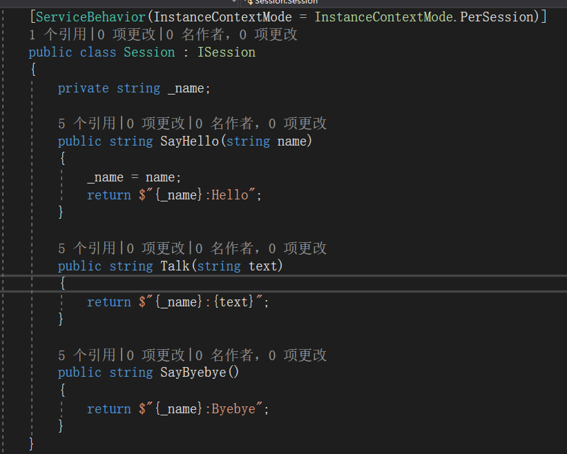
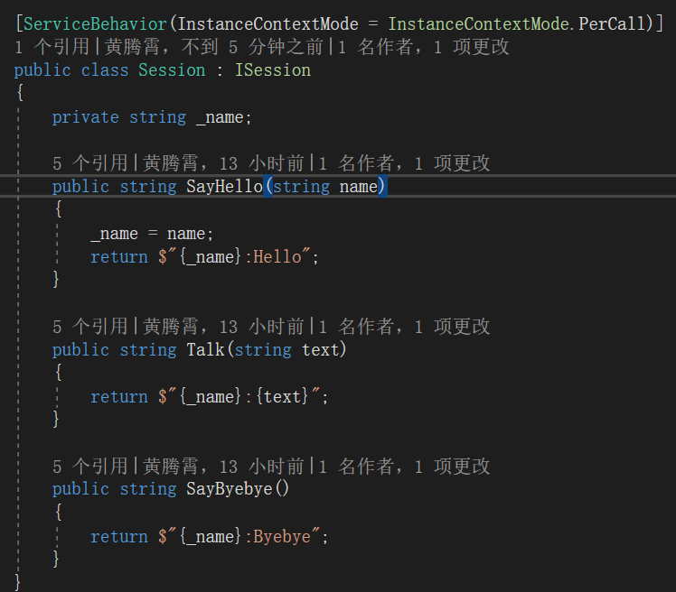
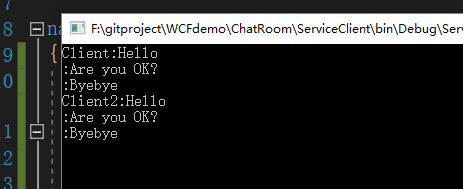
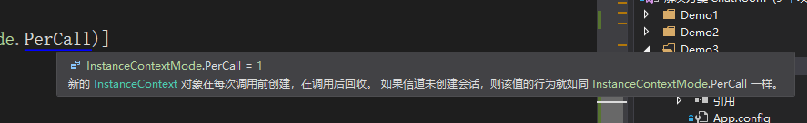
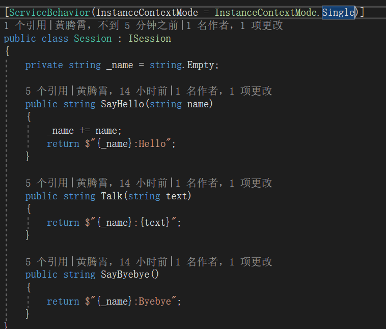
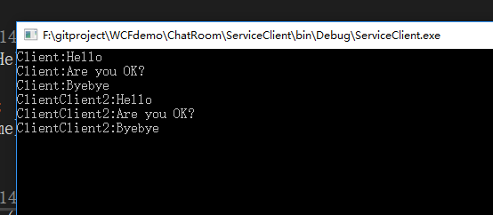

**本文demo已上传至github：[xinyuehtx/WCFdemo](https://github.com/xinyuehtx/WCFdemo)**

这个博客会介绍如何设置服务的实例化

-----

## 实例化(Instance)

在[2019-1-27-wcf入门（6） - huangtengxiao](https://xinyuehtx.github.io/post/wcf%E5%85%A5%E9%97%A8-6.html)中介绍会话时，我们已经接触过实例化。

如图所示，当时我们在服务实现上设置了一个`ServiceBehavior`，并且指定`InstanceContextMode`为`PerSession`。确保整个会话的生命周期内，只使用服务类的单个实例。

还是使用上一篇博客中会话的demo。我们试着为`InstanceContextMode`设置不同的选项。

我们首先设置为`PerCall`

结果如图所示

我们发现除了会话启动方法以外，其余方法都丢失了客户端的name

我们看下注释：“新的InstanceContext对象在每次调用前创建，在调用后回收。如果信道未创建会话，则该值的行为就如同InstanceContextMode.PerCall”一样

这个注释说明了两件事情：

- 设置为PerCall时，每次调用服务端的方法，都会新创建一个服务实例。我们在创建会话方法传入name的实例，随着方法调用的结束而销毁。后续的方法都是使用的新实例。
- 这个注释的后半句是错误的，应该是属于`PerSession`的内容。可以参见[InstanceContextMode Enum (System.ServiceModel) - Microsoft Docs](https://docs.microsoft.com/zh-cn/dotnet/api/system.servicemodel.instancecontextmode?view=netframework-4.7.2)。即在未启用会话时，`PerSession`和`PerCall`的行为时一致的。

那么对于`Single`呢？WCF中`Single`表示整个服务的生命周期内，使用同一个实例

我们再做个试验，将`InstanceContextMode` 设置为`Single`，并且将`_name = name`改为`_name += name`

我们看到第二个会话中客户端的name被拼接了

### 什么是实例化

实例化是一种服务行为设置，控制服务对象的创建和释放。

我们可以通过实例化控制服务端状态的使用（例如和会话结合，或者创建单例服务）

### 小结

我们研究了WCF服务的实例化，其特点有

- 可以有`PerCall`,`PerSession`,`Single`三种选择
- 可以在服务端留存状态

参考链接：

- [InstanceContextMode Enum (System.ServiceModel) - Microsoft Docs](https://docs.microsoft.com/zh-cn/dotnet/api/system.servicemodel.instancecontextmode?view=netframework-4.7.2)
- [2019-1-27-wcf入门（6） - huangtengxiao](https://xinyuehtx.github.io/post/wcf%E5%85%A5%E9%97%A8-6.html)
- [会话、实例化和并发 - Microsoft Docs](https://docs.microsoft.com/zh-cn/dotnet/framework/wcf/feature-details/sessions-instancing-and-concurrency)
- 

