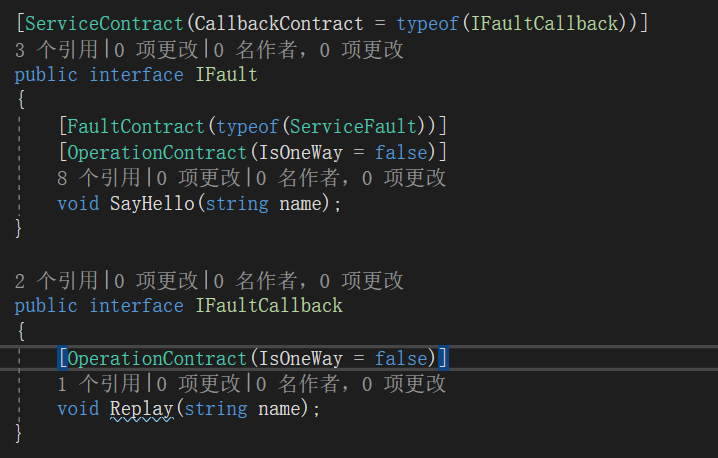
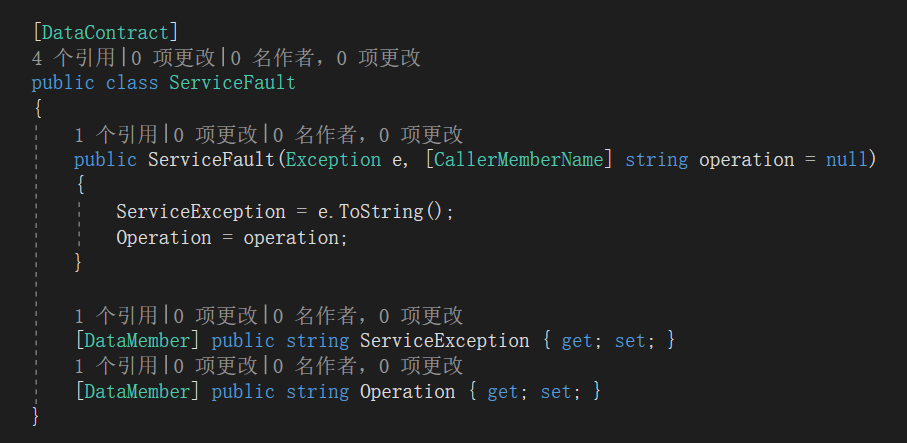
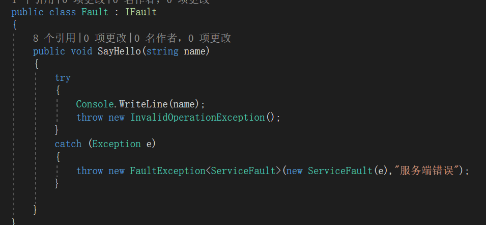
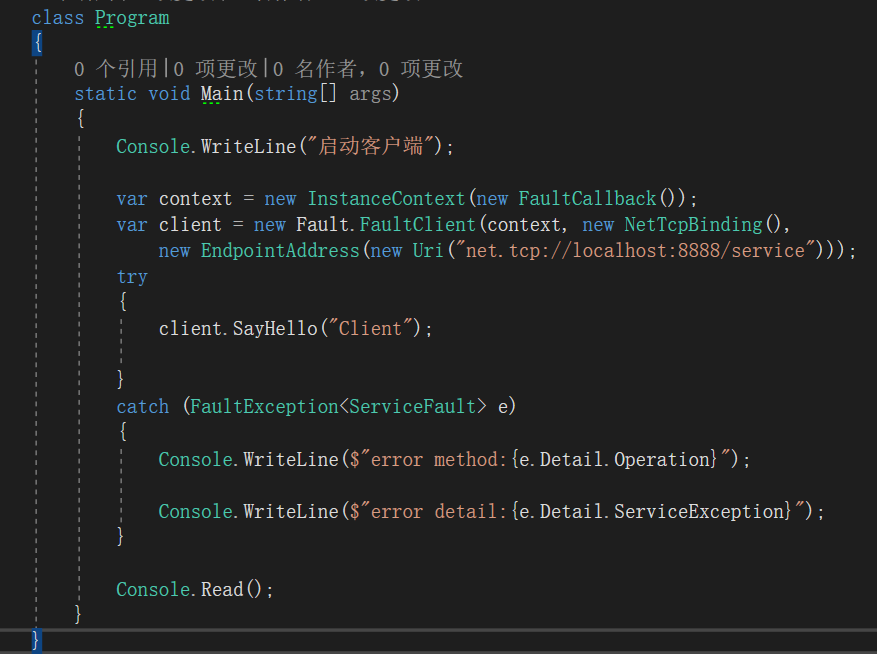
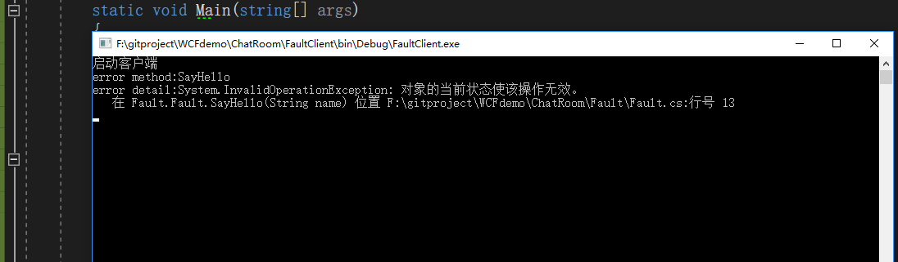
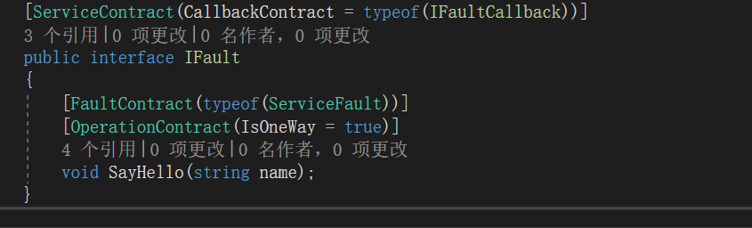
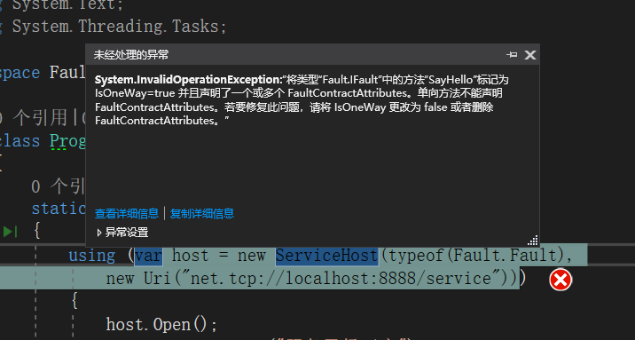

**本文demo已上传至github：[xinyuehtx/WCFdemo](https://github.com/xinyuehtx/WCFdemo)**

这个博客会介绍如何设置服务的异常回馈

-----

多进程之间调试，或者是客户端/服务器联调，很麻烦的一点是出了异常如何定位？

是客户端问题，还是服务端问题，抑或是信道问题？

这时候通过异常回馈将服务端发生的异常信息反馈给客户端就显得很重要。

## 错误协定（FaultContract）

服务操作可以标记错误协定，表明这个方法可能会出现指定错误。

示例中我们为`SayHello`方法指定了异常协定，表明可能会抛出详情信息为`ServiceFault`的异常。

而`ServiceFault`是一个通过数据协定的标记的可序列化的类型。这里我们通过它将方法中的异常，和方法名称做了封装。

在服务实现中，我们通过抛出`FaultException`，将`ServiceFault`包装，传递给客户端

在客户端我们通过trycatch将异常打印出来

可以看到异常成功输出

### 错误协定风险

聪明的同学都已经注意到，我们刚刚试验的操作协定是请求答复模式的（同步方法）。那么对于单向模式会如何呢？

我们尝试将`IsOneWay`设置为`True`

抛出异常咯，单向方法不可以使用错误协定

### 小结

我们研究了WCF服务的错误协定，其特点有

- 可以将服务端的指定错误回馈客户端，通过简单包装可以传递所有托管异常的基本信息
- 协定传递的对象需要可以被数据协定序列化
- 不能处理单向操作

参考链接：

- [如何：在服务协定中声明错误 | Microsoft Docs](https://docs.microsoft.com/zh-cn/dotnet/framework/wcf/how-to-declare-faults-in-service-contracts)
- [定义和指定错误 | Microsoft Docs](https://docs.microsoft.com/zh-cn/dotnet/framework/wcf/defining-and-specifying-faults)

