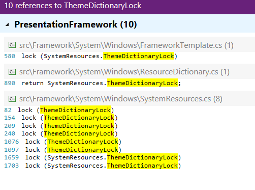

我们都知道我们都知道WPF是一个单UI线程的应用模型

-----

但是实际上我们可以通过在后台线程跑一个`Dispatcher`来运行UI元素

详情可以参见这个大大的博客[Launching a WPF Window in a Separate Thread, Part 1 : Reed Copsey, Jr.](http://reedcopsey.com/2011/11/28/launching-a-wpf-window-in-a-separate-thread-part-1/)

这种场景用来加载一个欢迎界面还是很nice的

但是显然WPF的团队没有充分考虑过这种场景，因为我们遇到了如下的异常“集合已经修改”


```C#
System.Windows.Markup.XamlParseException: 集合已修改；可能无法执行枚举操作。 ---> System.InvalidOperationException: 集合已修改；可能无法执行枚举操作。
   在 System.ThrowHelper.ThrowInvalidOperationException(ExceptionResource resource)
   在 System.Collections.Generic.List`1.Enumerator.MoveNextRare()
   在 System.Collections.Generic.List`1.Enumerator.MoveNext()
   在 System.Windows.Baml2006.WpfSharedBamlSchemaContext.GetKnownXamlType(Type type)
   在 System.Windows.Baml2006.WpfSharedBamlSchemaContext.GetXamlType(Type type)
   在 System.Windows.Baml2006.Baml2006SchemaContext.GetXamlType(Type type)
   在 System.Xaml.XamlObjectWriter.GetXamlType(Type clrType)
   在 System.Xaml.XamlObjectWriter.WriteEndMember()
   在 System.Xaml.XamlWriter.WriteNode(XamlReader reader)
   在 System.Windows.Markup.WpfXamlLoader.TransformNodes(XamlReader xamlReader, XamlObjectWriter xamlWriter, Boolean onlyLoadOneNode, Boolean skipJournaledProperties, Boolean shouldPassLineNumberInfo, IXamlLineInfo xamlLineInfo, IXamlLineInfoConsumer xamlLineInfoConsumer, XamlContextStack`1 stack, IStyleConnector styleConnector)
   在 System.Windows.Markup.WpfXamlLoader.Load(XamlReader xamlReader, IXamlObjectWriterFactory writerFactory, Boolean skipJournaledProperties, Object rootObject, XamlObjectWriterSettings settings, Uri baseUri)
   --- 内部异常堆栈跟踪的结尾 ---
   在 System.Windows.Markup.WpfXamlLoader.Load(XamlReader xamlReader, IXamlObjectWriterFactory writerFactory, Boolean skipJournaledProperties, Object rootObject, XamlObjectWriterSettings settings, Uri baseUri)
   在 System.Windows.Markup.WpfXamlLoader.LoadBaml(XamlReader xamlReader, Boolean skipJournaledProperties, Object rootObject, XamlAccessLevel accessLevel, Uri baseUri)
   在 System.Windows.Markup.XamlReader.LoadBaml(Stream stream, ParserContext parserContext, Object parent, Boolean closeStream)
   在 System.Windows.Application.LoadComponent(Object component, Uri resourceLocator)
```

问题堆栈如上，我们还抓到了不同的路径，但是最终指向的问题都是`GetKnownXamlType`

我们看下源码


整个方法中只有一个foreach循环，那么显然这是一个多线程问题


`_themeHelper`作为一个backing field只有一处赋值，而且`ThemeKnownTypeHelpers`属性不是线程安全的，所以应该是存在2种可能性：

1、循环的时候其他线程对该属性赋值

2、2个线程同时访问`ThemeKnownTypeHelpers`属性

我们跟踪下代码`Application.LoadComponent`调用了静态方法`XamlReader.LoadBaml`

这个方法中创建了baml的reader


我们关注下其中的参数`Baml2006SchemaContext`,这个类的公开构造函数中使用了静态属性`XamlReader.BamlSharedSchemaContext`。这是一个线程安全的`Lazy`构造的`WpfSharedBamlSchemaContext`。

所以所有线程都会访问同一个`WpfSharedBamlSchemaContext`


我们再看` ThemeKnownTypeHelper`,它是一个抽象类，`PresentationFramework`没有找到它的子类
但是我们在`PresentationFramework.Luna`里找到了`KnownTypeHelper`，它访问了`ThemeKnownTypeHelpers`属性，并且修改了集合


那么这个类会在哪里用到呢？我们在`SystemResource.LoadExternalAssembly`中找到了它。

这里是wpf的主题设置代码，当我们需要引入外部主题时，会从同名不同后缀的程序集进行查找。具体可参见[默认的WPF样式在哪里 - haungtengxiao](https://xinyuehtx.github.io/post/%E9%BB%98%E8%AE%A4%E7%9A%84WPF%E6%A0%B7%E5%BC%8F%E5%9C%A8%E5%93%AA%E9%87%8C.html)


不过在加载主题时是会适用锁的就是`ThermeDictionaryLock`,这个锁会对主题的`Style`和`Template`以及`Application`的资源字典加锁。但是调试发现，在`WpfXamlLoader.TransformNodes`的多条路径（比如下面这条）都可以无锁访问到`GetKnownXamlType`方法，而后者方法内的锁与前者不同。




所以也希望这个bug可以被修复

参考链接：

- [Launching a WPF Window in a Separate Thread, Part 1 : Reed Copsey, Jr.](http://reedcopsey.com/2011/11/28/launching-a-wpf-window-in-a-separate-thread-part-1/)
- [WpfSharedBamlSchemaContext](https://referencesource.microsoft.com/#PresentationFramework/src/Framework/System/Windows/Markup/Baml2006/WpfSharedBamlSchemaContext.cs,d37dbb607edee3ef)
- [XamlReader](https://referencesource.microsoft.com/#PresentationFramework/src/Framework/System/Windows/Markup/XamlReader.cs,5981dffc7d85947d)
- [Baml2006SchemaContext](https://referencesource.microsoft.com/#PresentationFramework/src/Framework/System/Windows/Markup/Baml2006/Baml2006SchemaContext.cs,099b5b3e3a0fd4bd)
- [KnownTypeHelper](https://referencesource.microsoft.com/#PresentationFramework/src/Framework/System/Windows/Markup/Baml2006/Baml2006SchemaContext.cs,099b5b3e3a0fd4bd)
- [ThemeKnownTypeHelper](https://referencesource.microsoft.com/#PresentationFramework/src/Framework/System/Windows/Markup/Baml2006/ThemeKnownTypeHelper.cs,5d8d06b3b80571ba,references)
- [SystemResource](https://referencesource.microsoft.com/#PresentationFramework/src/Framework/System/Windows/SystemResources.cs,896d92fba1218ec1)


