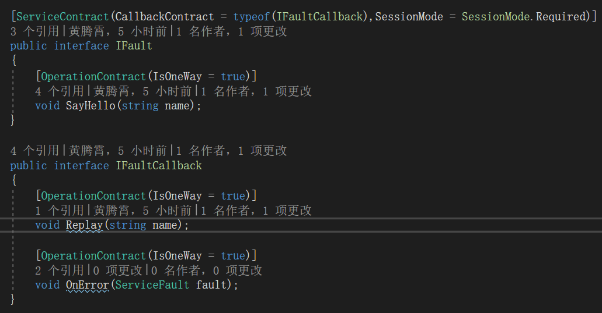
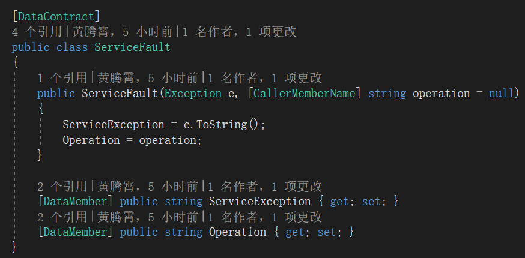
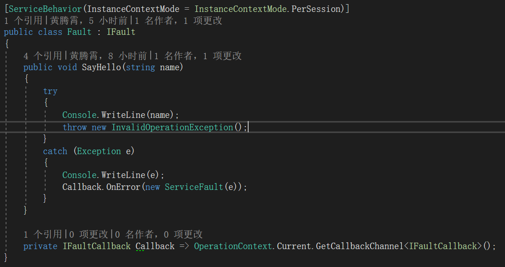
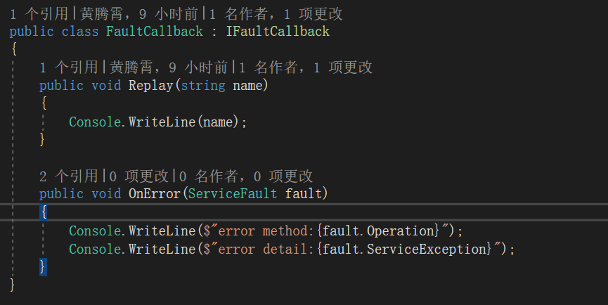
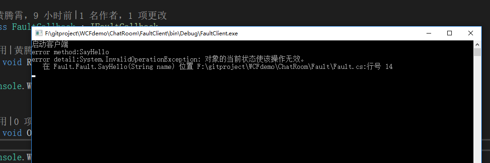

**本文demo已上传至github：[xinyuehtx/WCFdemo](https://github.com/xinyuehtx/WCFdemo)**

这个博客会介绍如何设置服务的异常回馈

-----

在之前的博客[2019-1-29-wcf入门（9） - haungtengxiao](https://xinyuehtx.github.io/post/wcf%E5%85%A5%E9%97%A8-9.html)和[2019-1-30-wcf入门（10） - haungtengxiao](https://xinyuehtx.github.io/post/wcf%E5%85%A5%E9%97%A8-10.html)中介绍了wpf提供的2种错误协定回馈异常的方式。

遗憾的是这2中方式都没有办法处理OneWay的情形。

这边博客介绍如何利用我们现有知识针对OneWay的情形回馈异常

## 回馈单向模式异常

### 为什么单向模式不能回馈异常

我们在[2019-1-25-wcf入门（4） - haungtengxiao](https://xinyuehtx.github.io/post/wcf%E5%85%A5%E9%97%A8-4.html)博客中说过，单向模式在调用服务端方法时会立刻返回。

那么当我们抛出异常时，服务端已经不知道该把异常信息回复给谁了。

所以对于单向模式，错误协定无法回馈错误信息。

### 如何回馈单向模式异常

还记得我们解决单向模式返回值问题的方案么？

没错就是[2019-1-25-wcf入门（5） - haungtengxiao](https://xinyuehtx.github.io/post/wcf%E5%85%A5%E9%97%A8-5.html)中提到的双工模式

说白了，就是添加一个传递异常信息的回调接口，在发生异常时向这个回调接口发送异常信息

我们在`IFaultCallback`接口中添加了一个`OnError`方法，传递[2019-1-29-wcf入门（9） - haungtengxiao](https://xinyuehtx.github.io/post/wcf%E5%85%A5%E9%97%A8-9.html)中错误协定定义的`ServiceFault`类型，它包含了方法和异常信息。注意`ServiceFault`需要能通过数据协定序列化

实现上catch所有异常，并将异常信息包装成`ServiceFault`发送给客户端

最后我们在客户端输出异常信息

结果如图所示，我们成功获得服务端异常信息

### 存在问题

既然是利用双工协定，那么必然需要一些双工协定的必要支持，例如绑定，会话，实例化等选择

这个会在一些期望添加单向模式异常反馈的现有WCF方案造成一些限制

### 小结

我们研究了WCF服务的单向模式异常反馈，其特点有

- 利用双工在业务层实现
- 有双工模式的限制
- 能处理单向操作

参考链接：

- [如何：在服务协定中声明错误 - Microsoft Docs](https://docs.microsoft.com/zh-cn/dotnet/framework/wcf/how-to-declare-faults-in-service-contracts)
- [定义和指定错误 - Microsoft Docs](https://docs.microsoft.com/zh-cn/dotnet/framework/wcf/defining-and-specifying-faults)
- [在协定和服务中指定和处理错误 - Microsoft Docs](https://docs.microsoft.com/zh-cn/dotnet/framework/wcf/specifying-and-handling-faults-in-contracts-and-services)
- [2019-1-29-wcf入门（9） - haungtengxiao](https://xinyuehtx.github.io/post/wcf%E5%85%A5%E9%97%A8-9.html)
- [2019-1-30-wcf入门（10） - haungtengxiao](https://xinyuehtx.github.io/post/wcf%E5%85%A5%E9%97%A8-10.html)
- [2019-1-25-wcf入门（4） - haungtengxiao](https://xinyuehtx.github.io/post/wcf%E5%85%A5%E9%97%A8-4.html)
- [2019-1-25-wcf入门（5） - haungtengxiao](https://xinyuehtx.github.io/post/wcf%E5%85%A5%E9%97%A8-5.html)

