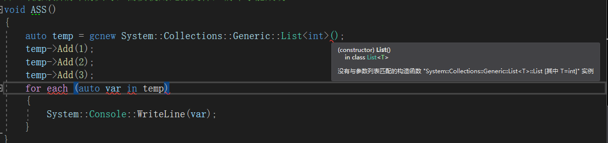
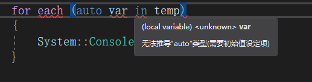
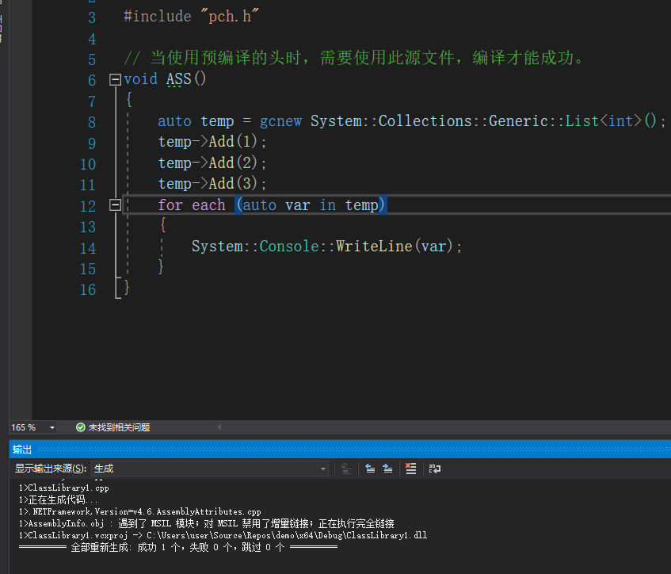
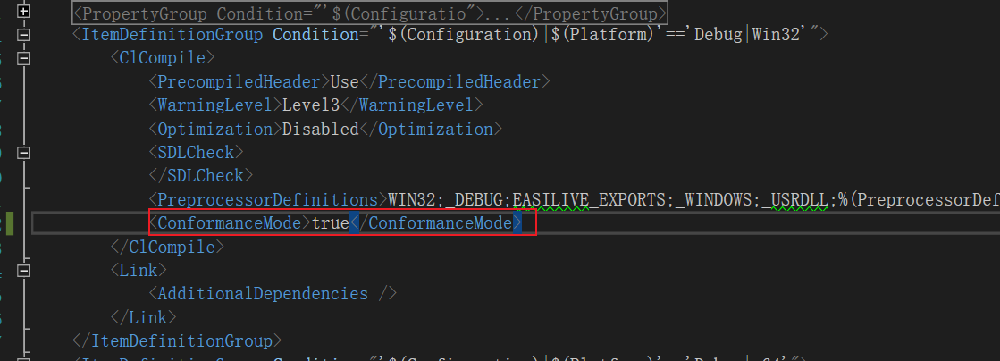
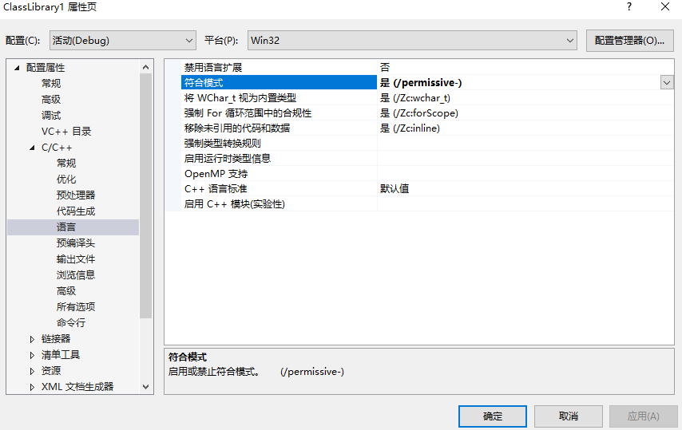

作为一名.Net开发，如果有一天编译器突然告诉你，你必须要为每一个list的构造函数传入参数，不能使用foreach处理数列。你会不会抓狂？

-----

来分享下我踩到的坑

然而c++/cli是.NET兼容语言，语法自然是支持list或者foreach的使用的。所以事实上这里的语法完全没有任何问题，而且是可以通过编译的，就如同下图。

那么是什么造成这些错误提示了呢？

既然语法没有问题，那么原因就可能集中在编译器上了。

那会不会是IDE的设置问题呢？

尝试了多个vs版本以及c++编译器版本，这个错误提示都会出现。

这样一来问题就应该在项目配置上，即我们的.vcxproj上面的设置

最终在找到了ItemDefinitionGroup->ClCompile->ConformanceMode这个设置

这个设置，是指标准C++兼容模式。

我们知道由于历史原因，c++存在多个版本，vc++和ISO的c++存在一定的语法差异。

这个选项就是告诉编译器，只能按照标准c++的语法进行编译，任何vc++特有的c++语法都不能通过。

那么，对于c++/cli来说，是.NET兼容语言，自然和标准c++的语法差异更大了。

所以我们将这一项改为false就能编译通过了。

当然在项目的属性页，也可以通过配置属性->C/C++->语言->符合模式，找到这个选项

不过对于vs创建的C++的CLR项目这个属性默认是false的。

因此，出现这个情况很可能是该项目从vc++项目改动过来导致的

参考链接：

- [Give Visual C++ a Switch to Standard Conformance - C++ Team Blog](https://devblogs.microsoft.com/cppblog/permissive-switch/)
- [MSVC conformance improvements in Visual Studio 2017 version 15.5 - C++ Team Blog](https://devblogs.microsoft.com/cppblog/msvc-conformance-improvements-in-visual-studio-2017-version-15-5/)

