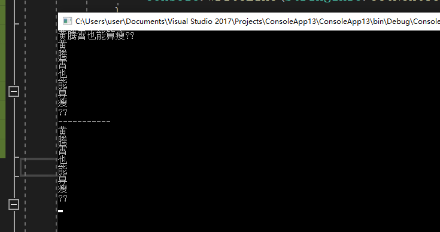

之前在处理文本的时候遇到过这样的一个问题，有的字，它看着是一个，但是程序说他是两个，但是实际真的是一个。
好吧，你们一定没有听懂我在讲什么。没关系一起来看看代码

-----

假如有这么一个字符串“黄腾霄好瘦哦”，需要使用程序找出这个字符串包含几个字，怎么找？

```C#
var s=“黄腾霄好瘦哦”;
var len=s.Length;
```

很简单是不是。那再看看这个字符串，“黄腾霄也能算瘦🤔”，不出意料的话应该是8个字对吧？

我们看看上一个程序的输出。


惊了，他居然输出了长度为9。

实际上这个地方的问题出在最后一个emoji上。

让我们先看看这个字符串的Unicode编码是什么样的。


我们看到这个`8个字符`的字符串实际上包含了9个Unicode。


而其中整个emoji字符🤔，实际是由2个Unicode字符拼接而成的。

实际上对于“U+D800-U+DFFF”中的值是作为代理字符对存在的，他们会将两个字符映射成为一个字符。

所以在Unicode编码上是2个，而显示上却只有一个。而我们的String.Length恰好就只是读Unicode编码的个数。

所以才会出现多一个的情况。

那么怎么办呢？我们看看下面这个代码

```c#
var s = @"黄腾霄也能算瘦🤔";
var len = s.Length;
var info = new StringInfo(s);
var realLength = info.LengthInTextElements;

```


成功！！`StingInfo`可以获取字符串实际显示的字符个数。

当然这样还不够，我们还是会想要枚举字符串中每个字符。

不过SringInfo并不是集合，也没有继承`IEnumerable`的接口

但是我们可以通过静态方法`StringInfo.GetNextTextElement`获得指定位置的显示字符

或者通过静态方法`StringInfo.GetTextElementEnumerator`获得指定字符串的显示字符迭代器。

我们看看如下代码

```c#
var s = @"黄腾霄也能算瘦🤔";
var len = s.Length;
var info = new StringInfo(s);
var realLength = info.LengthInTextElements;
Console.WriteLine(s);
for (int i = 0; i < realLength; i++)
{
    Console.WriteLine(StringInfo.GetNextTextElement(s, i));
}

Console.WriteLine("-----------");
var enumerator = StringInfo.GetTextElementEnumerator(s);
while (enumerator.MoveNext())
{
    Console.WriteLine(enumerator.GetTextElement());
}

```



我们看到每个显示字符都成功迭代了。（PS：console下字体无法识别emoji字符，所以会使用??来显示，但是枚举方法是对的）

---

参考文献：

[StringInfo Class (System.Globalization) - Microsoft Docs](https://docs.microsoft.com/en-us/dotnet/api/system.globalization.stringinfo?view=netframework-4.8)

[UTF-16 - 维基百科，自由的百科全书](https://zh.wikipedia.org/wiki/UTF-16#%E4%BB%8EU+D800%E5%88%B0U+DFFF%E7%9A%84%E7%A0%81%E4%BD%8D)


