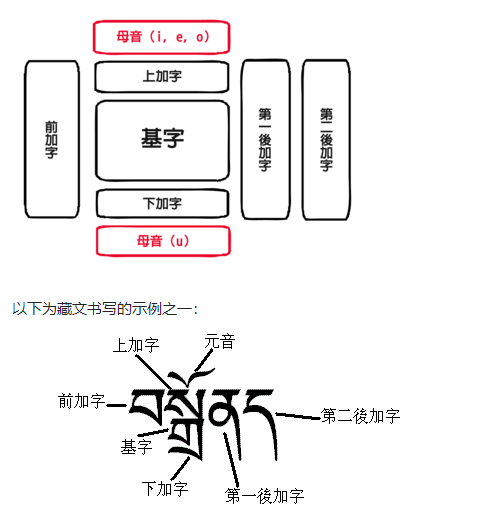
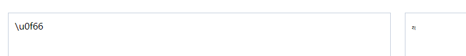
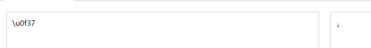
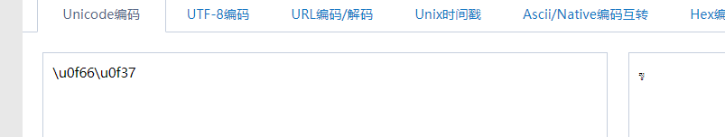
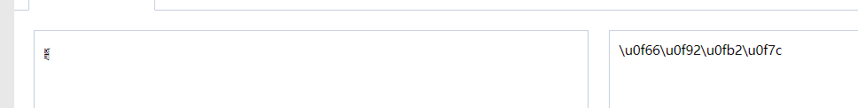
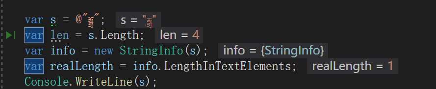

还记得我10min之前发的[2019-11-10-使用StringInfo正确查找字符个数 - huangtengxiao](https://xinyuehtx.github.io/post/%E4%BD%BF%E7%94%A8StringInfo%E6%AD%A3%E7%A1%AE%E6%9F%A5%E6%89%BE%E5%AD%97%E7%AC%A6%E4%B8%AA%E6%95%B0.html)这篇博客么？

你们以为2个Unicode组成的emoji就是极限了么？

这篇文章会带你们体验下世界语言的博大之组合字。

-----

组合字就是说对于某些精妙的语言，多个单独可渲染的文字，放在一起后就会渲染成一个文字。

其中最著名的就是我们的藏文。下图是wiki上的说明，大致意思就是一个藏文基字可以通过加加加好多个字，变成还是一个字。

 

比如我们可以看到下面两个藏文Unicode的渲染是这样的

但是他们合并起来之后就变成这样了

同样对于`སྒྲོ`字符，你看着是一个字符，实际上它有4个Unicode编码。

那么问题来了，[2019-11-10-使用StringInfo正确查找字符个数 - huangtengxiao](https://xinyuehtx.github.io/post/%E4%BD%BF%E7%94%A8StringInfo%E6%AD%A3%E7%A1%AE%E6%9F%A5%E6%89%BE%E5%AD%97%E7%AC%A6%E4%B8%AA%E6%95%B0.html)博客中提到的`SringInfo`能不能正确识别藏文的显示字符数呢？

成功！！所以再也不用担心自己编写文字软件时，找不对这些文字的光标位置了。

---

参考文献：

[2019-11-10-使用StringInfo正确查找字符个数 - huangtengxiao](https://xinyuehtx.github.io/post/%E4%BD%BF%E7%94%A8StringInfo%E6%AD%A3%E7%A1%AE%E6%9F%A5%E6%89%BE%E5%AD%97%E7%AC%A6%E4%B8%AA%E6%95%B0.html)

[藏文 - 维基百科，自由的百科全书](https://zh.wikipedia.org/wiki/%E8%97%8F%E6%96%87)

