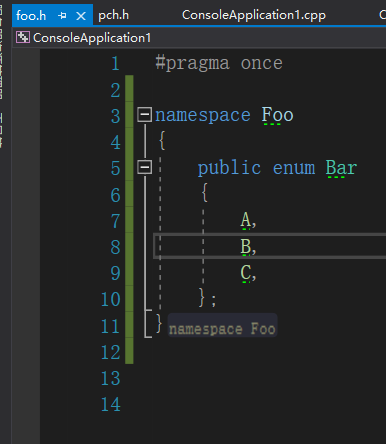
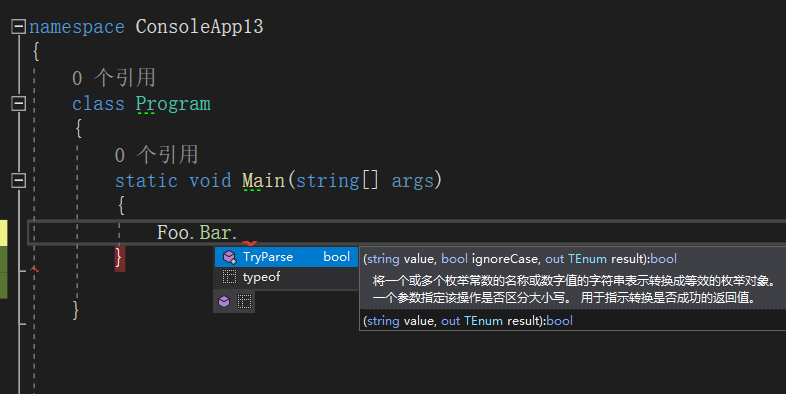
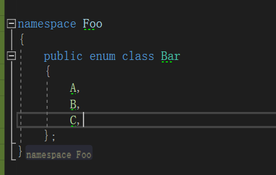
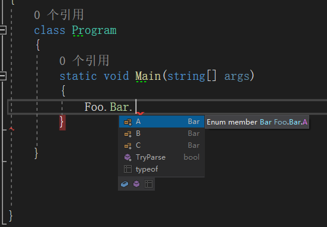

最近在搞C++/CLI，发现我在其中写的enum居然不见了，这个是怎么回事呢。

-----

首先我们在C++/CLI项目里面建立一个enum

当我们将其在c#项目中引用时，神奇的事情发生了，这个枚举的枚举值不见了。

现在我们试着给枚举值做一点改变，加一个class

枚举又正常了。

实际上在C++/CLI中我们可以定义两种枚举类型，不加`class`关键字的是标准C++枚举，加`class`关键字的是托管枚举或者叫做CLR枚举。

对于C++/CLI来说，作为一种跨边界语言，能够轻松的在托管和非托管语言中自由切换，但是对于C#项目（.NET）项目来说，必须使用CLS兼容的托管枚举。所以没有`class`关键字的枚举，自然就看不见了。

---

参考文献：

[visual studio - C++/CLI enum not showing up in C# with reference to C++/CLI project - Stack Overflow](https://stackoverflow.com/questions/7031439/c-cli-enum-not-showing-up-in-c-sharp-with-reference-to-c-cli-project)

[How to: Define and consume enums in C++/CLI - Microsoft Docs](https://docs.microsoft.com/en-us/cpp/dotnet/how-to-define-and-consume-enums-in-cpp-cli?view=vs-2019)