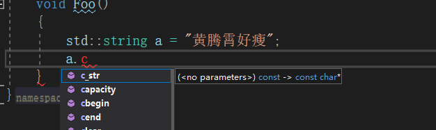
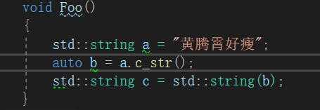
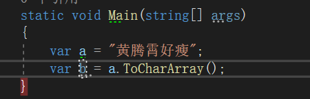
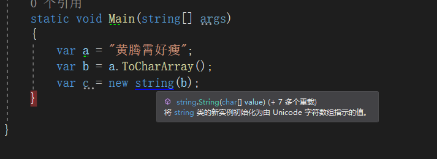
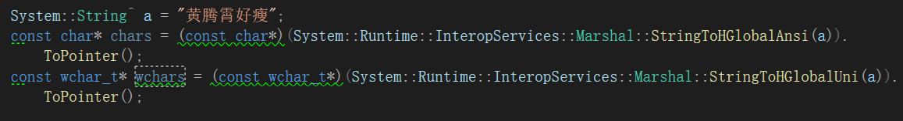
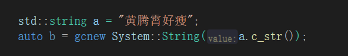

最近在搞C++/CLI，发现经常需要涉及字符串之间的传递和转换，因此记录下。

-----

在C++/CLI中，我们可以接触到三种字符串`std::string`,`System::string`,`cstring`。这里我们分别称之为标准字符串，托管字符串和c语言字符串。

# std::string 和 cstring

cstring是一个char数组，在string.h 中直接定义了`c_str`方法完成std::string 到 cstring的转换

这里获得的是一个char的指针常量，指向cstring数组

与此同时，string.h还定义了`string`构造函数从cstring构造std::string

# System::String 和 cstring

由于c#中safe代码区域不会使用指针，所以cstring的表现为char数组。

System::String 中定义了`ToCharArray`方法可以获得char数组

同样可以使用System::String 的构造函数从char数组构造System::String

当然你也可以使用`Marshal::StringToHGlobalAnsi`或者`Marshal::StringToHGlobalUni`将其转换为char\*或者wchar_t\*

# System::String 和std::string

std::string到System::String我没有直接的转换，直接使用cstring做中转

System::String到std::string或者std::wstring,可以使用marshal_context进行转换

---

参考文献：

[How to: Convert Standard String to System::String - Microsoft Docs](https://docs.microsoft.com/en-us/cpp/dotnet/how-to-convert-standard-string-to-system-string?view=vs-2019)

[c++ - convert a char* to std::string - Stack Overflow](https://stackoverflow.com/questions/1195675/convert-a-char-to-stdstring)

[How to: Convert System::String to Standard String - Microsoft Docs](https://docs.microsoft.com/en-us/cpp/dotnet/how-to-convert-system-string-to-standard-string?view=vs-2019)

[How to: Convert System::String to wchar_t* or char* - Microsoft Docs](https://docs.microsoft.com/en-us/cpp/dotnet/how-to-convert-system-string-to-wchar-t-star-or-char-star?view=vs-2019)