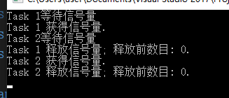

Semaphore大家应该都很熟悉，一个能够指定最大并发个数的同步锁。

实际上.NET还有一个轻量级的信号量实现SemaphoreSlim，其不但能够更加高效的实现信号量的功能，还提供了一个异步等待的API。

-----

我们首先回忆下SemaphoreSlim同步等待时的情况。

```C# 
    class Program
    {
        private static SemaphoreSlim semaphore;
        static void Main(string[] args)
        {
            semaphore = new SemaphoreSlim(1, 1);
            var tasks = new Task[2];

            for (int i = 0; i <= 1; i++)
            {
                tasks[i] = Task.Run(() =>
                {
                    Console.WriteLine("Task {0}等待信号量",
                        Task.CurrentId);
                    semaphore.Wait();
                    Console.WriteLine("Task {0} 获得信号量.", Task.CurrentId);
                    //模拟做事情况
                    Thread.Sleep(1000);

                    Console.WriteLine("Task {0} 释放信号量; 释放前数目: {1}.",
                        Task.CurrentId, semaphore.Release());
                });
            }

            // 等待task执行完成.
            Task.WaitAll(tasks);
            Console.ReadLine();
        }
    }
```

如上所示的代码中，SemaphoreSlim的初始信号数是1，且同时只能有一个线程获得锁。

此时我们的代码会依次执行。



但是此时task1和task2 的线程是阻塞的。那么在UI线程上使用，尤其是WPF这种单线程应用来说，几乎是不可行的。

此时我们就可以使用今天的主角`WaitAsync`

我们稍稍修改下代码

```c#
    class Program
    {
        private static SemaphoreSlim semaphore;

        static void Main(string[] args)
        {
            semaphore = new SemaphoreSlim(1, 1);
            var tasks = new Task[2];

            for (int i = 0; i <= 1; i++)
            {
                tasks[i] = Task.Run(async () =>
                {
                    var currentId = Task.CurrentId;
                    Console.WriteLine("Task {0}等待信号量",
                        currentId);
                    Foo(currentId);
                    Console.WriteLine("Task {0} 执行非同步区代码.", currentId);
                    Thread.Sleep(5000);
                    Console.WriteLine("Task {0} 非同步区代码执行完成.", currentId);
                });
            }

            // 等待task执行完成.
            Task.WaitAll(tasks);
            Console.ReadLine();
        }

        public static async Task Foo(int? id)
        {
            var currentId = id;
            await semaphore.WaitAsync();
            Console.WriteLine("Task {0} 获得信号量.", currentId);
            //模拟做事情况
            Console.WriteLine("Task {0} 执行同步区代码.", currentId);
            Thread.Sleep(1000);
            Console.WriteLine("Task {0} 同步区代码执行完成.", currentId);
            Console.WriteLine("Task {0} 释放信号量; 释放前数目: {1}.",
                currentId, semaphore.Release());
        }
    }
```

我们将同步区执行的代码抽取到方法Foo中，而内部调用`WaitAsync`。

结果如下所示


我们看到task3在没有获得同步锁的情况下`WaitAsync`直接返回线程控制权，所以task3线程没有被阻塞能够优先执行非同步区代码。而在获得信号量之后，继续执行同步区代码。

---

参考文档：

- [SemaphoreSlim Class (System.Threading) - Microsoft Docs](https://docs.microsoft.com/en-us/dotnet/api/system.threading.semaphoreslim?view=netframework-4.8)
- [Semaphore 和 SemaphoreSlim - Microsoft Docs](https://docs.microsoft.com/zh-cn/dotnet/standard/threading/semaphore-and-semaphoreslim)


