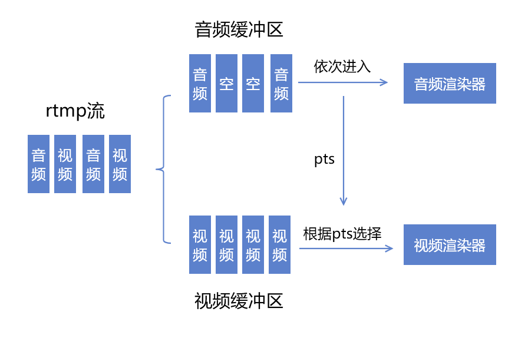

最近在搞音视频推流时，发现微信小程序端拉流时出现了画面卡死的问题。

现象是这样的，当推流端静音时，小程序拉流卡死；重新播放声音，小程序画面又再次播放

-----

所以说，问题集中在小程序端的拉流和客户端推流的音频上。

首先必须说明的是，我在视频推流时采用的策略是静音期间只推送视频帧，不推送音频帧。

在静音期间试着使用ffplay进行播放，流能够正常播放，所以不存在推流端视频流丢帧的问题

那么问题就可能集中在liverplayer播放器对纯视频帧的rtmp流的播放问题

## 猜想

那么就有一个`大胆猜测`

liveplay的播放原理是视频帧的播放依赖于音频帧的pts，结构如下图所示

这样做的好处是可以确保直播时期的音画同步，但是小程序这边没有考虑无音频帧的情况。

## 验证解决

既然只是需要一个pts，那么完全可以再静音期间推送空的音频帧，已确保音频的pts连续

那么播放器的画面就应该不会卡顿

试验一下，果然小程序的画面不再卡死

---

参考文献：

