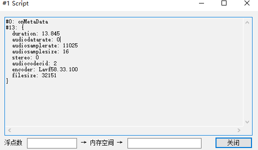
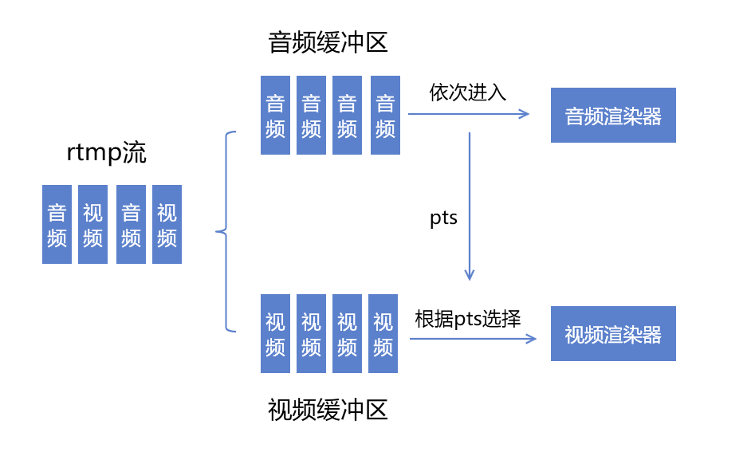

最近在搞音视频推流时，发现微信小程序端“偷偷更新”后，拉流时出现了加载失败的问题。

-----

小程序端一直在拉流之后一直在报2004，就是开始拉流但是一直失败。

然后官方文档和论坛就再也找不到任何相关信息了

同样，ffplay播放完全没有问题。那么又是同样的步骤——面向猜测开发

## 猜测

先试验下，ffmpeg进行推流，小程序播放正常。

于是使用flvdebugger进行分析，发现两者的metadata的存在差别。

下图是我推的流，这里我们没有在matedata中显式设置音频码率

于是又出现了一个大胆的`猜想`:

小程序liveplayer音频播放在某些情况下依赖于matadata中的音频码率，原来客户端推流音频码率设置为0，触发liveplayer的bug无法播放

至于微信为啥要这么做，可能的情况是：

- 为了确保直播中的音频质量，liveplayer设置了最低的播放码率要求。

如果检测到当前音频流的码率低于指定的阈值，那么播放器认为这个流存在丢包，导致卡顿等风险。

为了用户能够听到高质量的音频，干脆就不让他播放了，等到码率恢复再执行。

- 也有可能单纯没有考虑音频码率为0 的边界情况，导致bug

但是出于某种原因，微信没有根据实时的流计算码率，而是依赖于不稳定的metadata中设置的码率，导致播放出现问题

## 试验解决

那么就有一个`大胆猜测`

liveplay的播放原理是视频帧的播放依赖于音频帧的pts，结构如下图所示

这样做的好处是可以确保直播时期的音画同步，但是小程序这边没有考虑无音频帧的情况。

## 验证解决

既然只是需要一个pts，那么完全可以再静音期间推送空的音频帧，已确保音频的pts连续

那么播放器的画面就应该不会卡顿

那么解决方式就是在metadata中添加音频码率

不过音频码率没有办法精确计算，所以可以参照[2019-10-22-音频码率估算 - huangtengxiao](https://xinyuehtx.github.io/post/%E9%9F%B3%E9%A2%91%E7%A0%81%E7%8E%87%E4%BC%B0%E7%AE%97.html) 进行估算

基本设置在100-150kb/s都可以，（“反正小程序好像也没有怎么用它”）

设置之后再推流，播放完全正常

---

参考文档：

- [ live-player - 微信开放文档](https://developers.weixin.qq.com/miniprogram/dev/component/live-player.html)
- [2019-10-22-音频码率估算 - huangtengxiao](https://xinyuehtx.github.io/post/%E9%9F%B3%E9%A2%91%E7%A0%81%E7%8E%87%E4%BC%B0%E7%AE%97.html)

