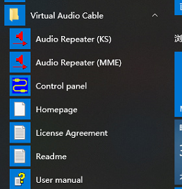
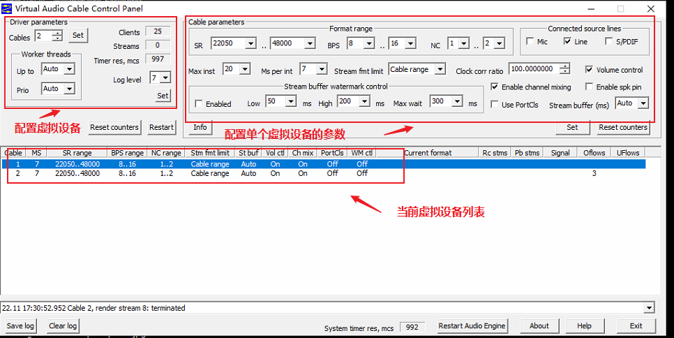
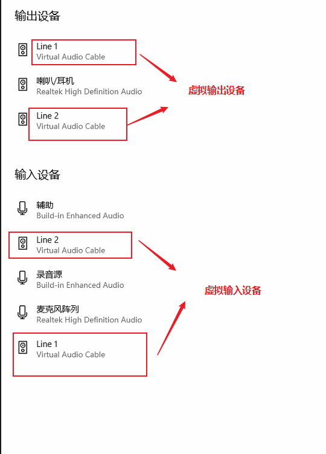
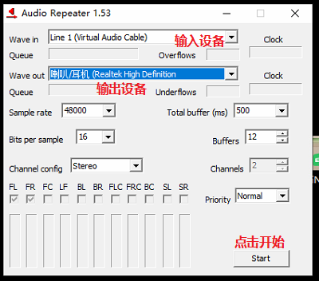
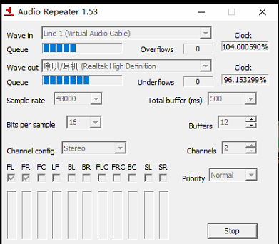
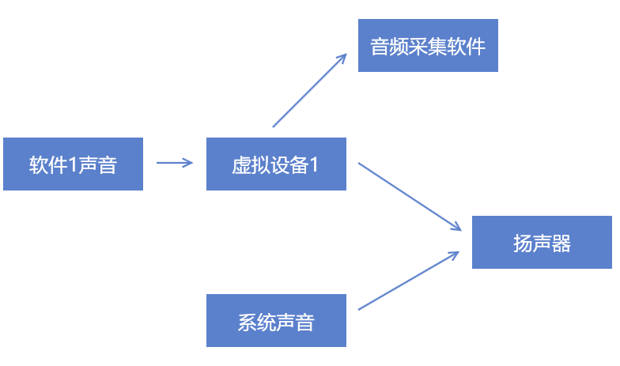

Virtual Audio Cable(VAC)是一款windows平台下的高效的虚拟声卡软件。

集音频设备虚拟，混流，采集，复用等功能与一体，倍儿好用

-----

VAC的官网地址是：[Virtual Audio Cable - connect audio applications, route and mix sounds](https://vac.muzychenko.net/cn/)

我们可以在官网找到下载地址，当前最新版本是4.60。

如果不够买的话可以下载试用版，不过使用时会有一个女声在重复`Trial`

## 介绍

安装过程不说了，反正一路选择是就行了。（不过注意的是，如果你已经装了某个版本的vac，重新安装时一定要提前卸载，否则容易出现异常）

安装完成后目录如下

`Control Panel`是VAC的设备配置控制面板，具体功能如下：

我们在这里可以设置自己的设备配置，配置完成后就可以在音频设备中看到我们的VAC虚拟设备

这里我设置了两个设备Line1，Line2既可以做输入又可以做输出

此时你将默认的音频输出设备设置为Line1，然后播放一个音频，就会发现系统是音量指示在变化，但是扬声器是没有声音发出的。因为此时的系统声音全部输入给了我们的虚拟设备，而扬声器没有得到输入，自然不会发出声音

那么怎么能够出现声音呢？

我们再打开Audio Repeater。他可以将指定设备的音频流进行拷贝（Repeat），然后输出到另一个设备中。

我们将Line1的音频再次输出到扬声器，然后开启一个音频。此时我们发现音频的声音再次出现

如果你是试用版，还能听到那个诡异的`trial`

## 使用

有同学说了，这样有啥用呀？搞了一个圈和没搞一样。

下面就介绍2种用法。

第一种用法如图所示，你可以将系统声音和扬声器之间，通过两个虚拟设备插入一个音频处理软件，这样你的系统声音就能够进行一些音效处理。比如变声啥的。

第二种用法就是将某一个软件的播放声音输入到虚拟设备，然后音频采集软件从虚拟设备进行声音采集，避免在采集软件声音时混入系统声音。

总之，VAC的引入可以比作在原有的音频播放过程中加入一层代理，可以给予我们更多的音频控制权

---

参考文档：

- [Virtual Audio Cable - connect audio applications, route and mix sounds](https://vac.muzychenko.net/cn/)
- [Virtual Audio Cable - Wikipedia](https://en.wikipedia.org/wiki/Virtual_Audio_Cable)

