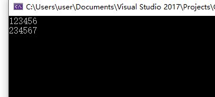
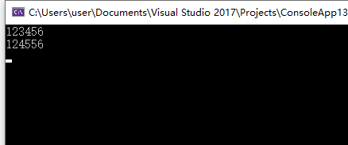

Span是C#7.0引入的，它旨在高效使用和管理一段连续的内存。

-----

很多人第一次接触它的时候，想不出它的具体使用场景。

我第一次接触的时候就会想这个和数组使用有啥区别么？

首先看一个例子

```c#
static void Main(string[] args)
{
    var str = "123456";
    var array = str.ToCharArray();
    Console.WriteLine(array);
    var span = new Span<char>(array);
    AddOne(span);
    Console.WriteLine(array);
}

private static void AddOne(Span<char> span)
{
    for (var index = 0; index < span.Length; index++)
    {
        var slice = span.Slice(index,1);

        var value = (byte)span[index]+1;
        slice.Fill((char)value);
    }
}

```

这里是将一个字符串的每一位数字加1



结果如图所示。

这个并没有体现span优势，但是如果我们现在期望只对原始字符串的某些子串进行处理呢？

很多人会想到使用substring，但是substring会返回一个新的字符串，这里就会增加内存开销。

那么使用数组如何？新建一个数组然后拷贝值过去，仍然是增加内存开销。

基于原数组处理呢？那就需要对AddOne方法添加重载，传入起始位置和长度。


那么span怎么做呢？如下图所示，使用slice切片即可

```C#
static void Main(string[] args)
{
    var str = "123456";
    var array = str.ToCharArray();
    Console.WriteLine(array);
    var span = new Span<char>(array);
    //传入一个slice即可
    AddOne(span.Slice(2,2));
    Console.WriteLine(array);
}

```



换言之Span的高效，不仅在于其只是一段连续内存的"视图"，而且，对于所有的处理方法可以和子集的处理方法统一API接口。（这里你可以类比下指针的功能，而span相对于指针的优势在于不需要length，而且内存可以GC）

这里对连续的内存对象的密集型操作是一个极大的优势

---

参考文档：

-  [Span<T> Struct (System) - Microsoft Docs](https://docs.microsoft.com/en-us/dotnet/api/system.span-1?view=netcore-3.1)
- [C# - All About Span: Exploring a New .NET Mainstay - Microsoft Docs](https://docs.microsoft.com/en-us/archive/msdn-magazine/2018/january/csharp-all-about-span-exploring-a-new-net-mainstay)
- [C# 7 Series, Part 10: Span<T> and universal memory management – Mark Zhou's Tech Blog](https://blogs.msdn.microsoft.com/mazhou/2018/03/25/c-7-series-part-10-spant-and-universal-memory-management/)


