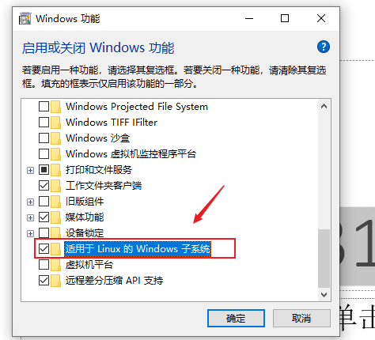
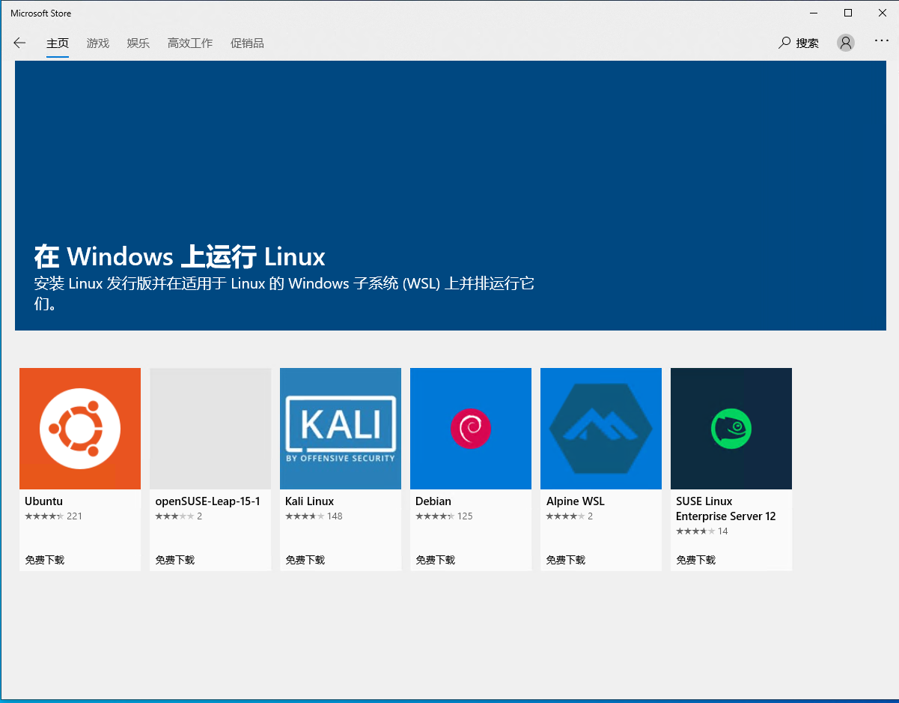
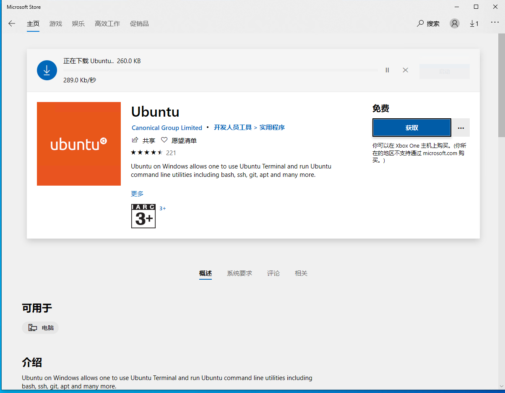
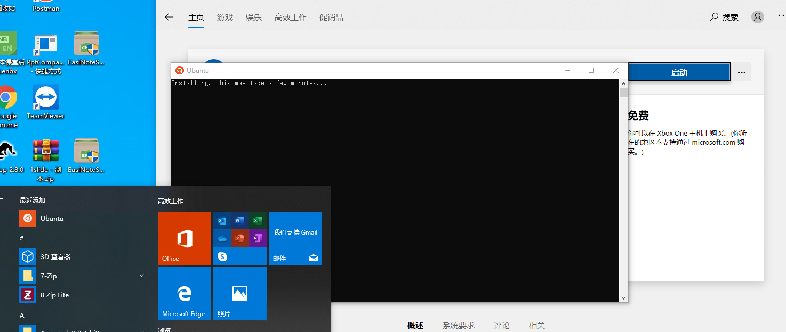
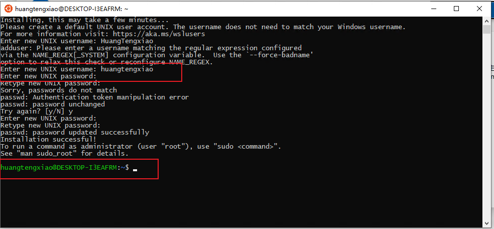
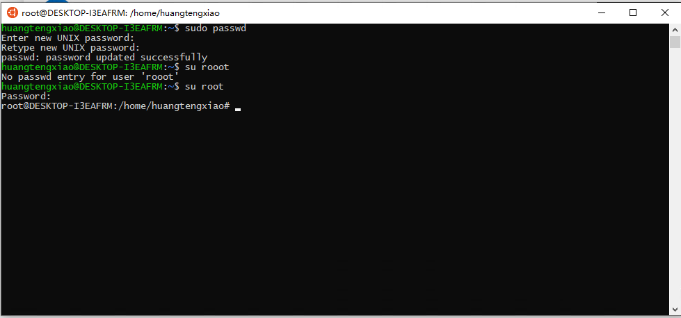

目前我们在大部分同学使用的都是Windows系统的电脑，若想能够使用Linux进行一些编程开发，大多数同学还是会使用双系统或者虚拟机。但是在Windows10的系统上，我们可以使用Linux子系统，这一更加轻量，便捷的方式使用Linux系统。

-----

要使用Linux子系统，我们首先需要开启这个windows功能，如下图所示。

经过一段时间的配置之后，系统会要求进行重启，我们选择立刻重启。

软件重启后，我们可以打开Microsoft Store，搜索Linux可以看到适用于windows的Linux系统。

这里我们选择Ubuntu，进行安装。

安装完成之后我们可以看到菜单栏已经多出来一个Ubuntu的图标。

打开之后会让你设置用户名和密码。（注意命名规范，我就输错了）

然后我们需要给root设置密码，输入sudo passwd，设置新密码。

设置完成之后，使用su root，就可以切换到root账号了

---

参考文档：

- 

