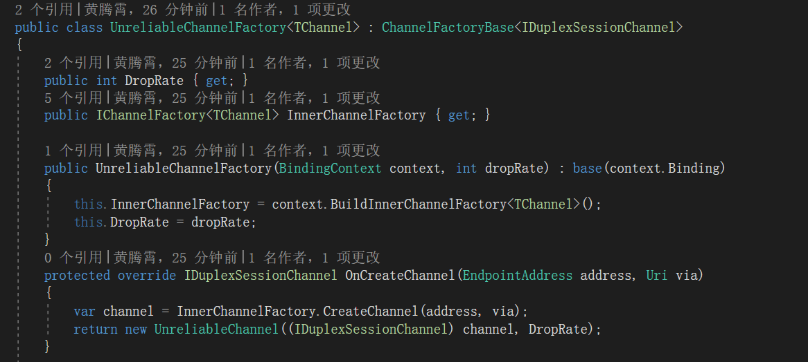

**本文demo已上传至github：[xinyuehtx/WCFdemo](https://github.com/xinyuehtx/WCFdemo)**

在之前的[2019-1-27-wcf入门（6） - huangtengxiao](https://xinyuehtx.github.io/post/wcf%E5%85%A5%E9%97%A8-6.html)博客介绍了wcf的会话，这一篇介绍可靠会话

-----

## 可靠消息传输

在了解可靠会话之前我们需要先了解下什么是可靠消息传输（Reliable Messaging）。

我们知道网络数据在传输过程中，丢包，乱序都是一种很常见的情况。

对于某些软件，数据的完整性和有序性是有要求的。

这个时候为了保证应用层面的稳定和有序，就需要一些设置确保消息能够确保端对端的传递。

### 可靠消息的目标

1. 确保从源到目标的消息传递。
2. 当源或者目标有一端出现故障时，可以进行独立恢复。

对这两点做一个简单的说明：

1. 对于协议的第一个目标。比如消息传送过程中丢包了，可以通过一些方式（如服务端通知客户端重发），确保这个消息还能完整的传送到目标节点
2. 对于协议的第二个目标。比如客户端发送消息时，服务端正好不可用（比如重启），那么可以通过一些方式（比如缓存消息，至服务可用时再发送），确保服务端可用时能够收到消息

### 可靠消息的实现

可靠消息的在wcf的实现方式有两种：队列和可靠会话

**队列**提供了消息发送和接收的缓冲区，将消息的源和目标进行分离。那么如果有一端不可用，消息也不会丢失。

这个方式的优点在于可以实现一些**离线模式**的应用，但是缺点也很明显，就是消息的**高延时**。

**可靠对话**有些类似于tcp的可靠数据包，无论中继节点的数目和类型如何，确保消息在端到端的可靠传输。并且能够屏蔽SOAP层面的失败（丢包，消息重复，乱序等），并在传输失败时重新建立连接

这个方法的最大优点在于**低延迟**

## 可靠会话演示

可靠会话可以实现屏蔽SOAP层面的失败，并在传输失败时重新建立连接。

这里简单演示可靠会话确保在不稳定信道上的作用。

### 不稳定信道

首先是创建不稳定信道，这里参考了[使命必达: 深入剖析WCF的可靠会话[实例篇](内含美女图片,定力差者慎入) - Artech - 博客园](http://www.cnblogs.com/artech/archive/2010/04/18/1715051.html)大大给出的示例，通过创建`IDuplexSessionChannel`的代理，对发送消息进行随机丢弃。再通过自定义绑定元素，注入这个不稳定信道的工厂。详细内容可以在**[xinyuehtx/WCFdemo](https://github.com/xinyuehtx/WCFdemo)**中查看示例源码

`MessageInspector`通过配置的`DropRate`进行随机丢包

接着我们创建一个`IDuplexSeesionChannnel`的代理，在`Send`方法中对消息进行随机丢弃

有了通道还需要通道工厂，创建`ChannelFactoryBase<IDuplexSessionChannel>`的子类，重写`OnCreateChannel`返回我们之前定义的不稳定通道

利用通道工厂需要再创建一个`BindingElement`子类，重写`BuildChannelFactory`，返回自定义通道工厂

### 服务实现

服务示例同[2019-1-27-wcf入门（6） - huangtengxiao](https://xinyuehtx.github.io/post/wcf%E5%85%A5%E9%97%A8-6.html)类似

### 创建服务和客户端进程

在服务端我们创建一个`CustomBinding`将`UnreliableElement`和`TcpTransportBindingElement`传入

客户端也类似，额外的我们这里连续发送20条消息

结果可见其中许多消息出现了丢失。

### 使用可靠会话

现在我们修改示例，在binding中添加一个`ReliableSessionBindingElement`,并且设置`Order`为false

我们看到20条消息都发送成功，但是其中部分消息的顺序是错误的

现在我们再将`Order`设置为true

消息完全保留，且没有顺序错误

### 小结

我们研究了可靠会话，其特点有

- 可以确保消息完整性，有序性等
- 对于不稳定的信道通信很有作用

参考链接：

- [2019-1-27-wcf入门（6） - huangtengxiao](https://xinyuehtx.github.io/post/wcf%E5%85%A5%E9%97%A8-6.html)
- [使用会话 - Microsoft Docs](https://docs.microsoft.com/zh-cn/dotnet/framework/wcf/using-sessions)
- [可靠服务 - Microsoft Docs](https://docs.microsoft.com/zh-cn/dotnet/framework/wcf/reliable-services)
- [可靠会话 - Microsoft Docs](https://docs.microsoft.com/zh-cn/dotnet/framework/wcf/feature-details/reliable-sessions)
- [可靠会话概述 - Microsoft Docs](https://docs.microsoft.com/zh-cn/dotnet/framework/wcf/feature-details/reliable-sessions-overview)
- [如何：可靠会话内交换消息 - Microsoft Docs](https://docs.microsoft.com/zh-cn/dotnet/framework/wcf/feature-details/how-to-exchange-messages-within-a-reliable-session)
- [如何：在可靠会话内保护消息 - Microsoft Docs](https://docs.microsoft.com/zh-cn/dotnet/framework/wcf/feature-details/how-to-secure-messages-within-reliable-sessions)
- [如何：使用 HTTPS 创建自定义可靠会话绑定 - Microsoft Docs](https://docs.microsoft.com/zh-cn/dotnet/framework/wcf/feature-details/how-to-create-a-custom-reliable-session-binding-with-https)
- [可靠会话的最佳做法 - Microsoft Docs](https://docs.microsoft.com/zh-cn/dotnet/framework/wcf/feature-details/best-practices-for-reliable-sessions)
- [如何：使用 ChannelFactory - Microsoft Docs](https://docs.microsoft.com/zh-cn/dotnet/framework/wcf/feature-details/how-to-use-the-channelfactory)
- [通道工厂和缓存 - Microsoft Docs](https://docs.microsoft.com/zh-cn/dotnet/framework/wcf/feature-details/channel-factory-and-caching)
- [使命必达: 深入剖析WCF的可靠会话[共8篇] - Artech - 博客园](http://www.cnblogs.com/artech/archive/2010/05/13/1734892.html)
- [使命必达: 深入剖析WCF的可靠会话[实例篇](内含美女图片,定力差者慎入) - Artech - 博客园](http://www.cnblogs.com/artech/archive/2010/04/18/1715051.html)
- [ChannelFactoryBase<TChannel> Constructor (System.ServiceModel.Channels)- Microsoft Docs](https://docs.microsoft.com/en-us/dotnet/api/system.servicemodel.channels.channelfactorybase-1.-ctor?view=netframework-4.7.2)
- [WCF的Binding模型之四：信道工厂（Channel Factory） - Artech - 博客园](http://www.cnblogs.com/artech/archive/2008/12/05/1348618.html)

