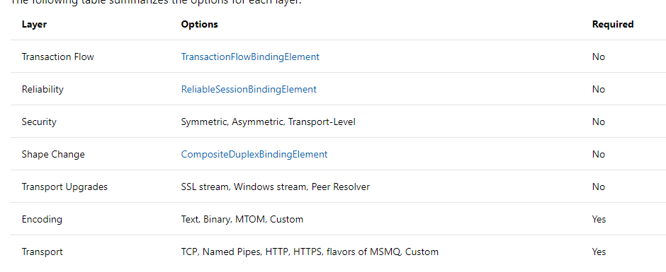

**本文demo已上传至github：[xinyuehtx/WCFdemo](https://github.com/xinyuehtx/WCFdemo)**

这篇文章将会介绍binding

-----

### 绑定

绑定是用于配置wcf如何进行endpoint的对象，其包括协议配置（如[2019-2-12-wcf入门（14） - huangtengxiao](https://xinyuehtx.github.io/post/wcf%E5%85%A5%E9%97%A8-14.html)用到的可靠会话配置），消息编码方式（如文本编码，二进制编码），底层传输方法（如tcp）。

不同的绑定能够支持的wcf服务功能也不同。作为入门教程，这里主要介绍下有哪些常见的系统的绑定，以及其支持的功能和适用场景。

- `BasicHttpBinding`：适用于与符合 WS-Basic Profile 的 Web 服务（例如基于 ASP.NET Web 服务 (ASMX) 的服务）进行的通信。 此绑定使用 HTTP 作为传输协议，并使用文本/XML 作为默认的消息编码。
- `WSHttpBinding`:一个安全且可互操作的绑定，适合于**非双工**服务约定，**支持会话，可靠会话**
- `NetNamedPipeBinding`：一个安全、**可靠**且经过优化的绑定，适用于 WCF 应用程序之间**本机**的通信，**支持会话**
- `NetMsmqBinding`: 一个排队绑定，适用于 WCF 应用程序之间的**跨计算机间**的通信，**支持会话**, **非双工**
- `NetTcpBinding`: 一个安全且经过优化的绑定，适用于 WCF 应用程序之间**跨计算机**的通信，**支持会话，可靠会话**。

### 自定义绑定

一般来说系统提供的绑定已经能够满足大部分的需求。

当然有一些同学希望做一些定制化处理，所以需要自定义绑定

这里就需要使用`CustomBinding`类型，并且向内部添加各层的绑定元素。各层的绑定元素参见下图

另外也可以参见[2019-2-12-wcf入门（14） - huangtengxiao](https://xinyuehtx.github.io/post/wcf%E5%85%A5%E9%97%A8-14.html)的示例，其中使用自定义绑定模拟了一个不稳定的信道。

### 小结

我们研究了绑定，其特点有

- 可以配置WCF服务可以实现的功能

参考链接：

- [Windows Communication Foundation 绑定概述 - Microsoft Docs](https://docs.microsoft.com/zh-cn/dotnet/framework/wcf/bindings-overview)
- [2019-2-12-wcf入门（14） - huangtengxiao](https://xinyuehtx.github.io/post/wcf%E5%85%A5%E9%97%A8-14.html)
- [系统提供的绑定 - Microsoft Docs](https://docs.microsoft.com/zh-cn/dotnet/framework/wcf/system-provided-bindings)
- [CustomBinding Class (System.ServiceModel.Channels) - Microsoft Docs](https://docs.microsoft.com/en-us/dotnet/api/system.servicemodel.channels.custombinding?view=netframework-4.7.2)
- [customBinding - Microsoft Docs](https://docs.microsoft.com/en-us/dotnet/framework/configure-apps/file-schema/wcf/custombinding)

