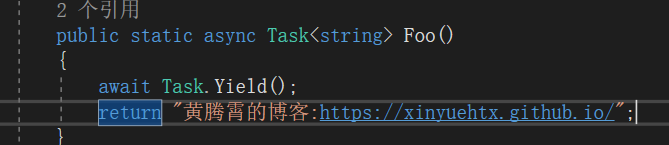
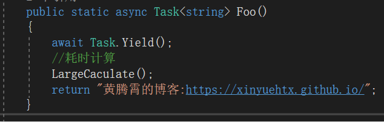
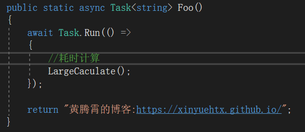
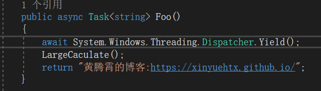
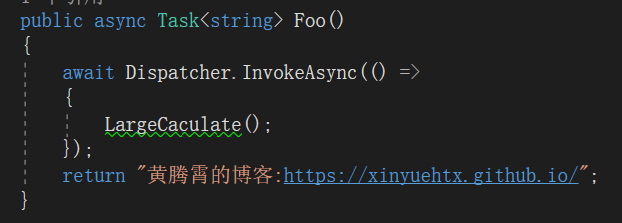
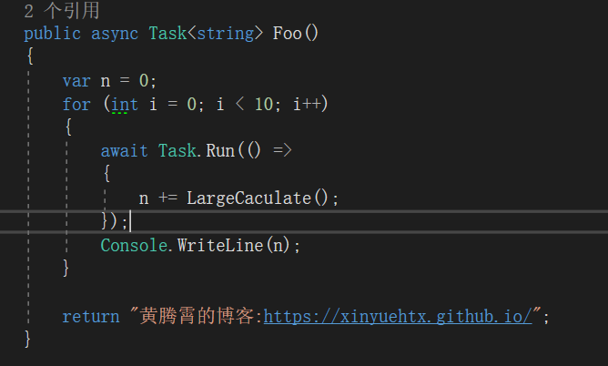
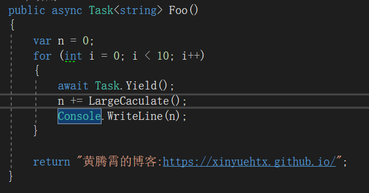
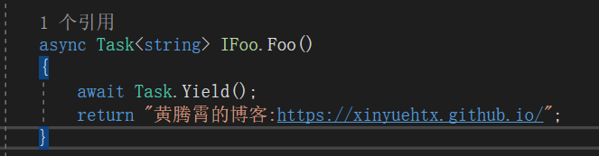
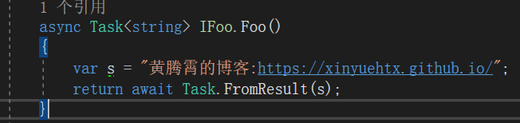

[出让执行权：Task.Yield, Dispatcher.Yield - walterlv](https://walterlv.com/post/yield-in-task-dispatcher.html)，毅仔的博客珠玉在前。同学们可以直接跳转过去看。

比较遗憾的是我没有在里面找到`Task.Yield`的合适的应用场景。关于`Task.Yield`的应用场景也是争论纷纷，可见这个东西必然很鸡肋。本文尝试了`Task.Yield`的几种使用场景，看看是否能够将代码变得更加优雅。

坐在MVP旁边狗尾续貂，诚惶诚恐。。

-----

ReferenceSource里面看到`Task.Yield`方法会直接返回一个`YieldAwaitable`

如果你的代码是这么写

那么此时它将自身线程出让，然后从线程池中拿出一个线程继续执行后续的代码

## 那么问题来了，什么地方适合使用`Task.Yield`

### 1. 单独线程做大规模计算

你可能会想到使用`Task.Yield`来开启一个后台线程做大规模计算

但是实际上我们可以使用更加常见的`Task.Run`来替代。

大部分情况下上图的两种写法效果是一致的。

那么不一样的地方在哪里呢？第一种写法会在后续的计算中使用同步上下文，而第二种不会

当然如果你在开发WPF程序，而那个耗时计算又是在UI线程上，就`可以`选择第一种。

注意：`Task.Yield`没有`ConfigureAwait`方法，可见其设计目标就是同步上下文的工作情况

### 2.耗时UI操作，防卡顿

上一小节提出的一种操作场景就是通过`Task.Yield`对耗时UI操作进行“切片”，防止卡顿。

但是至少对于WPF程序来说，这里显然有更优的解决方案

或者

在UI线程`Dispatcher.Yield`和`Task.Yield`是等价的，但是`Dispatcher.Yield`额外拥有精细化的优先级控制

### 3. 它真的很鸡肋，鸡肋到只剩下语法优化

研究之后我坚定了这个方法的鸡肋情况，绞尽脑汁能想到的就只有一些语法层面的简化

例如对于如下的循环中进行简写

这部分的代码简化后还是看着很清晰的

还有一种情况是在接口约束了返回值为`Task`的情况下，实现中没有异步时可以使用`Task.Yield`满足接口约束

当然你也可以使用`Task.FromResult`进行替代

不过这两者存在着是否进行线程切换的细微差别，大部分情况下，更少的线程切换（即`Task.FromResult`）是更优的

## 小结

`Task.Yield`可以快速便捷的出让线程的使用权，但是在实际应用上（至少是WPF）缺少较好的使用场景。

参考链接：

- [c# – Task.Yield – 真正的用法？ - 代码日志](https://codeday.me/bug/20180315/143017.html)
- [Dispatcher.Yield – When and how to use it on WinRT – wpdev](http://blog.wpdev.fr/dispatcher-yield-when-and-how-to-use-it-on-winrt/)
- [出让执行权：Task.Yield, Dispatcher.Yield - walterlv](https://walterlv.com/post/yield-in-task-dispatcher.html)
- [终于明白了 C# 中 Task.Yield 的用途 - dudu - 博客园](https://www.cnblogs.com/dudu/p/task-yield.html)
- [c# - When would I use Task.Yield()? - Stack Overflow](https://stackoverflow.com/questions/22645024/when-would-i-use-task-yield)
- [c# - Task.Yield - real usages? - Stack Overflow](https://stackoverflow.com/questions/23431595/task-yield-real-usages/23441833#23441833)
- [c# - "await Task.Yield()" and its alternatives - Stack Overflow](https://stackoverflow.com/questions/20319769/await-task-yield-and-its-alternatives)
- [Dispatcher.Yield Method (System.Windows.Threading) - Microsoft Docs](https://docs.microsoft.com/en-us/dotnet/api/system.windows.threading.dispatcher.yield?view=netframework-4.7.2)
- [Task.cs](https://referencesource.microsoft.com/#mscorlib/system/threading/Tasks/Task.cs,831f482d1bd8141f)
- [YieldAwaitable.cs](https://referencesource.microsoft.com/#mscorlib/system/runtime/compilerservices/YieldAwaitable.cs,dfe9c1a07538b32f)

