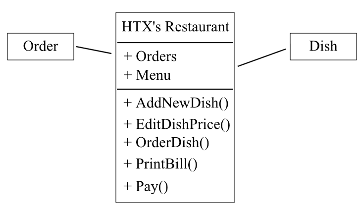

-----

设计模式大家都非常了解，不过反模式大概很少人听过。

没错，反模式顾名思义就是把大家平时在编程，代码设计，项目管理中遇到的各种典型错误归类，

总结出的“高考0分作文”

# The Blob

## 介绍

the blob 来源于美国电影[幽浮魔点 - 维基百科，自由的百科全书](https://zh.wikipedia.org/wiki/%E5%B9%BD%E6%B5%AE%E9%AD%94%E9%BB%9E)，描述的是一只外太空的史莱姆把所有人都吃掉的故事。如果你不知道这个故事，你可以去看看[《关于我转生后成为史莱姆的那件事》](https://www.iqiyi.com/a_19rrht5rk5.html)

the blob 表示的是一个类型具有了过多的职能（通常是包含了几乎所有的逻辑代码），导致其过于庞大，最后使代码难以维护。它有时也会被称为The god class（上帝类，上帝对象），这个类就像上帝一样，无所不知，无所不能。所以我们这些凡人是没有办法对上帝进行维护的

## 产生原因

The blob产生的原因有很多种，最大的一个原因是团队里面的成员缺乏对面向对象或者单一职责的理解。比如像我这样的编程初学者，很可能就面向过程进行编程。

比如我需要开一家餐厅，那么就要有菜单和订单。结果我编程编的很开心，就把菜单管理和订单管理的功能都编写到一个类中了，而Order和Dish只是仅包含数据的贫血对象。这种类就可以认为是the blob 。当然在今后的开发中我还可以把人员管理，原材料采购都丢到这个类里面，最终形成一个无人可懂的庞然大物。

## 造成影响

the blob最大的问题是两个：难以复用和难以测试。当你使用如此一个庞然大物时，你不知道会额外引入哪些不可控问题。另外单元测试更是不用想，高耦合代码一直都是单元测试的噩梦。

极端情况下，这个类已经无法被他人接手重构，没有人知道抽离一个模块是否会引起其他部分的bug。过了这个临界点，整个类就完全失控了。

## 修复建议

最佳的修改是安照面向对象原则进行重构。将the blob中不同业务的方法和属性解耦抽离，封装成单独的可用模块。而原有代码的业务逻辑从依赖于底层实现，变为依赖于模块接口。例如我从饭店中抽离出菜单系统和订单系统两个子模块，相关的方法和属性封装到子模块中，原有类的结构就变得更加简单了。而子模块中也只要关注自身相关的业务，减少了耦合。

参考链接：

- [反面模式 - 维基百科，自由的百科全书](https://zh.wikipedia.org/wiki/%E5%8F%8D%E9%9D%A2%E6%A8%A1%E5%BC%8F)
- [AntiPatterns](https://sourcemaking.com/antipatterns)
- [幽浮魔点 - 维基百科，自由的百科全书](https://zh.wikipedia.org/wiki/%E5%B9%BD%E6%B5%AE%E9%AD%94%E9%BB%9E)

