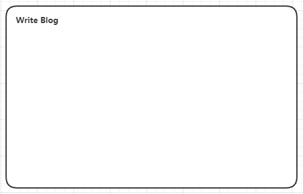
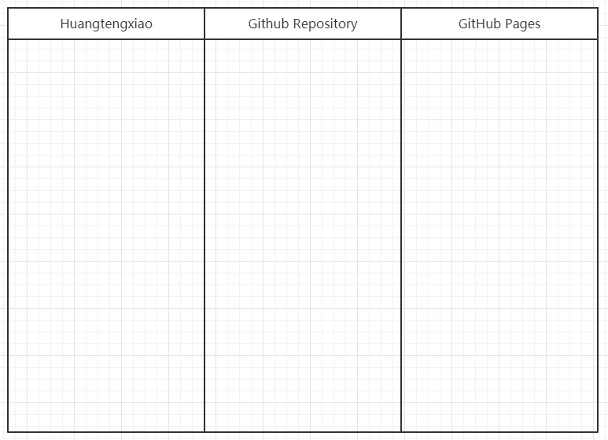
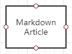
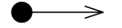
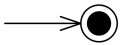
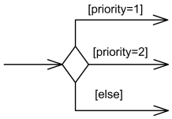
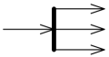
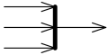
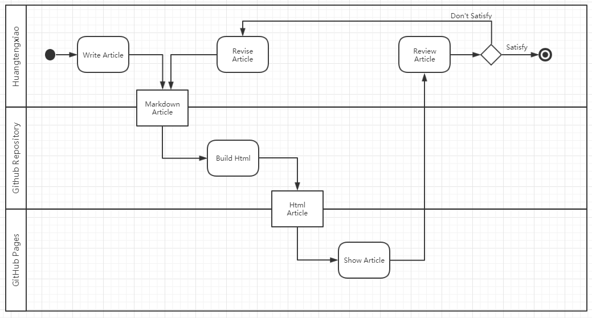
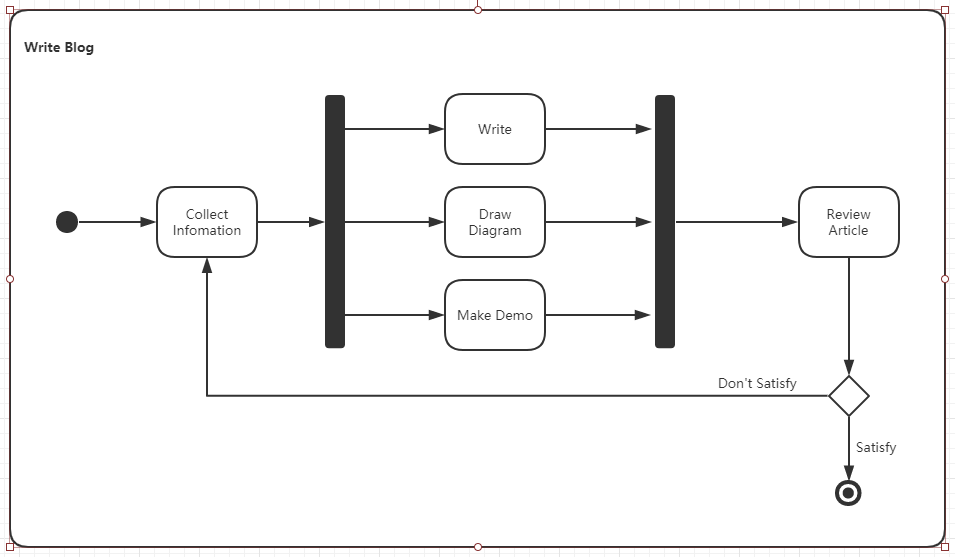

在面向对象的软件分析及设计中，UML活动图描述了某项功能中控制和动作之间的传递关系。

-----

# 定义

UML活动图（Activity Diagrams）是一种描述某一特定功能（活动）中，运行行为（动作）和操作逻辑（控制）关系的简单表达方式。它可以作为特定用例的详细逻辑描述。

## 概念

在活动图中，需要明确以下几个概念：

- 活动
- 动作
- 对象
- 控制

### 活动

活动(Activity)是指通常是指一个完整的功能性单元。它由一系列相互关联的动作流组成。

活动整体使用**圆角矩形**表示，左上角标明活动名称。例如我们可以将撰写blog作为一个活动。

例如在研究一个blog时，被研究的blog就是一个主体

除此之外，也可以将活动中的动作，按照业务模型中的角色或者组织单元进行划分。

从纵向或者横向分为多个**矩形空间**——泳道。每个泳道中的动作代表，该动作由泳道对应的角色完成。

例如发布博客这个行动会有作者，github源码仓库，blog主页三个参与者

### 对象

对象（Object）是指活动图中在不同动作之间传递的实体。使用**直角矩形**表示。

例如在发布博客过程中传递的Markdown格式的文章就是一个对象

动作也使用圆角矩形标识，内部标明动作名称。例如收集资料，就是写博客活动中的一个动作

例如对于blog案例，与其相关的外部角色，就可能是网友或者技术论坛

在表示方法上没有统一规定，可以是一个小人，或者是表示简单类型的类图。

需要注意的是这里的角色是独立于主题之外存在的。

### 控制

控制（control）是活动图中的各种逻辑单元。

常见的有活动开始、活动结束、选择分支开始、选择分支合并、并行动作开始、并行动作合并。

- 活动开始：实心圆+箭头，表示整个活动的开始

- 活动结束：包含实心圆的空心圆+箭头，表示整个活动结束

- 选择分支开始：空心菱形+分支箭头，表示根据条件选择对应活动执行

- 选择分支合并：空心菱形+合并箭头，表示活动选择分支合并

- 并行动作开始：粗实线+分支箭头，表示同时进行多个活动（注：此处可以表示逻辑并行）

- 并行动作合并：粗实线+合并箭头，表示同时进行的多个活动合并

# 绘制

这里我创建了两个活动图。

第一个是活动图表示blog的部署。活动图采用泳道形式，黄腾霄撰写文章，再把markdown格式的文章传至github仓库，github的ci将其编译成HTML，在传递至github page进行展示。之后我会对展示的文章进行检查，对不满意的地方进行修改，直至文章满意。

第二个活动图表示blog的撰写。撰写blog时，需要先收集信息，然后进行撰写，绘图，写demo，完成文章后进行审查。如果不满意，则回到信息收集过程，重复上述步骤，直至文章满意

参考链接：

- [Unified Modeling Language (UML) description](https://www.uml-diagrams.org/)
- [统一建模语言 - 维基百科，自由的百科全书](https://zh.wikipedia.org/wiki/统一建模语言)
- [An association between UML actor and a use case indicates that the actor and the use case communicate with each other.](https://www.uml-diagrams.org/use-case-actor-association.html)
- [UML Multiplicity and Collections - defining and using multiplicity and collections in UML - lower and upper bounds, cardinality, order, unique.](https://www.uml-diagrams.org/multiplicity.html)
- [2019-5-30-UML基础 - huangtengxiao](https://xinyuehtx.github.io/post/UML基础.html)
- [2019-5-30-UML用例图 - huangtengxiao](https://xinyuehtx.github.io/post/UML用例图.html)

