在面向对象的软件分析及设计中，UML类图描述了系统中各个组成部分的静态结构关系。

-----

# 定义

UML类图（Class Diagrams）是一种面向对象分析和设计中，描述被分析系统中各个组成部分之间相互关系的图形。

## 类图的理解

一直以来，大部分同学对类图存在一些误解。其中最重要的一条是类图中的`类`，与我们指定编程语言中的`类`，并不完全是同一个概念。类图中的`类`，表示一种类别，是对同一类事务的抽象。类图中的`类`，可以表示.NET中的`类`，也可以表示业务场景中的某一个概念单元。
因此，对于类图来说，不仅仅是能够表现类的实现，也能够描述领域模型。

## 类图中的实体单元

在类图中，有如下几种实体单元：

- 类

- 接口

- 对象

  

### 类

在UML中，类表示一系列对象的抽象。在类图中，类使用**直角矩形**表示，中间使用粗体表示类名。

例如在一个餐馆中，顾客可以认为是一个类

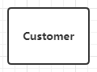

当然除了名字以外，类也有一些特征——属性（Attribute）和操作（operation）。

对于需要表现属性和操作的类，需要使用三层的矩形，每层分别为名称，属性，操作。

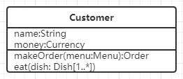

### 接口

接口和类的表示方法很类似，也是使用**直角矩形**表示，不过接口会多一个关键字《interface》。

例如我们可以提取一个Person的接口，它有名字，能吃。

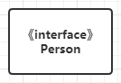

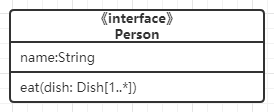

### 对象

对象是类的实例，也同类的表示方法一样，使用**直角矩形**。不同的是，在对象的命名上，采用添加下划线的__对象名:类名__

例如一个名叫黄腾霄的顾客。

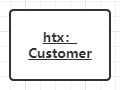

## 类图中的关系表示  

  在类图从，常见的关系使用方法有：实现、泛化、关联、聚合、组合、依赖等。

### 实现

实现专指类对接口的实现，使用**虚线三角**表示。从类指向接口。

### 泛化

泛化专指子类对父类的继承，使用**实线三角**表示，从子类指向父类

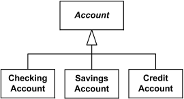

### 关联

关联是指类图中两个类型的实例之间的联系。这个联系可以是单向或者双向的连接，（即可以通过一定方式从一个实例，找到另一个实例）。也可以是表示为逻辑上或者物理上的组成或者组合（聚合），（例如一个实例是另一个实例的一部分）。

关联由**实线**表示，可选的是在实线上添加关联名称，以及表示阅读方向的**实心三角形**

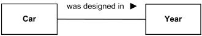

### 聚合

聚合是关联的子类，表示的是属性和实例之间的弱联系，被聚合部分可以独立存在。

聚合使用**空心菱形和实线**表示，菱形处于主实例这一边。

**注**：从我的实践上来说，这个标记基本没有什么大用处，完全可以使用普通的关联代替。如果大家发现一些合适的场景，可以联系我

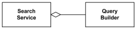

### 组合

组合是关联的子类，表示的是属性和实例之间的强联系，被组合部分不可以独立存在。

组合使用**实心菱形和实线**表示，菱形处于主实例这一边。

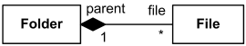

### 依赖

依赖表明某一个UML元素需要另一个元素进行说明或者实现。

例如某个类需要进行日志输出，会调用日志工具类的一些方法，那么我们可以认为这个类依赖于日志工具类

依赖使用**虚线箭头**表示，指向被依赖类

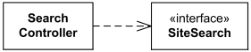

## 常见问题

### 如何区分关联、聚合、组合

首先关联是聚合和组合的父类，聚合和组合特指类之间的组成关系，因此通常一端是另一端的某个属性。

聚合和组合的区分是，被聚合或组合的实例，是否能够在逻辑上或者物理上独立存在。这个情况往往需要根据具体场景分析。例如驾驶的场景中，轮胎和汽车是组合关系，它不能独立于汽车存在于这个场景。但是在汽车回收场景中，轮胎可以是聚合关系，因为汽车报废后，轮胎还能够走单独的回收流程。

**实践**：对于less is more 原则，只对必要的情况进行说明。所以一般情况下，我们可以都使用关联。在特定情况下，再使用组合。至于聚合，我没有发现什么特别的使用场景，所以可以不使用。

### 如何区分关联和依赖

关联特指实例之间的关系。而依赖的场景就相对广泛，类、包等都可以存在依赖关系。

针对到实例场景，存在依赖通常表示某个类是不完整的，或者不能独立完成某些操作的。

我们可以按照如下问题问自己，确认A类是不是B类的依赖：

- A类能够作为B类属性存在么
- 没有A类，B类的所有操作都能独立完成么

如果答案都是不能，那么这个情景下，更推荐使用依赖，而不是关联

## 实践

这里给出了一个餐厅的类图。

顾客通过菜单进行下单。而订单上记录了菜单中的项目，而这些项目会指向特定的菜肴。订单会交给厨师，厨师做出菜肴。顾客进行食用。

其中菜单中的项目是菜单的组成，因此食用组合。而顾客需要依赖于菜单，才能完成点菜。

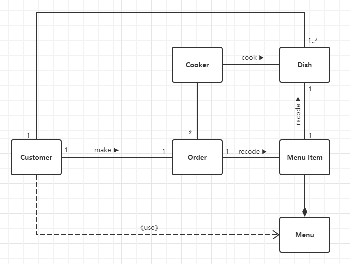

参考链接：

- [Unified Modeling Language (UML) description](https://www.uml-diagrams.org/)
- [统一建模语言 - 维基百科，自由的百科全书](https://zh.wikipedia.org/wiki/统一建模语言)
- [类图 - 维基百科，自由的百科全书](https://zh.wikipedia.org/wiki/類別圖)
- [An association between UML actor and a use case indicates that the actor and the use case communicate with each other.](https://www.uml-diagrams.org/use-case-actor-association.html)
- [UML Multiplicity and Collections - defining and using multiplicity and collections in UML - lower and upper bounds, cardinality, order, unique.](https://www.uml-diagrams.org/multiplicity.html)
- [2019-5-30-UML基础 - huangtengxiao](https://xinyuehtx.github.io/post/UML基础.html)
- [2019-5-30-UML用例图 - huangtengxiao](https://xinyuehtx.github.io/post/UML用例图.html)
- [2019-5-31-UML活动图 - huangtengxiao](https://xinyuehtx.github.io/post/UML活动图.html)

