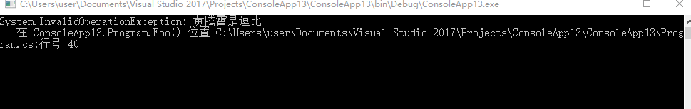
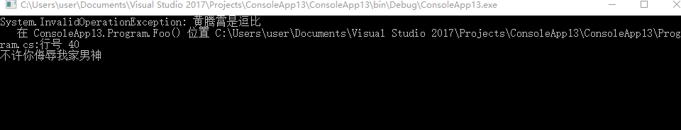
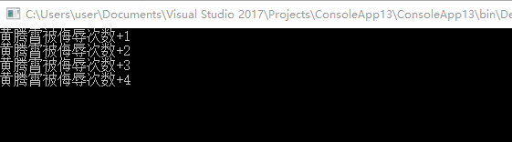

异常处理是代码中很重要的一项注意点。但是有时候一些不恰当的异常处理，反而会影响我们在代码运行时的调试。

-----

## 出现问题

假如我们有这么一段代码，我期望调用`Bar`方法，输出“黄腾霄是帅哥”。

但是在实际运行中，其中的一个方法`Foo`抛出了一个异常。

而作为代码书写者，为了确保软件的`正常运行`，将这个方法的所有异常都吞掉了。

此时导致的结果就是，用户端看到软件运行`正常`，但是没有期望的输出

```c#
		static void Main(string[] args)
        {
            Bar();
        }

        static void Bar()
        {
            try
            {
                Foo();
                Console.WriteLine("黄腾霄是帅哥");
            }
            catch (Exception)
            {
                // ignored
            }
        }

        static void Foo()
        {
            throw new InvalidOperationException("黄腾霄是逗比");
        }
```

## 修改代码

此时就需要使用我们这篇博客的主角——`AppDomain.FirstChanceException`

我们试着对代码进行如下修改

```C#
		private static int n = 1;

        static void Main(string[] args)
        {
            AppDomain.CurrentDomain.FirstChanceException += (sender, eventArgs) =>
            {
                 Console.WriteLine(eventArgs.Exception);
            };
            Bar();
        }

        static void Bar()
        {
            try
            {
                Foo();
                Console.WriteLine("黄腾霄是帅哥");
            }
            catch (Exception)
            {
                // ignored
            }
        }

        static void Foo()
        {
            throw new InvalidOperationException("黄腾霄是逗比");
        }
```

我们可以看到异常信息被输出到屏幕了，并且此时程序仍然正常运行，没有出现奔溃



## 什么是FirstChanceException

`FirstChanceException`是一个异常通知事件。当一个`AppDomain`中引发任何异常的时候，CLR会优先触发`FirstChanceException`, 当其被处理后，才会开始寻找原始异常的处理函数。

例如我们在`Bar`的`catch`块中添加一些日志输出，会发现这些输出出现在`FirstChanceException`的输出之后

```C#
		static void Bar()
        {
            try
            {
                Foo();
                Console.WriteLine("黄腾霄是帅哥");
            }
            catch (Exception)
            {
                Console.WriteLine("不许你侮辱我家男神");
            }
        }
```



对于`FirstChanceException`，需要注意的是它只是一个通知。它会在任何引发异常的地方（throw）的地方，触发事件。但是它并不能作为异常统一处理的地方。

## 思考

- 假如我们在FirstChanceException的处理函数中抛出一个异常会怎么样？

请你`绝对不要`做出这种事情。我们刚刚说了FirstChanceException会在任何引发异常的地方触发该事件，如果你在FirstChanceException的处理函数中再次抛出异常，`即使使用了trycatch`，也会出现死循环，最终导致stackoverflow。

所以不能够在这个方法里面写出任何可能出现异常的代码。

- 使用诸如`throw;`这样的语句是否会对同一个异常再次触发FirstChanceException？

参见下面这个例子，请问我被侮辱了几次？

```c#
		static void Main(string[] args)
        {
            AppDomain.CurrentDomain.FirstChanceException += (sender, eventArgs) =>
            {
                Console.WriteLine($"黄腾霄被侮辱次数+{n++}");
            };
            try
            {
                try
                {
                    try
                    {
                        throw new InvalidOperationException("黄腾霄是逗比");
                    }
                    catch (Exception e)
                    {
                        throw new ArgumentException("不许你侮辱我家男神", e);
                    }
                }
                catch (Exception e)
                {
                    ExceptionDispatchInfo.Capture(e).Throw();
                }
            }
            catch (Exception e)
            {
                throw;
            }
        }
```

答案是4次。实际上FirstChanceException是每次`引发`异常的地方都会触发。而无论是 ExceptionDispatchInfo.Capture(e).Throw();还是throw;都只是保证了该异常的堆栈可以连续，而这个异常仍然会被重新`引发`一次。



参考链接：

- [一文看懂 .NET 的异常处理机制、原则以及最佳实践 - walterlv](https://blog.walterlv.com/post/dotnet-exception.html)
- [AppDomain.FirstChanceException Event (System) -Microsoft Docs](https://docs.microsoft.com/en-us/dotnet/api/system.appdomain.firstchanceexception?view=netframework-4.8)


