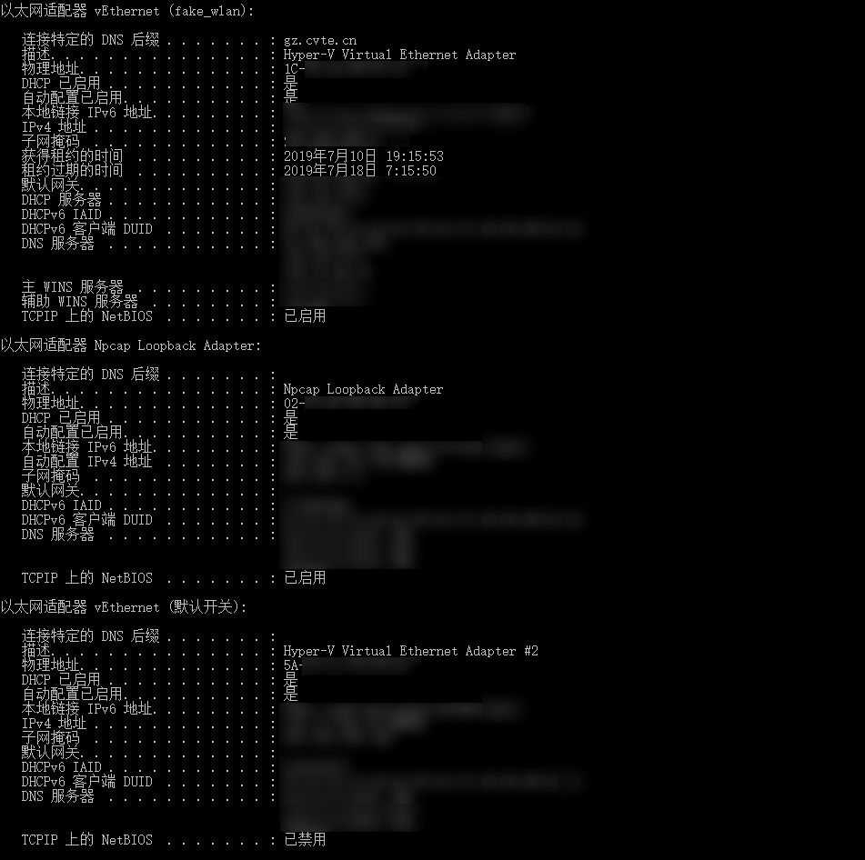
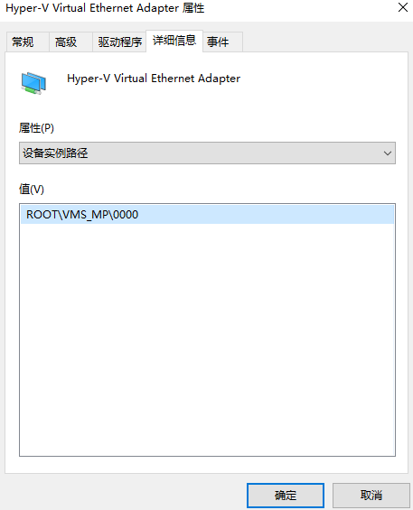
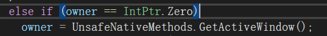
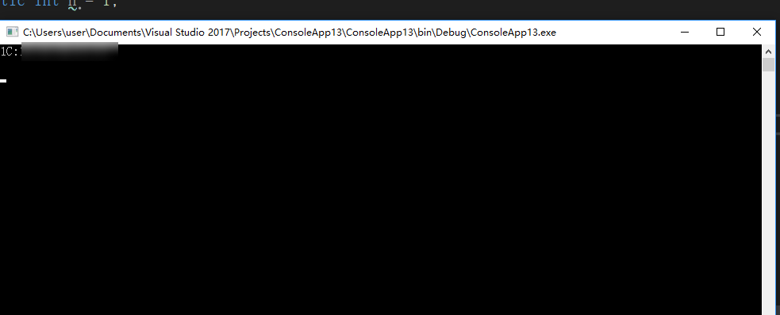

我们经常会在代码中查找设备的Mac地址，以确认设备的唯一性。但是如果你的设备安装了一些虚拟机，这个时候就会比较麻烦了

-----

## 出现问题

看一下我这边通过ipconfig /all 跑出来的结果，大家猜猜看，哪个才是我的物理网卡呢？



看名称？看描述，看NetBIOS启用状态？唉，都不靠谱，你能想到是第一个标着fake_wlan，描述带Hyper-V的才是我的物理网卡么？

## How

那么如何才能去找到我们的物理网卡信息呢？

OK，首先的一个问题是如何找到网卡信息。德熙这边的博客有介绍了[dotnet core 获取 MacAddress 地址方法](https://blog.lindexi.com/post/dotnet-core-获取-macaddress-地址方法)，不过很不巧这里面没有介绍虚拟网卡和物理网卡的区分方法。

不过，德熙的博客里面介绍了使用WMI，查询`Win32_NetworkAdapterConfiguration`的方式找到网络适配器的信息。对于系统来说物理网卡和虚拟网卡的`Win32_NetworkAdapterConfiguration`是没有区别的，所以这里我们看不出分别（Ipconfig也是如此）

但是WMI有另外一个信息叫做，`Win32_NetworkAdapter`，他包含了网络适配器的信息。

而这个信息中最关键的两点是`NetConnectionStatus`和`PNPDeviceID`，前者代表了网络连接状态，可以过滤哪些不在上网的设备，后者更为重要，表示设备实例路径，就是下面这个家伙



设备实例路径有什么用呢？小Track就是物理网卡的设备实例路径都是以"PCI"开头的，（当然你要说厂家喜欢乱来，或者自己把里面的内容改了，那我也没有办法）。

OK，有了这些知识，我们写代码就很方便了。

额，不完全是。这个其实是跟点击其他程序窗口这一操作有关。其实你只要启动时点击其他窗口的手速够快，也能出现。

我们看看MessageBox的源码。当我们采用MessageBox.Show方法重载不带有owner参数时，他会通过GetActiveWindow这个方法获取当前激活的窗口，作为owner。而我们通过只要在程序执行到这里之前点击其他程序窗口，就会出现上述问题



```C#
        static string Bar()
        {
            var managementClass = new ManagementClass("Win32_NetworkAdapter");
            var managementObjectCollection = managementClass.GetInstances();
            var builder = new StringBuilder();
            foreach (var managementObject in managementObjectCollection.OfType<ManagementObject>())
            {
                using (managementObject)
                {
                    if (managementObject["NetConnectionStatus"] != null
                        &&  managementObject["NetConnectionStatus"].ToString() == "2"
                        && managementObject["PNPDeviceID"].ToString().Contains("PCI"))
                    {
                        if (managementObject["MacAddress"] == null)
                        {
                            continue;
                        }

                        builder.AppendLine(managementObject["MacAddress"].ToString().ToUpper());
                    }
                }
            }

            return builder.ToString();
        }
```

结果如下，只剩下一个1C开头的我们的物理网卡的Mac地址了



参考链接：

- [dotnet core 获取 MacAddress 地址方法](https://blog.lindexi.com/post/dotnet-core-获取-macaddress-地址方法)
- [根据GetAdaptersInfo()如何区分网卡类型 - Annie_L - 博客园](https://www.cnblogs.com/annie-fun/p/6406630.html)
- [利用WMI打造完美“三无”后门-消灭一切假网卡 - Demon's Blog](http://demon.tw/copy-paste/vbs-wmi-trojan-2.html)


