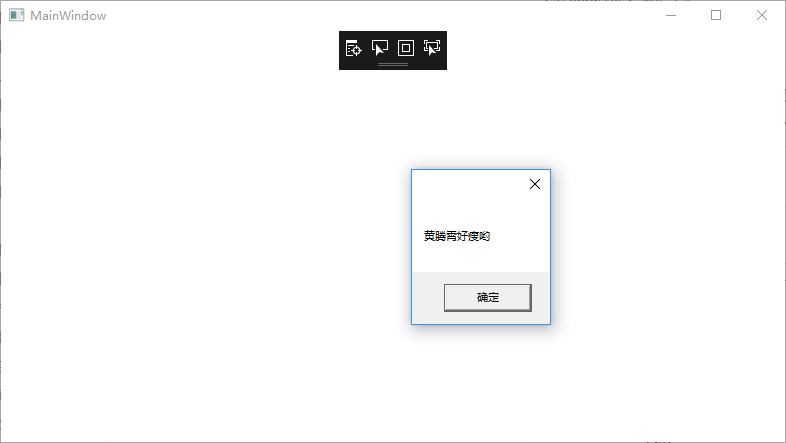

我们在一个窗口调用MessageBox.Show方法会在，该窗口制造出一个模态的消息框。但是有小伙伴最近问我他发现这个消息框经常会到窗口下面显示。

-----

## 出现问题

我们来看下他的代码，很简单完全没有问题是不是

但是在实际运行中，其中的一个方法`Foo`抛出了一个异常。

而作为代码书写者，为了确保软件的`正常运行`，将这个方法的所有异常都吞掉了。

此时导致的结果就是，用户端看到软件运行`正常`，但是没有期望的输出

```c#
        public MainWindow()
        {
            InitializeComponent();
            Loaded += (sender, args) =>
            {
                MessageBox.Show("黄腾霄好瘦哟");
            };
        }
```



我们稍稍做一些改动，让messagebox延迟一点点出现。然后我们在主窗口显示后立刻点击其他程序窗口

```C#
        public MainWindow()
        {
            InitializeComponent();
            Loaded += async (sender, args) =>
            {
                await Task.Delay(3000);
                MessageBox.Show("黄腾霄好瘦哟");
            };
        }
```

惊这个messagebox掉下去了。


## Why

有小伙伴会问，这个是一个时机问题么？

额，不完全是。这个其实是跟点击其他程序窗口这一操作有关。其实你只要启动时点击其他窗口的手速够快，也能出现。

我们看看MessageBox的源码。当我们采用MessageBox.Show方法重载不带有owner参数时，他会通过GetActiveWindow这个方法获取当前激活的窗口，作为owner。而我们通过只要在程序执行到这里之前点击其他程序窗口，就会出现上述问题


## How

怎么改就很简单了，我们主动将owner传入，就再也不会出现上述问题了

例如我们在`Bar`的`catch`块中添加一些日志输出，会发现这些输出出现在`FirstChanceException`的输出之后

```C#
        public MainWindow()
        {
            InitializeComponent();
            Loaded += async (sender, args) =>
            {
                await Task.Delay(3000);
                MessageBox.Show(this, "黄腾霄好瘦哟");
            };
        }
```

参考链接：

- [MessageBox.cs](https://referencesource.microsoft.com/#PresentationFramework/src/Framework/System/Windows/MessageBox.cs,451867ccabfb0df5)


