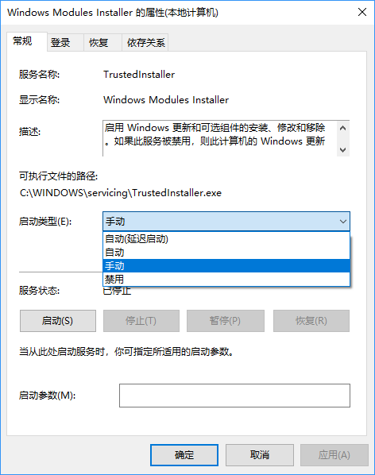
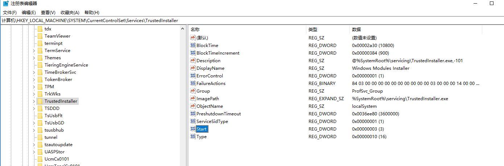
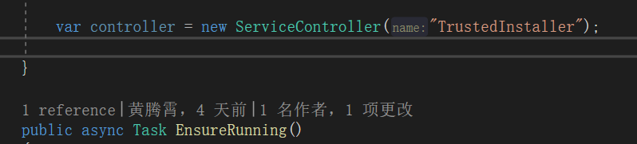
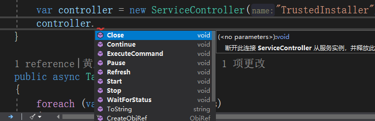

今天我们来实现使用代码处理windows服务的启动或者关闭

-----

处理windows服务的启动和关闭实际上我们需要关注两个事情。

第一个是设置服务的启动类型——手动、自动、自动（延时启动）、禁用，第二个是控制服务的状态——启动、停止、暂停、恢复。

毕竟如果服务被禁用了，你也没法启动呀



OK，我们开始处理启动类型。

启动类型实际上就是服务对应的注册表的一个键值

他存储在`计算机\HKEY_LOCAL_MACHINE\SYSTEM\CurrentControlSet\Services\服务名\Start`中

他有1-4的数值，分别对应自动（延时启动）、自动、手动、禁用。和我们看到的上图中下拉列表时一样样的



既然是注册表，那我们可以通过读写注册表进行控制

```c#
	     protected string ReadRegistryValue(string service)
        {
            RegistryUtility.GetRegVal(RegistryKey.OpenBaseKey(RegistryHive.LocalMachine, RegistryView.Default),
                @"SYSTEM\CurrentControlSet\services\" + service, "Start", out var value);
            return value;
        }
        
        
	public static class RegistryUtility
    {
        public static bool GetRegVal(RegistryKey rootkey, string keypath, string keyname, out string rtn)
        {
            rtn = "";
            try
            {
                RegistryKey key = rootkey.OpenSubKey(keypath);
                rtn = key.GetValue(keyname).ToString();
                key.Close();
                return true;
            }
            catch
            {
                return false;
            }
        }
    }
```


注意：如果你使用上述代码去处理`TrustedInstaller`服务，你会发现如果尝试去修改注册表，会出现权限不够的问题（即使你使用了管理员权限）。

此时建议直接使用bat脚本`"sc config {serviceName} start= {startValue}`

OK，现在是第二个问题，控制服务状态

C#的`System.ServiceProcess.dll`中为我们提供了一个`ServiceController`对象，通过它可以轻松对服务状态进行控制







参考链接：

- 


