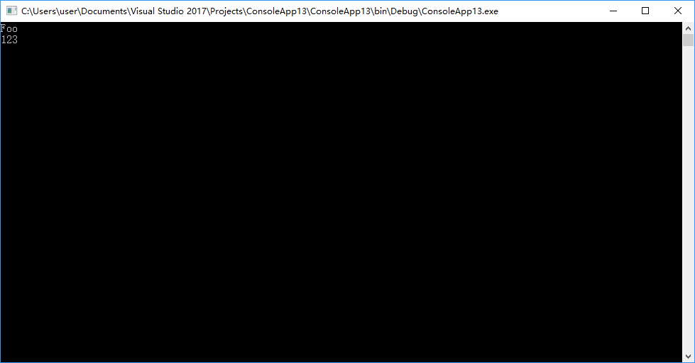

最近在做RPC的时候遇到了一点问题，接口I的调用方在进程A，而实现方在进程B。那么要完成进程A中的操作，必然要在进程A生成接口I的动态代理。怎么办呢？这里使用`DispatchProxy`来进行实现

-----

`DispatchProxy`是一个抽象类，使用方法非常简单。只需要继承这个类，重写他的`Invoke`方法，这里我们可以从参数获得代理被调用方法的`MethodInfo`以及其传入的参数。这里我们先试着打印他的方法名称

```C#
    public class ADispatchProxy : DispatchProxy
    {
        protected override object Invoke(MethodInfo targetMethod, object[] args)
        {
            Console.WriteLine(targetMethod.Name);
            return null;
        }
    }
```

接着我们考虑接口IA

```C#
	public interface IA
    {
        void Foo(string a);
    }
```

试着创建一个IA的代理，这里用到了静态方法`DispatchProxy.Create<IA, ADispatchProxy>()`

```C#
    class Program
    {
        static void Main(string[] args)
        {
            var a = DispatchProxy.Create<IA, ADispatchProxy>();
            a.Foo("123");
        }
    }
```


OK，我们通过一个动态代理完成了接口的调用。

那么现在我们再试着通过容器注入一个实现。这里是通过`ConcurrentDictionary`做的简单容器

```C#
	/// <summary>
    /// 用于模块内部使用的IOC容器
    /// </summary>
    internal class Container
    {
        private static readonly Lazy<Container> Instance = new Lazy<Container>();
        public static Container Current => Instance.Value;

        private readonly ConcurrentDictionary<Type, object> _dictionary = new ConcurrentDictionary<Type, object>();

        /// <summary>
        /// 向容器中添加对象。
        /// </summary>
        /// <typeparam name="T">对象的指定类型。</typeparam>
        /// <param name="value">向容器中添加的对象实例。</param>
        public void Set<T>(T value)
        {
            _dictionary[typeof(T)] = value;
        }

        /// <summary>
        /// 从容器中获取指定类型的对象实例。
        /// </summary>
        /// <typeparam name="TService">指定类型。</typeparam>
        /// <returns>容器中指定类型的对象实例。</returns>
        public TService Get<TService>()
        {
            var type = typeof(TService);
            return (TService) Get(type);
        }

        /// <summary>
        /// 从容器中获取指定类型的对象实例。
        /// </summary>
        /// <typeparam name="TService">指定类型。</typeparam>
        /// <returns>容器中指定类型的对象实例。</returns>
        public object Get(Type type)
        {
            if (_dictionary.TryGetValue(type, out var value))
            {
                return value;
            }

            return null;
        }
    }
```

而在调用端代码更改如下，我们向容器中注入IA的实现A，并且在ADispatchProxy的invoke方法中获取实例，进行调用

```C#
    class Program
    {
        static void Main(string[] args)
        {
            Container.Current.Set<IA>(new A());
            var a = DispatchProxy.Create<IA, ADispatchProxy>();
            a.Foo("123");
        }
    }


    public interface IA
    {
        void Foo(string a);
    }

    public class A : IA
    {
        public void Foo(string a)
        {
            Console.WriteLine(a);
        }
    }

    public class ADispatchProxy : DispatchProxy
    {
        protected override object Invoke(MethodInfo targetMethod, object[] args)
        {
            var type = targetMethod.DeclaringType;
            var o = Container.Current.Get(type);
            if (o != null) 
            {
                Console.WriteLine(targetMethod.Name);
                return targetMethod.Invoke(o, args);
            }

            return null;
        }
    }
```

可以看到在动态代理中完成了实例方法的调用。我们之后再将参数信息通过IPC传递给进程B，就可以实现RPC了。



参考链接：

[DispatchProxy Class (System.Reflection) - Microsoft Docs](https://docs.microsoft.com/en-us/dotnet/api/system.reflection.dispatchproxy?view=dotnet-plat-ext-2.1)


