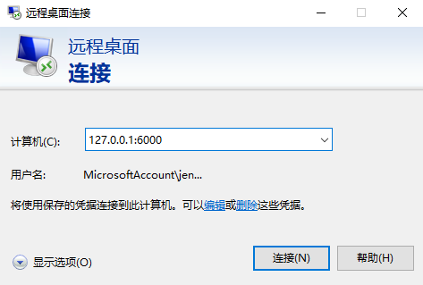

我们在上一篇文章[2020-1-10-内网穿透神器frp - huangtengxiao](https://xinyuehtx.github.io/post/%E5%86%85%E7%BD%91%E7%A9%BF%E9%80%8F%E7%A5%9E%E5%99%A8frp.html)中介绍了如何使用frp的tcp模式，在公网暴露内网设备的tcp服务。还根据此技术实现了对内网设备的远程桌面服务访问。今天我们来分析下这种方式存在的问题，以及可以参考的解决方案。

-----

## Frp的TCP模式问题

这里主要存在2个问题。

第一个是安全问题：

试想一下，frp的tcp模式相当于你的设备直接向公网暴露了一个tcp端口。任何设备都可以尝试连接这个端口。这里就会有很大的安全风险。

第二个问题是网络问题：

我的所有请求都需要进行frp的服务器进行中转，这里势必会造成比较大的网络延时。（尤其是我们大部分的vps是部署在国外）这对我们的服务响应速度会造成较大影响。

## 解决安全问题（stcp）模式

对于安全问题，frp的思路是，既然这些服务有可能被坏人攻击，那我们只要限制特定设备能够使用这个端口就好了。

那么问题来了，我怎么知道哪些设备是允许使用的呢？

服务端配置？那就又陷入了内网穿透的问题。

最简单的方法是使用密钥验证。这就是frp的Secret TCP（stcp）模式的思路。

如下图所示，frp客户端1需要暴露一个tcp端口。于是他在向服务端注册时，额外传了一个密钥。

所有其他设备期望访问这个端口，必须要先验证这个密钥。

这样一来，我们就需要在发起请求的设备上也配置一个frp客户端，通过这个客户端带着密钥发起请求。


### 如何配置

- 服务端：配置仍然同默认配置一致，直接运行即可
- 客户端1：配置需要将type改为stcp，并且增加一个sk字段。这里不需要远端端口，因为不公开

```ini
# frpc.ini
[common]
# 你的frp服务器的公网ip
server_addr = x.x.x.x
# 你的frp服务器的默认端口
server_port = 7000

[rdp]
type = stcp
# 只有 sk 一致的用户才能访问到此服务
sk = abcdefg
local_ip = 127.0.0.1
# 远程桌面的本地端口号
local_port = 3389
```

- 客户端2：

```ini
# frpc.ini
[common]
# 你的frp服务器的公网ip
server_addr = x.x.x.x
# 你的frp服务器的默认端口
server_port = 7000

[rdp_visitor]
type = stcp
# stcp 的访问者
role = visitor
# 要访问的 stcp 代理的名字
server_name = rdp
# 只有 sk 一致的用户才能访问到此服务
sk = abcdefg
# 绑定本地端口用于访问 远程桌面 服务
bind_addr = 127.0.0.1
bind_port = 6000
```

此时，你在客户端2，使用127.0.0.1:6000即可访问客户端1的远程服务。




## 解决网络问题（xtcp）模式

思考一下，我们的frp服务器主要目的是为了解决两台设备相互识别的情况。在正式运行时，其实并不需要服务端做什么事情。

frp客户端就好比两个相亲的对象，frp服务端是媒婆。媒婆介绍完之后，就应该有相亲对象自己聊天了。

这个就是点对点模式（p2p）。在frp中，这个可以通过设置xtcp实现。

### 如何配置

- 服务端：配置需要增加一个udp端口 7001,增加完之后就是如下

```ini
# frps.ini
[common]
bind_port = 7000
bind_udp_port = 7001
```

- 客户端1：配置需要将type改为xtcp即可

```ini
# frpc.ini
[common]
# 你的frp服务器的公网ip
server_addr = x.x.x.x
# 你的frp服务器的默认端口
server_port = 7000

[rdp]
type = xtcp
# 只有 sk 一致的用户才能访问到此服务
sk = abcdefg
local_ip = 127.0.0.1
# 远程桌面的本地端口号
local_port = 3389
```

- 客户端2：配置需要将type改为xtcp即可

```ini
# frpc.ini
[common]
# 你的frp服务器的公网ip
server_addr = x.x.x.x
# 你的frp服务器的默认端口
server_port = 7000

[rdp_visitor]
type = xtcp
# stcp 的访问者
role = visitor
# 要访问的 stcp 代理的名字
server_name = rdp
# 只有 sk 一致的用户才能访问到此服务
sk = abcdefg
# 绑定本地端口用于访问 远程桌面 服务
bind_addr = 127.0.0.1
bind_port = 6000
```

此时，你在客户端2，使用同样的方式，以127.0.0.1:6000即可访问客户端1的远程服务。


不过需要注意的是，目前frp的p2p服务还不完善，很多nat设备还是不能够穿透的。

此时大家还是需要切换回stcp来使用。


---

参考文档：

-  [2020-1-7-如何使用mac电脑连接你的windows设备 - huangtengxiao](https://xinyuehtx.github.io/post/%E5%A6%82%E4%BD%95%E4%BD%BF%E7%94%A8mac%E7%94%B5%E8%84%91%E8%BF%9E%E6%8E%A5%E4%BD%A0%E7%9A%84windows%E8%AE%BE%E5%A4%87.html)
-  [frp/README_zh.md at master · fatedier/frp](https://github.com/fatedier/frp/blob/master/README_zh.md#%E5%AE%89%E5%85%A8%E5%9C%B0%E6%9A%B4%E9%9C%B2%E5%86%85%E7%BD%91%E6%9C%8D%E5%8A%A1)
-  [2020-1-10-内网穿透神器frp - huangtengxiao](https://xinyuehtx.github.io/post/%E5%86%85%E7%BD%91%E7%A9%BF%E9%80%8F%E7%A5%9E%E5%99%A8frp.html)
-  [fatedier/frp: A fast reverse proxy to help you expose a local server behind a NAT or firewall to the internet.](https://github.com/fatedier/frp)


