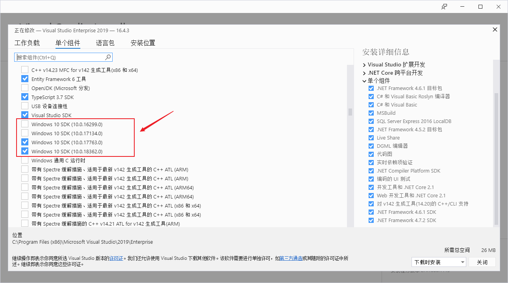

想必大家都有过维护旧版本项目的经验。遇到的第一个问题一定是如何将项目跑起来。相较于其他项目类型，c++（尤其是vc++）应该是一个项目升级较为麻烦程序类型。今天和大家介绍下如何处理c++项目的升级。

-----

### 重定向目标解决方案

对于c++项目升级第一步，也是最简单最重要的一步就是使用vs自带的重定向解决方案。

这里在解决方案资源管理器——解决方案——右击——选择重定目标解决方案。

然后vs就会弹出来下面的选择框，让你选择指定的windows SDK，以及目标平台工具集版本。

一般来说，只要无脑选择最新的选项，就能解决80%的问题。

### 编辑vcxproj文件

如果你手上没有vs怎么办。那你可以直接使用文本编辑器编辑项目的vcxproj文件。

找到`WindowsTargetPlatformVersion`和`PlatformToolset`进行更新。

那么有同学说，这个值应该填什么呢？

基本上`PlatformToolset`可以按照vs15,17,19，来对应v140，v141，v142。

而对于`WindowsTargetPlatformVersion`可以参照[Windows SDK archive - Windows app development](https://developer.microsoft.com/en-us/windows/downloads/sdk-archive)获取各个发行的windows的SDK版本。

### 缺少SDK或者工具集

当你重定向项目之后，编译可能会出现缺少对应SDK或者工具集的问题，这说明你的设备上缺少对应的开发组件。

这里可以找到vs——工具——获取工具和功能。然后在弹出的安装界面中找到对应的sdk和工具集。

需要注意的是，vs2019已经不再提供windows8.1的SDK了。所以如果你需要在windows8.1的平台编译，需要去微软官网下载（[Windows SDK archive - Windows app development](https://developer.microsoft.com/en-us/windows/downloads/sdk-archive)）。

### 其他可能问题

如果能够顺利升级最新版本，当然是最理想的。

但是c++有一些nuget包会在target文件中指定工具集版本，只针对目标工具集版本项目才进行添加。

这样就会导致新版本工具集的项目因为缺少nuget依赖无法编译。

这个时候你可以选择仅升级目标项目的SDK版本，而保持项目的工具集版本。这样就能编译通过了。

不过这样的风险是，如果将来vs不再支持此版本的工具集，就无法编译了。所以大家在开发时，尽量选择多版本，或者保持更新的nuget项目的轮子哦。

---

参考文档：

-  [WindowsTargetPlatformVersion makes it impossible to create generic project files - Developer Community](https://developercommunity.visualstudio.com/content/problem/140294/windowstargetplatformversion-makes-it-impossible-t.html)
-  [Windows SDK archive - Windows app development](https://developer.microsoft.com/en-us/windows/downloads/sdk-archive)

