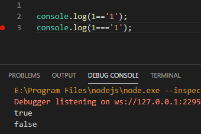
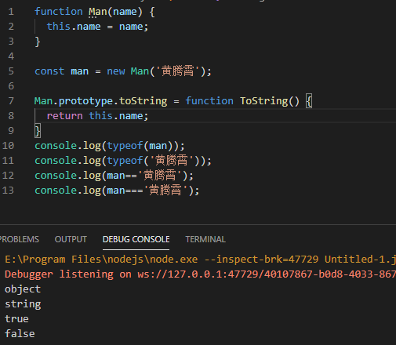
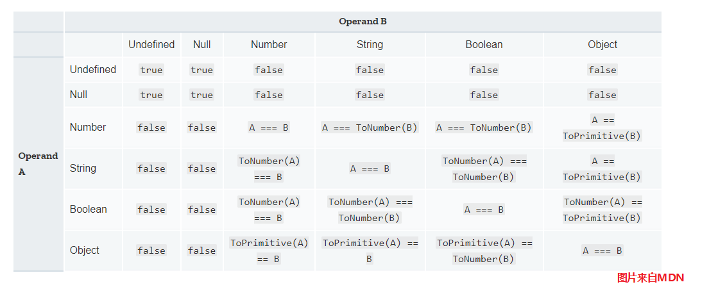

大家在学习JavaScript时，是否遇到这个问题，为什么JavaScript的比较符号是===和!==，而不是大家常见的==和!=？

实际上这两种比较符号都存在于JavaScript中，但是两者的表现并不相同。这里就给大家做介绍。

-----

### 区别

==和===有什么样子的区别呢？我们先来看这样一个例子。

这里我们比较数字1和字符串‘1’，我们看到===的比较结果与我们的普遍认知相符合，是返回false的

而==的比较结果居然返回的是true。

字符串为什么会和数字比较结果相同呢？



### 原因

实际上这两个比较运算符的实现机制是不同的：

- ==也叫loose equality，仅比较两者的值。对于不同类型的对象，会先做类型转换
- ===也叫strict equality，会先比较两个对象的类型，类型相同才比较值。

这么说概念可能不是很清晰，我们再看一个例子。

这里我们创建了一个Man类型，重新了它的toString方法，返回他的name字符串。

然后这里我们使用name为‘黄腾霄’的man对象，和'黄腾霄'字符串进行比较。

同时我们使用typeof输出两个对象的类型。

```javascript
function Man(name) {
  this.name = name;
}

const man = new Man('黄腾霄');

Man.prototype.toString = function ToString() {
  return this.name;
}
console.log(typeof(man));
console.log(typeof('黄腾霄'));
console.log(man=='黄腾霄');
console.log(man==='黄腾霄');
```

我们看到两个对象的类型是不同的，所以===返回false。

但是man对象进过类型转换（toString）方法后 ，返回的字符串和'黄腾霄'是相同的，所以==返回为true。



那么如何判断使用==时，类型的转换呢？MDN上面列出了一个详细的类型转换表格，参见如下：



### 使用

说了这么多，那么我们该怎么使用呢？

最佳使用方法是——永远不要使用==。

这里有两个原因：

- 容易出现bug：JavaScript是一种动态类型的语言。对于刚刚我们演示的，不同类型的对象进行比较，==也可能返回true，这里就是bug的隐患。你很容易忽略检查对象类型，导致逻辑错误。
- 性能差距：即使你能保证对象使用，也不应该使用==。对于不同的类型比较，==多做了一步类型转换，这里就会显著增加性能消耗。而===，只需要判断类型不同就能够直接返回了。


---

参考文档：

-  [Equality comparisons and sameness - JavaScript - MDN](https://developer.mozilla.org/en-US/docs/Web/JavaScript/Equality_comparisons_and_sameness)
-  [== vs === in Javascript and Which Should be Used When · CodeAhoy](https://codeahoy.com/javascript/2019/10/12/==-vs-===-in-javascript/)
-  [JS Comparison Table](https://dorey.github.io/JavaScript-Equality-Table/)
-  [Difference between == and === Equal Operator in JavaScript - Java67](https://www.java67.com/2013/07/difference-between-equality-strict-vs-operator-in-JavaScript-Interview-Question.html)
-  [Object.prototype.toString() - JavaScript - MDN](https://developer.mozilla.org/en-US/docs/Web/JavaScript/Reference/Global_Objects/Object/toString)
-  [JavaScript - toString( ) function - GeeksforGeeks](https://www.geeksforgeeks.org/javascript-tostring-function/)
-  [JavaScript toString() - Scaler Topics](https://www.scaler.com/topics/tostring-in-javascript/)


