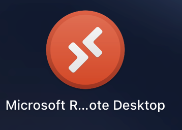
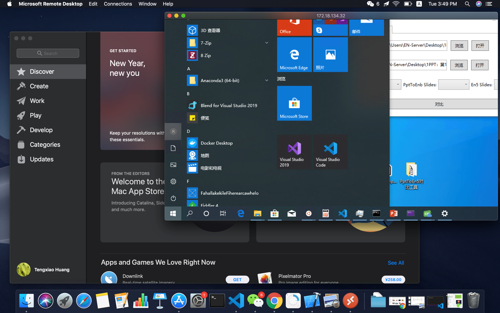
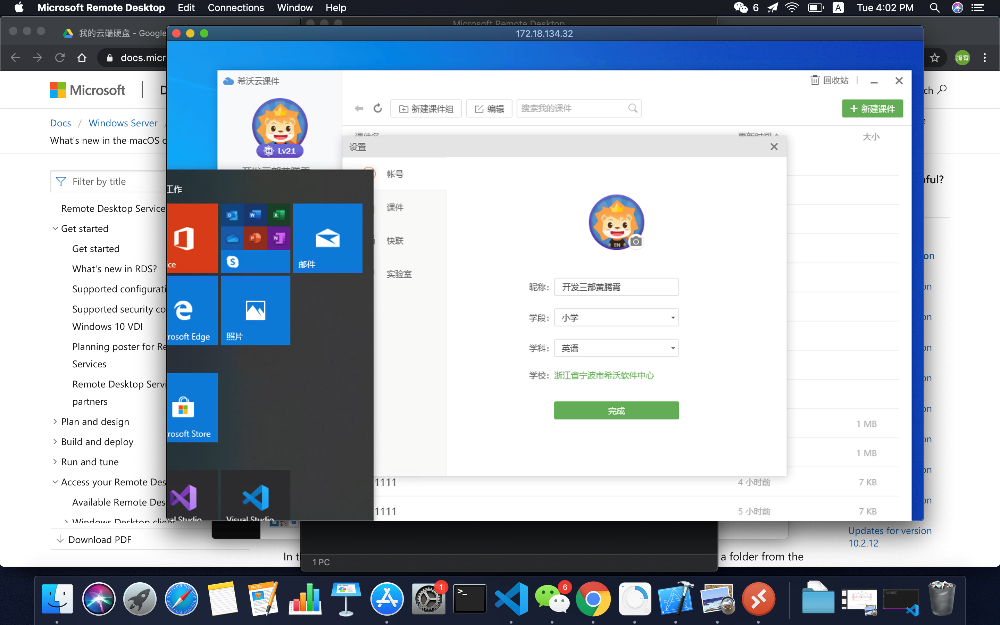
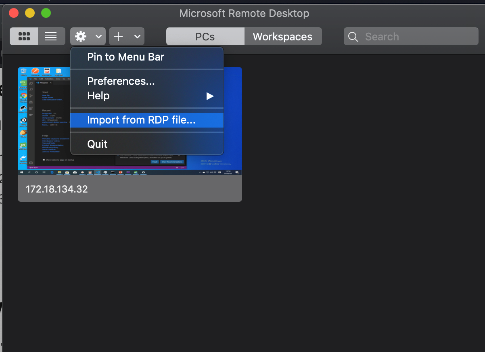
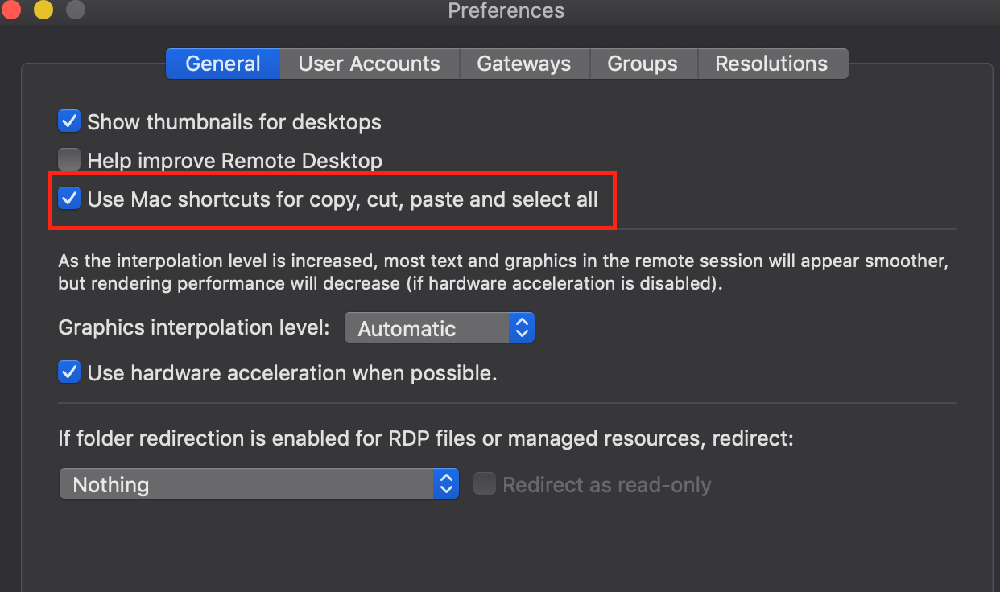
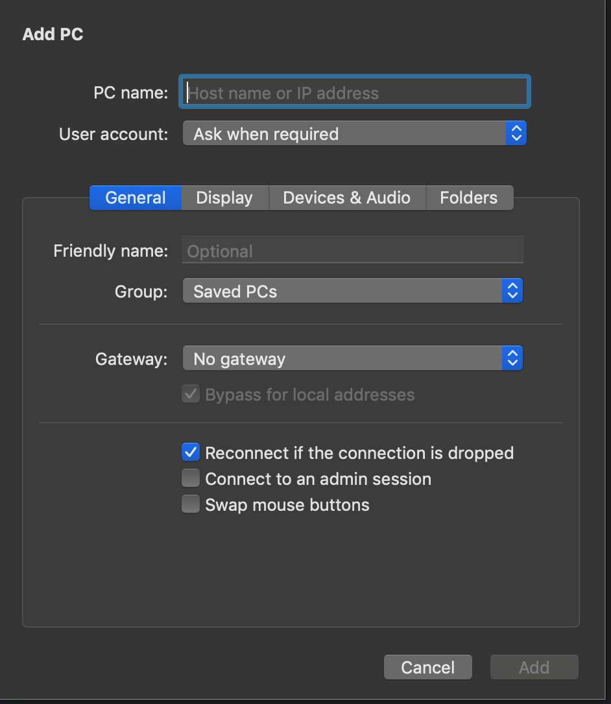

现在的程序员基本都需要熟悉各个平台的开发了。我的工作设备是windows，我家里平时自己用的是mac。

经常会遇到这样的情况，有时候人在家中坐，锅从天上来。临时出现了一些bug，或者软件问题需要你立刻去解决。

但是身边没有合适的设备可以进行远程呀？今天就介绍一款高效工具 Microsoft Remote Desktop 10

-----

Microsoft Remote Desktop 10 是微软官方出品的专门为了多平台对windows进行远程桌面连接的客户端

他可以实现Mac Ios Android Windows等多个平台对Windows设备进行远程操作。

下面是我在电脑上使用的效果。这里完全获取了远程桌面账户的权限，不但可以获取图像，而且可以流畅操作各类windows软件。（从此可以带着mac使用en5上课了）

此外他还支持使用RDP文件导入远程桌面配置，因此可以轻松从现有设备中迁移远程桌面配置。

另外对于在双系统下操作不便的同学来说，可以自主选择你的复制粘贴等快捷键是使用ctrl+c，ctrl+v， 还是command+c，command+v

## 如何获取

在[Microsoft Remote Desktop 10 - 微软官方免费远程桌面控制 Windows 的软件 APP - 异次元软件下载](https://www.iplaysoft.com/microsoft-remote-desktop.html)文章后面附有各个端的下载地址，当然你也可以在对应的应用商店——微软商店，app store等搜索下载指定的版本

PS：需要注意的是，写这篇博客的时候，mac版本的还是只能从app store的美版下载

下载完成后在这里添加对应的ip和windows登入账号即可。

当然对于，目标windows设备，必须先开启远程桌面功能。在[Microsoft Remote Desktop 10 - 微软官方免费远程桌面控制 Windows 的软件 APP - 异次元软件下载](https://www.iplaysoft.com/microsoft-remote-desktop.html)文章有介绍如何设置windows设备允许进行远程桌面连接。

## 缺陷

这里的方案是基于windows远程桌面的，自然有其原生的缺陷，那就是路由问题。

如果你在家里想要连接公司的设备，只有目标设备有公网IP的情况下才能够连接成功。如果是内网设备，会因为找不到对应IP，导致无法进行远程桌面连接。

当然这里也是有解决方法的。使用FRP进行内网穿透的方案，只要你有一台带公网IP的服务器，就可以实现内网设备的远程桌面连接。

---

参考文档：

-  [Microsoft Remote Desktop 10 - 微软官方免费远程桌面控制 Windows 的软件 APP - 异次元软件下载](https://www.iplaysoft.com/microsoft-remote-desktop.html)
-  [Get started with the macOS client - Microsoft Docs](https://docs.microsoft.com/en-us/windows-server/remote/remote-desktop-services/clients/remote-desktop-mac)

